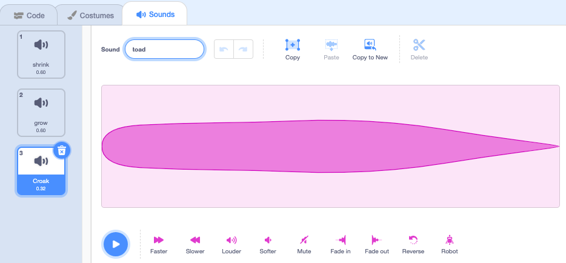
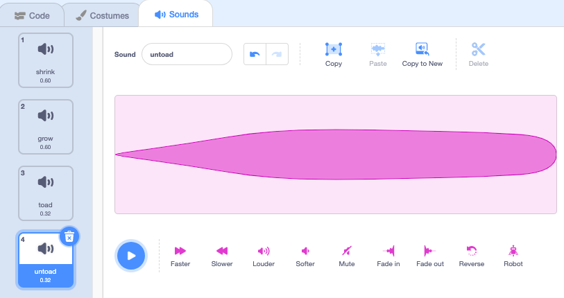

## मेंढक में रुपांतरण

<div style="display: flex; flex-wrap: wrap">
<div style="flex-basis: 200px; flex-grow: 1; margin-right: 15px;">
अब एक और मंत्र का समय है। इस बार आप एक `toad`{:class="block3events"} संदेश प्रसारित करके एक रूपांतरण मंत्र देने जा रहे हैं जो **fairy** स्प्राइट को मेंढक में बदल देता है! 

हो सकता है कि वह एक साहसिक कार्य पर जा रही हो, जहां एक मेंढक होना अधिक उपयोगी होगा।
</div>
<div>
{:width="300px"}
</div>
</div>

--- task ---

'toad' संदेश प्रसारित करने के लिए **toad** बटन स्प्राइट में एक स्क्रिप्ट जोड़ें।


```blocks3 
when this sprite clicked
broadcast [toad v]
```

--- /task ---

--- task ---

**Fairy** स्प्राइट का चयन करें **Costumes** टैब पर क्लिक करें।

**Fairy** स्प्राइट को मेंढक में बदलने के लिए आप **Fairy-a** और **Fairy-toad-a** वेशभूषा का उपयोग करेंगे।


--- /task ---

--- task ---

**Code** टैब पर क्लिक करें और एक `switch costume to`{:class="block3looks"} ब्लॉक को मौज़ूदा `when flag clicked`{:class="block3events""} स्क्रिप्ट के अंत में जोड़ें ताकि ताकि आप अपना प्रोजेक्ट चलाते हैं तो Fairy मानव रूप में हो:


```blocks3
when flag clicked
set size to [100] %
+ switch costume to [Fairy-a v]
```

--- /task ---

--- task ---

मेंढक में बदलने के लिए **Fairy** स्प्राइट में एक नई स्क्रिप्ट जोड़ें:


```blocks3  
when I receive [toad v]
switch costume to [Fairy-toad-a v]
```

--- /task ---

--- task ---

**Wand** स्प्राइट में **Croak** ध्वनि जोड़ें।

ध्वनि का नाम बदलकर `toad` करें:




--- /task ---

--- task ---

जब मंत्र चलाया जाता है तब `toad`{:class="block3sound"} ध्वनि चलाने के लिए **Wand** स्प्राइट में एक स्क्रिप्ट जोड़ें:


```blocks3  
when I receive [toad v]
play sound [toad v] until done
```

--- /task ---

--- task ---

**परीक्षण:** परीक्षण करें कि जब आप **toad** बटन पर क्लिक करते हैं तो आप **Fairy** को ध्वनि प्रभाव के साथ मेंढक में बदल सकते हैं। **Fairy** स्प्राइट को वापस मानव में बदलने के लिए हरे झंडे पर फिर से क्लिक करें।


--- /task ---

एक 'toad' मंत्र का उल्टा एक 'untoad' मंत्र है।

--- task ---

'untoad'{:class="block3events"} संदेश `broadcast`{:class="block3events"} करने के लिए **untoad** बटन स्प्राइट में एक स्क्रिप्ट जोड़ें:


```blocks3 
when this sprite clicked
broadcast [untoad v]
```

--- /task ---

--- task ---

**Fairy** स्प्राइट में `untoad`{:class="block3events"} के लिए एक नई स्क्रिप्ट जोड़ें:


```blocks3  
when I receive [untoad v]
switch costume to [Fairy-a v]
```

--- /task ---

--- task ---

**Wand** स्प्राइट का चयन करें **Sounds** टैब पर स्विच करें।

**toad** ध्वनि को **Duplicate** करें और उसका नाम बदलकर `untoad` करें ।

**Reverse** आइकन पर क्लिक करें ताकि **untoad** ध्वनि पीछे की ओर चले।




--- /task ---

--- task ---

`untoad`{:class="block3sound"} ध्वनि चलाने के लिए **Wand** स्प्राइट में एक स्क्रिप्ट जोड़ें:


```blocks3  
when I receive [untoad v]
play sound [untoad v] until done
```

--- /task ---

--- task ---

**परीक्षण:** **toad** और **untoad** मंत्रों को चला कर देखें, और **Fairy** के मेंढक के रूप में होने पर **shrink** और **grow** भी चला कर देखें।

--- /task ---

--- save ---
