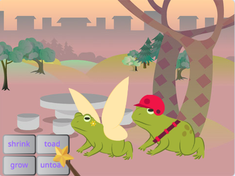
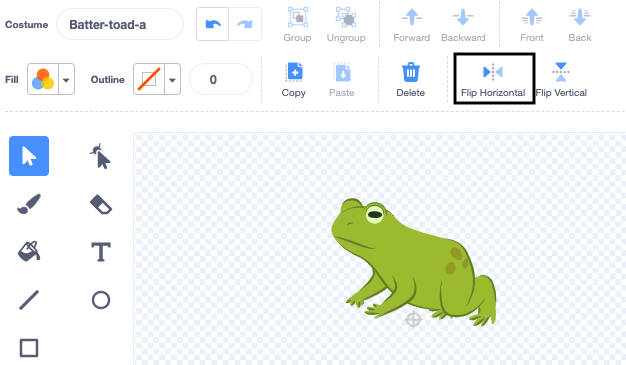

## एक और चरित्र जोड़ें

मंत्रों का जवाब देने के लिए अपनी पसंद का स्प्राइट प्राप्त करें। आपको स्प्राइट के लिए एक मेंढक की पोशाकों का एक 'मैश-अप' बनाना होगा, और कोड जोड़ना होगा ताकि मंत्र संदेश प्रसारित होने पर पोशाक बदल जाए।

{:width="300px"}

--- task ---

**Fairy** स्प्राइट को डुप्लिकेट करें।

**Fairy-a** और **Fairy-toad-a** पोशाक हटाएं। आपके पास केवल **toad** पोशाक रह जाएगी।

**new sprite**में अपनी पसंद की पोशाक जोड़ें।

हमनें **Batter** चुना है।

हो सकता है कि आप उस दिशा को बदलना चाहें जहां स्प्राइट इंगित कर रहा है।

**सलाह:** यदि आपका स्प्राइट उल्टा हो जाता है तो आप Sprite properties पेन में या कोड ब्लॉक का उपयोग करके इसके `rotation-style`{:class="block3motion"} को `left-right`{:class="block3motion"} में बदल सकते हैं।

--- /task ---

जब आप स्प्राइट को बड़ा या छोटा करते हैं, तो आप चाहते हैं कि पैर उसी जगह पर रहें।

--- task ---

पोशाक के चारों ओर एक आयत बनाने के लिए पहले **Select** (तीर) टूल का उपयोग करें और फिर इसे **Group** करें। फिर अपने चरित्र को क्रॉसहेयर के ऊपर खींचें।

--- /task ---

--- task ---

**toad** पोशाक पर क्लिक करें।

अपने स्प्राइट से मेल खाने के लिए पोशाक का नाम बदलें, हमने **Batter-toad-a** इस्तेमाल किया।

--- /task ---

--- task ---

यदि मेंढक की पोशाक मुख्य पोशाक के विपरीत दिशा की ओर है तो आप **Flip Horizontal** उपयोग कर सकते हैं।

--- /task ---

अब आपको मेंढक को चरित्र की तरह दिखाने की जरूरत है। दो पोशाकों को इस तरह से मिलाना 'मैश-अप' कहलाता है।

--- task ---

आप एक छोटा सा विवरण जोड़ सकते हैं, जैसे रंग का छींटा, या Paint एडिटर में से धूप का चश्मा या टोपी कॉपी और पेस्ट कर सकते हैं।

**सलाह:** आप अपने चरित्र स्प्राइट में कोई भी पोशाक जोड़ सकते हैं। **Select** (तीर) टूल का उपयोग करें और **Copy** या **Paste** पर क्लिक करें।

**सलाह:** आप सभी वस्तुओं को एक पोशाक में समूहित कर सकते हैं। उन्हें चुनें ( **Select** टूल या <kbd>Ctrl-a</kbd> का उपयोग कर के) और फिर **Group** क्लिक करें।

हमारा Batter toad ऐसा दिखता है: 

--- /task ---

--- task ---

अपने नए स्प्राइट के लिए **Code** टैब पर स्विच करें।

अपने नए स्प्राइट के लिए सही पोशाकों का उपयोग करने के लिए सभी `switch costume`{:class="block3looks"} को बदल दें

आप स्प्राइट के शुरुआती `size`{:class="block3looks"} को भी बदलना चाह सकते हैं जब `when green flag clicked`{:class="block3events"}।

--- /task ---

--- task ---

**टेस्ट:** स्पेल बटन पर क्लिक करें — दोनों चरित्रों को को मंत्रों के प्रसारण का जवाब देना चाहिए।

**डीबग:** जाँचे की आपने अपने नये स्प्राइट के `switch costume`{:class="block3looks"} ब्लॉक्स में पोशाकें बदल दी हैं ।

--- /task ---

--- save ---
