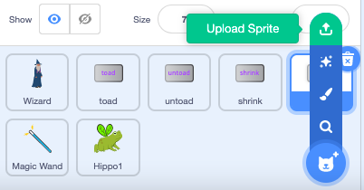

## प्रोजेक्ट को अपग्रेड करें

आप अपनी जादुई दुनिया का विस्तार कैसे करेंगे? आप ऐसा कर सकते हैं:
+ और चरित्र जोड़ सकते
+ छड़ी में विभिन्न ध्वनि और दृश्य प्रभाव जोड़ सकते हैं।
+ अधिक मंत्र जोड़ें - आप `hide`{:class="block3looks"} और `show`{:class="block3looks"} के साथ पात्रों को गायब कर सकते हैं औरउन्हें फिर से प्रकट कर सकते हैं, दृश्य प्रभाव लागू कर सकते हैं या उन्हें उल्टा कर सकते हैं।

एक दोस्त के साथ पात्रों की अदला-बदली क्यों नहीं करते? सबसे पहले, एक दूसरे के स्प्राइट्स को देखने के लिए प्रोजेक्ट लिंक को किसी मित्र के साथ अदला-बदली करें। उनके स्प्राइट्स को सेव करने के लिए, अपने Scratch backpack का उपयोग करें या साझा क्षेत्र में स्प्राइट्स डाउनलोड करें। फिर अपने प्रोजेक्ट पर वापस जाएं और सेव किए गए स्प्राइट्स को जोड़ें।

[[[scratch-backpack]]]

--- collapse ---
---
title: एक स्प्राइट डाउनलोड करें
---

आप स्प्राइट्स को अपने प्रोजेक्ट से डाउनलोड करके अपने कंप्यूटर में सेव कर सकते हैं। Sprite सूची में स्प्राइट पर राइट-क्लिक करें और export चुनें।

किसी प्रोजेक्ट में स्प्राइट लोड करने के लिए, 'Choose a Sprite' मेनू से 'Upload a Sprite' विकल्प चुनें।

--- /collapse ---

एक दोस्त के साथ और मंत्र बनाएं और उन्हें अपने पात्रों में जोड़ें। तय करें कि कौन सा मंत्र बनाना है। सुनिश्चित करें कि आप दोनों अपने द्वारा प्रसारित संदेशों के लिए बिल्कुल एक ही नाम का उपयोग करते हैं।

--- collapse ---
---
title: पूरा किया हुआ प्रोजेक्ट।
---

आप [ पूर्ण प्रोजेक्ट यहां ](https://scratch.mit.edu/projects/518413238/) {: target = "_ blank"} से देख सकते हैं।

--- /collapse ---

--- save ---
