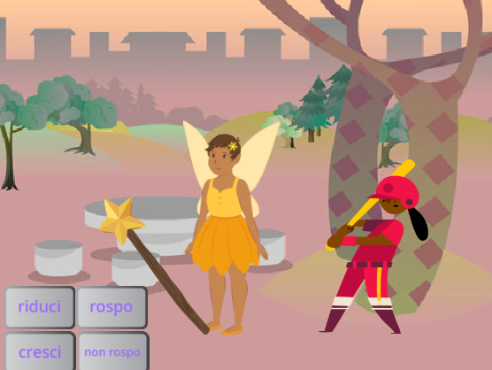

## Quello che farai

Crea un'app in cui usi una bacchetta magica per trasformare i folletti in rospi e farli crescere e rimpicciolire.

Tu:
+ Creerai pulsanti che `trasmettono`{:class="block3events"} messaggi ad altri sprite
+ Chiederai a più sprite di rispondere quando `ricevono`{:class="block3events"} lo stesso messaggio
+ Utilizzerai il menu dei blocchi `Suono`{:class="block3sound"} per invertire i suoni

**Trasmettere** e **ricevere** messaggi è come il **botta e risposta** in musica.
 
 
  "P3T3 P3T3 è una canzone tradizionale del Ghana, Africa occidentale. Viene eseguita da una persona guida che **chiama** e da un gruppo che **risponde** ripetendo una frase chiave quando sentono la chiamata." - Kwame Bakoji-Hume, Attività africane CIC

<audio controls><source src="images/Pete-Pete.mp3" type="audio/wav"></audio>  

--- no-print ---

### Gioca ▶️

--- task ---

  
Usa la bacchetta magica per fare clic sui pulsanti e lanciare incantesimi. Cosa fa ogni incantesimo ai personaggi?

  <iframe allowtransparency="true" width="485" height="402" src="https://scratch.mit.edu/projects/embed/518413238/?autostart=false" frameborder="0"></iframe>

--- /task--- --- /no-print ---

--- print-only ---

--- /print-only ---

