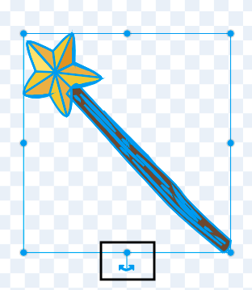

## Scegli la tua bacchetta

<div style="display: flex; flex-wrap: wrap">
<div style="flex-basis: 200px; flex-grow: 1; margin-right: 15px;">
In questo passaggio imposterai la scena, sceglierai la tua bacchetta e creerai la tua magia generata al computer.
  
</div>
<div>
{:width="300px"}
</div>
</div>

<p style="border-left: solid; border-width:10px; border-color: #0faeb0; background-color: aliceblue; padding: 10px;">
<span style="color: #0faeb0">**Le immagini generate al computer (CGI)**</span> possono essere utilizzate per creare effetti speciali che non possono avvenire nel mondo reale. Realizzare un film fantasy o un'animazione moderna richiede molto codice e computer art.
</p>

--- task ---

Apri [Progetto iniziale Messaggi incantati](https://scratch.mit.edu/projects/518441891/editor){:target="_blank"}. Scratch si aprirà in una nuova scheda del browser.

[[[working-offline]]]

--- /task ---

--- task ---

Dovresti vedere una fata in un bosco.


--- /task ---

Hai bisogno di una bacchetta per lanciare un incantesimo.

--- task ---

Fai clic su **Scegli uno Sprite** e digita `wand` nella casella di ricerca:


**Scegli:** Aggiungi la bacchetta che preferisci al tuo progetto.

--- /task ---

--- task ---

Aggiungi codice in modo che lo sprite della **bacchetta** segua il `puntatore del mouse`{:class="block3motion"} e sia `di fronte`{:class="block3looks"}ai pulsanti:


```blocks3
when flag clicked
forever
go to (mouse-pointer v) //change from 'random position'     
go to [front v] layer // in front of the buttons
end
```

--- /task ---

--- task ---

**Test:** Clicca sulla bandierina verde per eseguire il tuo progetto. La bacchetta seguirà il puntatore del mouse.

--- /task ---

Rendi la bacchetta più grande e inclinata, come se la stessi usando davvero.

--- task ---

Vai al riquadro Sprite e modifica la proprietà **Dimensione** uguale a `200` per rendere la bacchetta più grande:


--- /task ---

--- task ---

Fai clic sulla scheda **Costumi** per aprire il costume Bacchetta nell'editor di disegno.

Fai clic sullo strumento **Seleziona** (Freccia) e poi disegna un rettangolo attorno all'intera bacchetta per selezionare tutte le parti del costume.


Quindi fai clic sull'icona **Gruppo** per raggruppare le parti della bacchetta.


--- /task ---

--- task ---

Usa lo strumento **Ruota** sulla bacchetta per ruotare la bacchetta.



**Suggerimento:** Se non riesci a visualizzare lo strumento **Ruota**, fai clic sulla lente **Zoom out** (-) nella parte inferiore dell'editor di disegno per rimpicciolire la vista.

--- /task ---

Il costume **Bacchetta** ostacola il cursore del mouse quando provi a fare clic sui pulsanti.

--- task ---

Muovi la bacchetta in modo che la sua punta sia un po' lontana dal mirino al centro.


--- /task ---

--- task ---

**Test:** Clicca sulla bandierina verde e muovi il mouse sullo stage. La bacchetta dovrebbe seguirlo.

--- /task ---

--- task ---

Se hai effettuato l'accesso al tuo account Scratch, fai clic sul pulsante verde Remix. Questo salverà una copia del progetto dentro il account Scratch.


Puoi cambiare il titolo del tuo progetto.


**Suggerimento:** Scegli nomi utili per i tuoi progetti, così potrai trovarli più facilmente quando ne avrai molti.

Se non hai un account Scratch, puoi fare clic su **File** quindi su **Salva sul tuo computer** per salvare una copia del progetto.

--- /task ---

--- save ---
