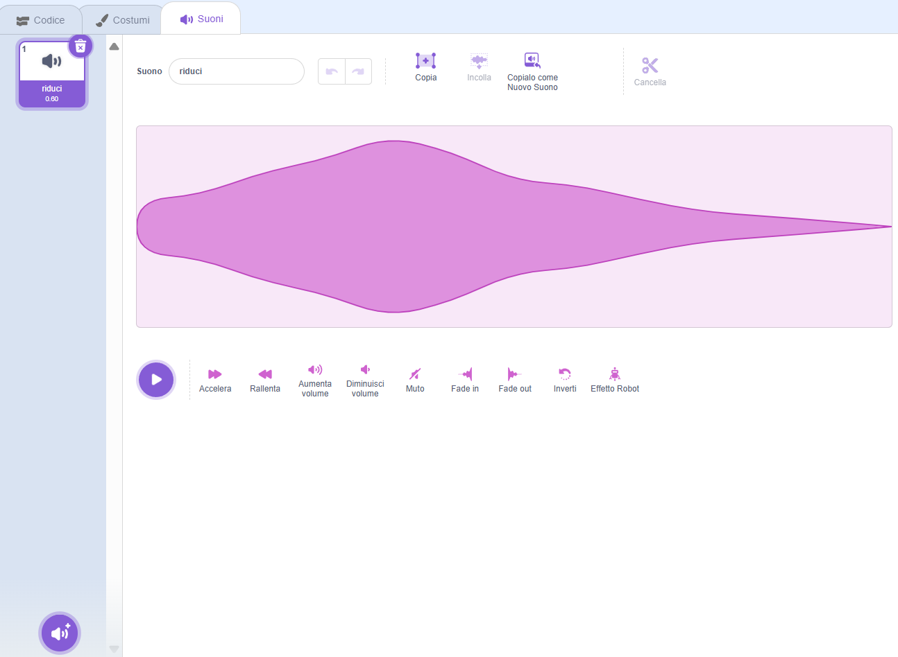

## L'incantesimo di rimpicciolimento

<div style="display: flex; flex-wrap: wrap">
<div style="flex-basis: 200px; flex-grow: 1; margin-right: 15px;">
Ora farai rimpicciolire la fata quando clicchi sul pulsante riduci.
</div>
<div>
{:width="300px"}
</div>
</div>

--- task ---

Fai clic sullo sprite **riduci** nell'elenco degli sprite sotto lo Stage.

Aggiungi un blocco `quando si clicca questo sprite `{:class="block3events"}:


```blocks3
when this sprite clicked
```

--- /task ---

Quando fai clic sul pulsante riduci, vuoi che lo sprite della **Fata** si riduca.

Lo sprite **riduci** ha bisogno di `inviare a tutti`{:class="block3events"} un `messaggio`{:class="block3events"} così che lo sprite della **fata** sappia che l'incantesimo di rimpicciolimento è stato lanciato.

--- task ---

Aggiungi un blocco `invia a tutti`{:class="block3events"}:


```blocks3
when this sprite clicked
+ broadcast (message1 v)
```

--- /task ---

--- task ---

Fai clic su `messaggio1`{:class="block3events"} e scegli 'Nuovo messaggio'. Assegna un nome al nuovo messaggio `riduci`.


Il tuo codice dovrebbe assomigliare a questo:


```blocks3
when this sprite clicked
broadcast (shrink v)
```

--- /task ---

Ora quando clicchi il bottone **riduci**, Scratch `invia a tutti`{:class="block3events"} il messaggio `riduci`{:class="block3events"}, ma non succederà ancora niente.

--- task ---

Aggiungi il codice allo sprite della **Fata** per rimpicciolirlo quando riceve un messaggio `riduci`{:class="block3events"}:


```blocks3
when I receive [shrink v]
change size by [-10] // negative numbers decrease the size
```

--- /task ---

--- task ---

**Test:** Fai clic sul pulsante **riduci** per rimpicciolire lo sprite della **Fata**. Fallo tutte le volte che vuoi.

**Debug:** Se il tuo sprite **Fata** cresce invece di ridursi, aggiungi un meno `-` prima del numero `10` per un numero negativo `-10`.

--- /task ---

--- task ---

Aggiungi uno script per impostare lo sprite della **Fata** alla dimensione normale `quando viene cliccata la bandiera verde`{:class="block3events"}:


```blocks3
when flag clicked
set size to [100] %
```

--- /task ---

Quando i messaggi vengono `inviati`{:class="block3events"} possono essere ricevuti da tutti gli sprite. Quando la **Bacchetta** `riceve`{:class="block3events"} il messaggio `riduci`{:class="block3events "} dovrebbe `riprodurre un suono`{:class="block3sound"}.

--- task ---

Fai clic sullo sprite della **bacchetta** e poi sulla scheda **Suoni**.

Aggiungi il suono **Slide Whistle (fischio di trascinamento)**.

Rinomina il suono in `riduci` così è facile da trovare.




--- /task ---

--- task ---

Aggiungi uno script per riprodurre il suono:


```blocks3
when I receive [shrink v]
play sound [shrink v] until done

```

--- /task ---

--- task ---

**Test:** Clicca sulla bandierina verde per eseguire il tuo progetto. Fai clic sul pulsante **riduci** per sentire il suono e vedere la **Fata** rimpicciolirsi.

--- /task ---

Il pulsante **riduci** `trasmette`{:class="block3events"} un messaggio `riduci`{:class="block3events "}. Sia lo sprite della **Fata** che la **Bacchetta** `ricevono`{:class="block3events"} il messaggio.

--- save ---
