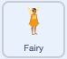

## L'incantesimo della crescita

<div style="display: flex; flex-wrap: wrap">
<div style="flex-basis: 200px; flex-grow: 1; margin-right: 15px;">
Hai anche bisogno di un incantesimo di crescita per riportare lo sprite **Fata** alle dimensioni normali o per creare un'enorme fata!
</div>
<div>
{:width="300px"}
</div>
</div>

**Suggerimento:** In questo passaggio aggiungerai il codice a tre sprite diversi. Assicurati di selezionare lo sprite corretto dall'elenco Sprite sotto lo Stage e fai clic sulla scheda **Codice**.

--- task ---

Aggiungi uno script allo Sprite del pulsante **cresci** per trasmettere `invia a tutti`{:class="block3events"} il messaggio `cresci`{:class="block3events"}:


```blocks3
when this sprite clicked
broadcast (cresci v)
```

--- /task ---

--- task ---

Aggiungi uno script per far crescere lo sprite della **Fata**:



```blocks3
when I receive [cresci v]
change size by [10] // i numeri positivi aumentano le dimensioni
```

--- /task ---

Puoi invertire il suono "riduci" per creare il suono "cresci"!

<p style="border-left: solid; border-width:10px; border-color: #0faeb0; background-color: aliceblue; padding: 10px;">
<span style="color: #0faeb0">**Quiz sui brani riprodotti al contrario**</span> sono quiz musicali ribaltati. Le tracce vengo suonate al contrario e i concorrenti devono indovinare la canzone originale: non è così facile come sembra. 
</p>

--- task ---

Fai clic sullo sprite della **bacchetta** e poi sulla scheda **Suoni**.

Fai clic con il pulsante destro del mouse (o tocca e tieni premuto) il suono **riduci** e scegli **duplica**.


Assegna il nome `cresci` alla copia.

Fai clic sull'icona **Inverti** per riprodurre il suono al contrario.


--- /task ---

--- task ---

Aggiungi uno script allo sprite **bacchetta** per suonare `cresci`{:class="block3sound"} quando il messaggio `cresci`{:class="block3events"} viene ricevuto:


```blocks3
when I receive [cresci v]
play sound [cresci v] until done
```

--- /task ---

--- task ---

**Test:** Fai clic sui pulsanti degli incantesimi **riduci** e **cresci** per lanciare gli incantesimi tutte le volte che vuoi.

--- /task ---

--- save ---

