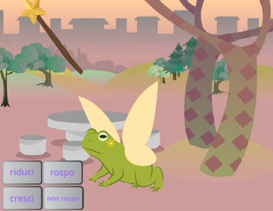
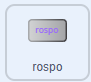
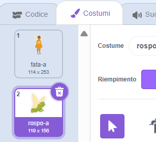
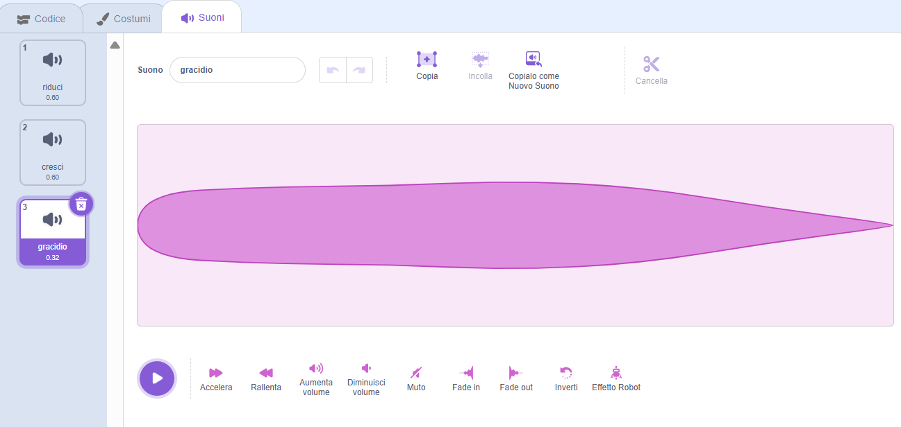
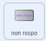
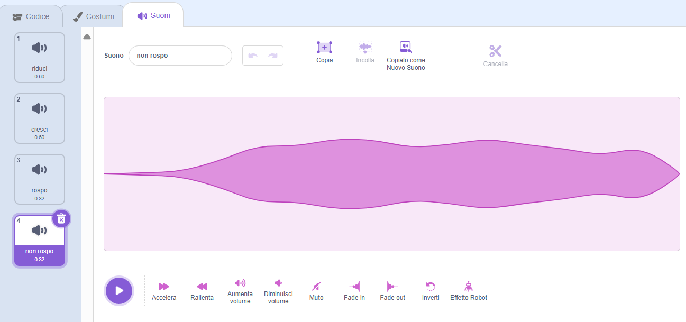

## Trasformazione in rospo

<div style="display: flex; flex-wrap: wrap">
<div style="flex-basis: 200px; flex-grow: 1; margin-right: 15px;">
Ora è il momento per un altro incantesimo. Questa volta lancerai un incantesimo di trasformazione trasmettendo un messaggio `rospo`{:class="block3events"} che trasforma lo sprite **Fata** in un rospo! 

Forse sta partendo per un'avventura in cui essere un rospo sarà più utile.
</div>
<div>
{:width="300px"}
</div>
</div>

--- task ---

Aggiungi uno script allo sprite del pulsante **rospo** per trasmettere il messaggio "rospo":



```blocks3 
when this sprite clicked
broadcast [rospo v]
```

--- /task ---

--- task ---

Seleziona lo sprite **libellula** e fai clic sulla scheda **Costumi**.

Per trasformare lo sprite della **Fata** in un rospo utilizzerai i costumi **Fata-a** e **Fata-rospo-a**.



--- /task ---

--- task ---

Clicca sulla scheda **codice** e aggiungi un blocco `passa al costume`{:class="block3looks"} alla fine dello script esistente `quando la bandierina viene cliccata`{:class="block3events"} così la Fata avrà una forma umana quando esegui il tuo progetto:


```blocks3
when flag clicked
set size to [100] %
+ switch costume to [Fata-a v]
```

--- /task ---

--- task ---

Aggiungi un nuovo script allo sprite della **Fata** per trasformarlo in un rospo:


```blocks3  
when I receive [rospo v]
switch costume to [Fata-rospo-a v]
```

--- /task ---

--- task ---

Aggiungi il suono **Gracidio** allo sprite **Bacchetta**.

Rinomina il suono in `rospo`:




--- /task ---

--- task ---

Aggiungi uno script allo sprite della **Bacchetta** per riprodurre il suono del `rospo`{:class="block3sound"} quando viene lanciato l'incantesimo rospo:


```blocks3  
when I receive [rospo v]
play sound [rospo v] until done
```

--- /task ---

--- task ---

**Test:** Testa che puoi trasformare la **Fata** in un rospo, con un effetto sonoro, quando clicchi il bottone **rospo**. Clicca di nuovo sulla bandiera verde per trasformare lo sprite della **Fata** in un essere umano.


--- /task ---

L'opposto dell'incantesimo "rospo" è l'incantesimo "non rospo".

--- task ---

Aggiungi uno script allo sprite del pulsante **non rospo** per trasmettere `invia a tutti`{:class="block3events"} il messaggio "non rosp"{:class="block3events"}:



```blocks3 
when this sprite clicked
broadcast [non rospo v]
```

--- /task ---

--- task ---

Aggiungi un nuovo script per `de-rospizzare`{:class="block3events"} lo sprite **Fata**:


```blocks3  
when I receive [non rospo v]
switch costume to [Fata-a v]
```

--- /task ---

--- task ---

Fai clic sullo sprite della **bacchetta** e poi clicca sulla scheda **Suoni**.

**Duplica** il suono **rospo** e rinominalo in `non rospo`.

Fai clic sull'icona **Inverti** in modo che il suono di **non rospo** venga riprodotto al contrario.




--- /task ---

--- task ---

Aggiungi uno script allo sprite della **bacchetta** per riprodurre il suono dell'incantesimo `non rospo`{:class="block3sound"}:


```blocks3  
when I receive [non rospo v]
play sound [non rospo v] until done
```

--- /task ---

--- task ---

**Test:** Prova gli incantesimi **rospo** e **non rospo**, e prova **riduci** e **cresci** quando la **Fata** è in forma rospo.

--- /task ---

--- save ---
