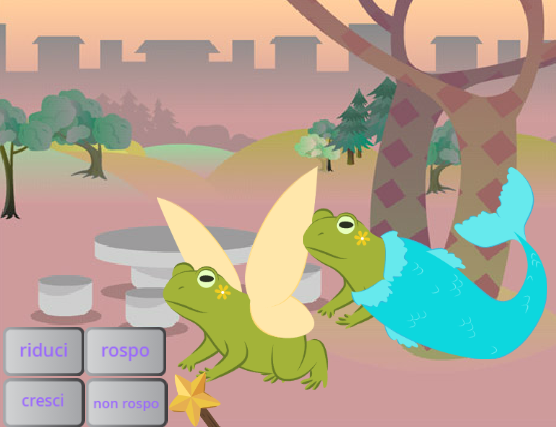
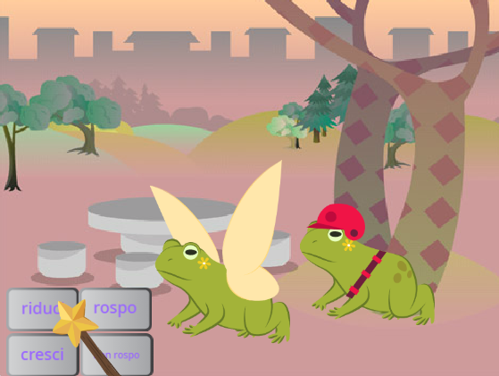
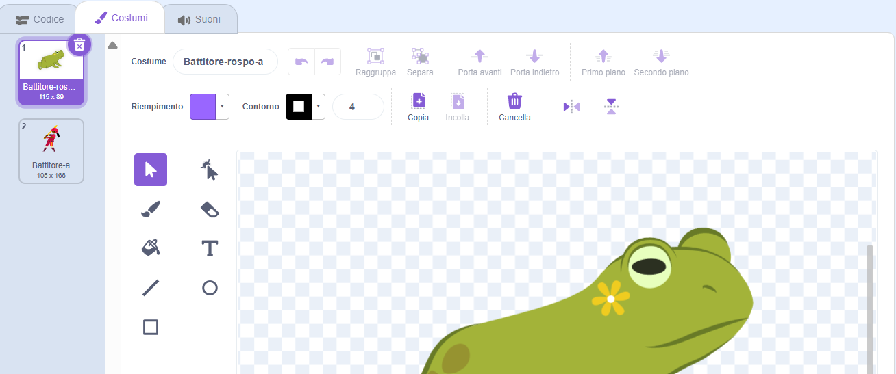
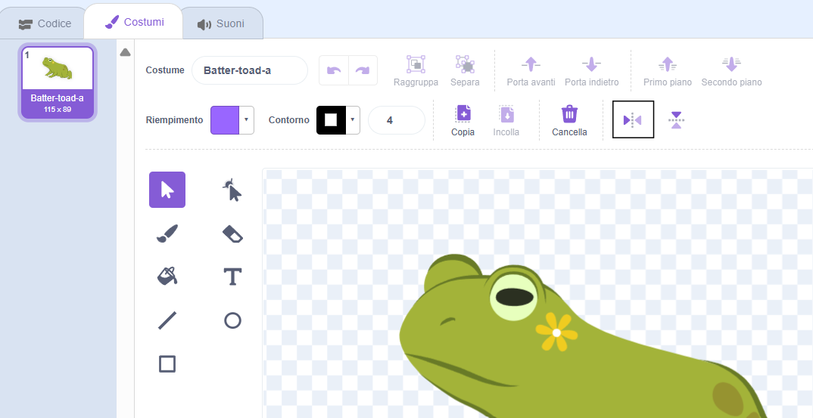

## Aggiungi un altro personaggio

Metti uno sprite a tua scelta per rispondere agli incantesimi. Dovrai creare una combinazione del costume da rospo per lo sprite e aggiungere il codice in modo che il costume cambi quando vengono trasmessi gli incantesimi.

{:width="300px"}

--- task ---

Duplica lo sprite della**Fata**.

Elimina i costumi **Fata-a** e **Fata-rospo-a**. Ti resterà un costume da **rospo**.

Aggiungi un costume a tua scelta al **nuovo sprite**.

Noi abbiamo scelto il **battitore**:

Potresti voler cambiare la direzione in cui punta lo sprite.

**Suggerimento:** Se il tuo sprite va sottosopra puoi cambiare il suo `stile di rotazione`{:class="block3motion"} `sinistra - destra`{:class="block3motion"} nel riquadro delle proprietà Sprite o utilizzando un blocco di codice.

--- /task ---

Quando fai crescere o rimpicciolire uno sprite, vuoi che i piedi rimangano nello stesso posto.

--- task ---

Per prima cosa usa lo strumento **Seleziona** (freccia) per disegnare un rettangolo attorno al costume e poi **Raggruppalo**. Quindi trascina il tuo personaggio sopra il mirino.

--- /task ---

--- task ---

Clicca sul costume da **rospo**.

Rinomina il costume per adattarlo al tuo sprite, noi abbiamo usato **Battitore-rospo-a**.

--- /task ---

--- task ---

Se il costume da rospo è rivolto nella direzione opposta rispetto al costume principale, puoi usare **Capovolgi orizzontalmente**.

--- /task ---

Ora devi far assomigliare il rospo al personaggio. Combinare due costumi in questo modo si chiama "combinazione".

--- task ---

Potresti aggiungere un piccolo dettaglio, come un tocco di colore, oppure copiare e incollare occhiali da sole o un cappello nell'editor di disegno.

**Suggerimento:** Puoi aggiungere qualsiasi costume allo sprite del tuo personaggio. Utilizza lo strumento **Seleziona** (freccia), quindi fai clic su **Copia** o **Incolla**.

**Suggerimento:** Puoi raggruppare tutti gli oggetti in un costume. Selezionali (con lo strumento **seleziona** oppure <kbd>Ctrl-A</kbd>) e poi clicca **raggruppa**.

Il nostro rospo battitore appare così: 

--- /task ---

--- task ---

Passa alla scheda **Codice** per il tuo nuovo sprite.

Cambia tutti i blocchi `cambio costume`{:class="block3looks"} per utilizzare i costumi corretti per il tuo nuovo sprite.

Potresti anche voler cambiare la `dimensione iniziale`{:class="block3looks"} dello sprite `quando si clicca sulla bandiera verde`{:class="block3events"}.

--- /task ---

--- task ---

**Test:** Fai clic sui pulsanti degli incantesimi: entrambi i personaggi dovrebbero rispondere alle trasmissioni degli incantesimi.

**Debug:** Controlla di aver cambiato i costumi nei blocchi `passa al costume`{:class="block3looks"} per il tuo nuovo sprite.

--- /task ---

--- save ---
