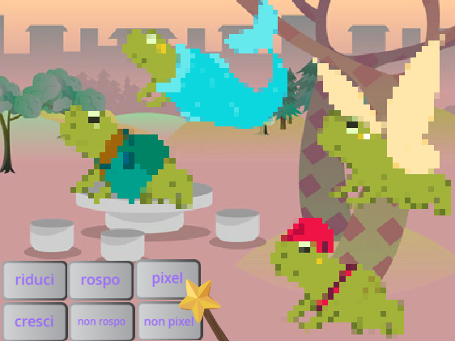
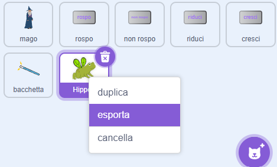
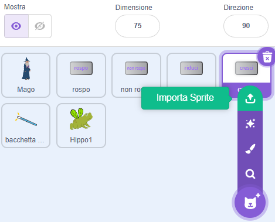

## Migliora il tuo progetto

Come espanderai il tuo mondo magico? Potresti:
+ Aggiungere più personaggi
+ Aggiungere diversi effetti sonori e visivi alla bacchetta.
+ Aggiungere altri incantesimi: potresti far sparire e riapparire i personaggi con `nascondi`{:class="block3looks"} e `mostra`{:class="block3looks"}, applicare effetti visivi o capovolgerli.

Perché non scambiare i personaggi con un amico? Innanzitutto, scambia gli indirizzi del progetto con un amico per vedere gli sprite degli altri. Per salvare i loro sprite, usa la valigetta di Scratch o scarica gli sprite in un'area condivisa. Quindi torna al tuo progetto e aggiungi gli sprite salvati.

[[[scratch-backpack]]]

--- collapse ---
---
title: Scarica uno sprite
---

Puoi salvare gli sprite sul tuo computer scaricandoli dal tuo progetto. Fai clic con il tasto destro su uno sprite nell'elenco degli Sprite e scegli esporta.

Per caricare uno sprite in un progetto, scegli l'opzione "Carica uno Sprite" dal menu "Scegli uno Sprite".

--- /collapse ---

Crea più incantesimi con un amico e aggiungili ai tuoi personaggi. Decidi quali incantesimi creare. Assicurati che entrambi utilizziate esattamente lo stesso nome per i messaggi che trasmettete.

--- collapse ---
---
title: Il progetto completo
---

Qui puoi visualizzare i [progetti completati](https://scratch.mit.edu/projects/1064141525/){:target="_blank"}.

--- /collapse ---

--- save ---
