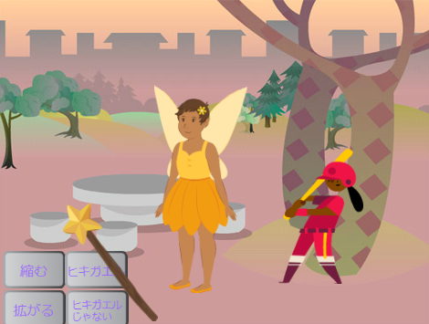

## You will make

魔法の杖を使ってスプライトをヒキガエルに変えて、それらを大きくしたり小さくしたりするアプリを作りましょう。

あなたは次のことを行います。
+ メッセージを他のスプライトに`送る`{:class="block3events"}ボタンを作成します
+ 同じメッセージを`受け取ったとき`{:class="block3events"}複数のスプライトが反応するようにします
+ `サウンド`{:class="block3sound"}ブロックメニューを使用して、音を反転します

**Broadcasting** and **receiving** messages is like a **call and response** pattern in music.
 
 
  P3T3 P3T3 は、西アフリカのガーナの伝統的な歌です。 It is performed by one lead person who **calls** and a group that **respond** by repeating a key phrase when they hear the call." - Kwame Bakoji-Hume, African Activities CIC

<audio controls><source src="images/Pete-Pete.mp3" type="audio/wav"></audio>  

--- no-print ---

### Play ▶️

--- task ---

  
魔法の杖を使ってボタンをクリックし、呪文を唱えます。 各呪文はキャラクターに何をしますか？

  <iframe allowtransparency="true" width="485" height="402" src="https://scratch.mit.edu/projects/embed/518413238/?autostart=false" frameborder="0"></iframe>

--- /task--- --- /no-print ---

--- print-only ---

--- /print-only ---

