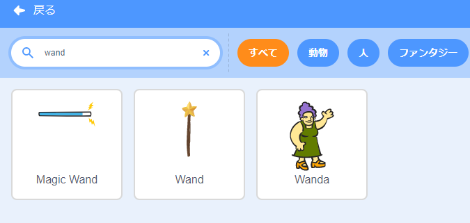

## あなたの杖を選ぼう

<div style="display: flex; flex-wrap: wrap">
<div style="flex-basis: 200px; flex-grow: 1; margin-right: 15px;">
このステップでは、シーンを設定し、杖を選択して、コンピューターで生成された独自の魔法を作成します。
  
</div>
<div>
{:width="300px"}
</div>
</div>

<p style="border-left: solid; border-width:10px; border-color: #0faeb0; background-color: aliceblue; padding: 10px;">
<span style="color: #0faeb0">**コンピューター生成画像（CGI）**</span> を使用して、現実の世界では発生しない特殊効果を作成できます。 現代ファンタジー映画やアニメーションを作成するには、多くのコードとコンピューターアートが必要です。
</p>

--- task ---

[呪文の送信スタータープロジェクト](https://scratch.mit.edu/projects/706346527/editor){:target="_blank"}を開きます。 スクラッチはブラウザの別のタブで開きます。

[[[working-offline]]]

--- /task ---

--- task ---

森の中に妖精がいるはずです。


--- /task ---

呪文を唱えるには杖が必要です。

--- task ---

**スプライトを選ぶ** をクリックして、検索ボックスに `wand` と打ち込みます 。




**選択：** プロジェクトに好みの杖を追加します。

--- /task ---

--- task ---

**Wand** スプライトが `マウスポインター`{:class="block3motion"}を追いかけ、ボタンより `前面`{:class="block3looks"}に表示されるようにコードを追加します。


```blocks3
when flag clicked
forever
go to (mouse-pointer v) //「どこかの場所」から変更     
go to [front v] layer // ボタンの前面
end
```

--- /task ---

--- task ---

**テスト:** 緑色の旗をクリックして、プロジェクトを実行します。 杖はマウスポインターについていきます。

--- /task ---

実際に使っているようにするため、杖を大きくして傾けます。

--- task ---

スプライト区画に移動し、 **大きさ** プロパティを `200` に変更して、杖を大きくします。


--- /task ---

--- task ---

[ **コスチューム**] タブをクリックして、ペイントエディターでWandコスチュームを開きます。

**選択** （矢印）ツールをクリックし、杖全体の周りに長方形を描いて、コスチュームのすべての部分を選択します。


次に、 **グループ化** アイコンをクリックして、杖のパーツを結合します。


--- /task ---

--- task ---

杖の **回転** ツールを使用して、杖を斜めに配置します。


**ヒント：** **回転** ツールが表示されない場合は、ペイントエディタの下にある **Zoom out** （-）ツールをクリックしてズームアウトします。

--- /task ---

ボタンをクリックしようとすると、 **Wand** コスチュームがマウスカーソルの邪魔になります。

--- task ---

杖を動かして、その先端が中央の十字線からちょうど離れるようにします。


--- /task ---

--- task ---

**テスト：** 緑色の旗をクリックして、ステージ上でマウスを動かします。 杖がついていくはずです。

--- /task ---

--- task ---

Scratchのアカウントにサインインしている場合は、緑色のリミックスボタンをクリックします。 これにより、あなたのScratchアカウントにプロジェクトのコピーが保存されます。


プロジェクトのタイトルを変更できます。


**ヒント:** プロジェクトがたくさんあるときに簡単に見つけられるように、プロジェクトにわかりやすい名前を付けます。

Scratchアカウントをお持ちでない場合は、[ **ファイル**]、[ **コンピューターに保存する**] の順にクリックして、プロジェクトのコピーを保存できます。

--- /task ---

--- save ---
