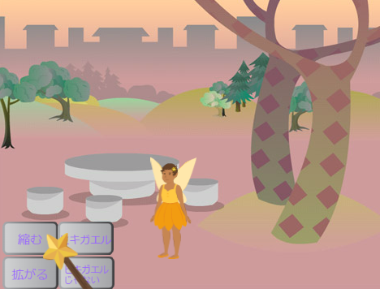
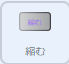
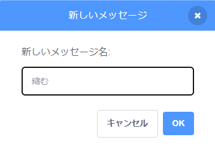
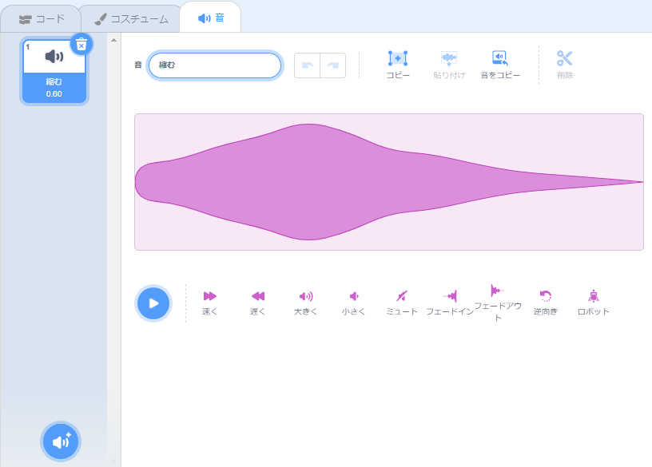

## 縮む呪文

<div style="display: flex; flex-wrap: wrap">
<div style="flex-basis: 200px; flex-grow: 1; margin-right: 15px;">
次は、縮小ボタンをクリックしたときにFairyが縮むようにしましょう。
</div>
<div>
{:width="300px"}
</div>
</div>

--- task ---

ステージの下のスプライトリストで **縮む** スプライトをクリックします。

`このスプライトが押されたとき`{:class="block3events"}ブロックを追加します。



```blocks3
when this sprite clicked
```

--- /task ---

縮むボタンをクリックすると、 **Fairy** スプライトが縮むようにしたいです。

**縮む** スプライトは `メッセージ`{:class="block3events"} を `送る`{:class="block3events"}必要があります。これにより、 **Fairy** スプライトは縮む呪文が唱えられたことを認識します。

--- task ---

`[メッセージv]を送る`{:class="block3events"}ブロックを追加します：


```blocks3
when this sprite clicked
+ broadcast (message1 v)
```

--- /task ---

--- task ---

`メッセージ1`{:class="block3events"}をクリックし、「新しいメッセージ」を選択します。 新しいメッセージに `縮む`という名前をつけます。



コードは以下のようになります：


```blocks3
when this sprite clicked
broadcast (縮む v)
```

--- /task ---

これで、 **縮む** ボタンをクリックすると、Scratchは `縮む`{:class="block3events"}メッセージを`送る`{:class="block3events"} のですが、まだ何も起こりません。

--- task ---

**Fairy** スプライトにコードを追加して、 `縮む`{:class="block3events"}メッセージを受信したときに縮むようにします。


```blocks3
when I receive [縮む v]
change size by [-10] // マイナスの数はサイズを小さくします
```

--- /task ---

--- task ---

**テスト：** **縮む** ボタンをクリックして、 **** スプライトを縮ませます。 これを何度でも実行してください。

**デバッグ：** **Fairy** スプライトが縮まないで拡がる場合は、数値 `10`の前にマイナス`-` を付けて、負の数値`-10` にしてください。

--- /task ---

--- task ---

`緑の旗`{:class="block3events"}がクリックされたとき、 **Fairy** スプライトを通常のサイズ に設定するスクリプトを追加します。


```blocks3
when flag clicked
set size to [100] %
```

--- /task ---

メッセージが `送られる`{:class="block3events"}と、すべてのスプライトで受け取ることができます。 **Wand** が `縮む`{:class="block3events"}メッセージを`受け取る`{:class="block3events"}と、`音を鳴らす`{:class="block3sound"}ようにします。

--- task ---

**Wand** スプライトをクリックしてから、 **音** タブをクリックします。

**Slide Whisle** の音を追加します。

音の名前を `縮む` に変更して、見つけやすくします。




--- /task ---

--- task ---

音を再生するスクリプトを追加します。


```blocks3
when I receive [縮む v]
play sound [縮む v] until done

```

--- /task ---

--- task ---

**テスト：** 緑色の旗をクリックして、プロジェクトを実行します。 **縮む** ボタンをクリックすると音が聞こえ、 **Fairy** が縮みます。

--- /task ---

**縮む** ボタンが`縮む`{:class="block3events"}メッセージを`送り`{:class="block3events"}ます。 **Fairy** と **Wand** スプライト の両方が、メッセージを`受信`{:class="block3events"}し、応答しました。

--- save ---
