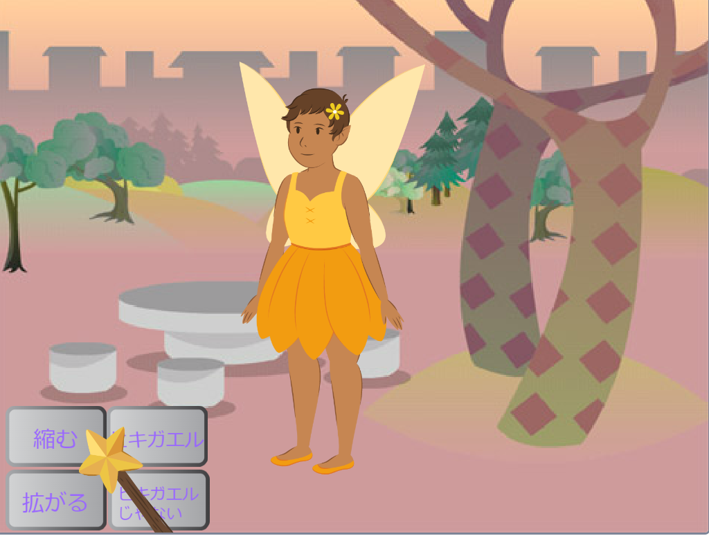

## 拡がる呪文

<div style="display: flex; flex-wrap: wrap">
<div style="flex-basis: 200px; flex-grow: 1; margin-right: 15px;">
**Fairy**スプライトを通常のサイズに戻したり、もっと大きくするのに、拡がる呪文も必要です。
</div>
<div>
{:width="300px"}
</div>
</div>

**ヒント：** このステップでは、3つの異なるスプライトにコードを追加します。 ステージの下のスプライトリストから正しいスプライトを選択していることを確認し、**コード**タブをクリックしてください。

--- task ---

**拡がる**ボタンスプライトにスクリプトを追加して`拡がる`{:class="block3events"}メッセージを `送る`{:class="block3events"} ようにします。


```blocks3
when this sprite clicked
broadcast (grow v)
```

--- /task ---

--- task ---

**Fairy** スプライトを大きくするスクリプトを追加します。


```blocks3
when I receive [grow v]
change size by [10] // positive numbers increase the size
```

--- /task ---

「縮む」音を逆にして「拡がる」音を出すことができます！

<p style="border-left: solid; border-width:10px; border-color: #0faeb0; background-color: aliceblue; padding: 10px;">
<span style="color: #0faeb0">**逆方向に再生される曲のクイズ**</span> は、ひねりを加えた音楽クイズです。 トラックが逆になり、回答者は元の曲を推測する必要があります—それは思ったほど簡単ではありません。 
</p>

--- task ---

**Wand** スプライトを選択し、**音**タブをクリックします。

**縮む**音を右クリック（またはタップアンドホールド）して、 **複製**を選択します。


コピーに `拡がる`という名前をつけます。

**逆向き** アイコンをクリックして、サウンドを逆方向に再生します。


--- /task ---

--- task ---

**Wand** スプライトにスクリプトを追加して、 `拡がる`{:class="block3events"}メッセージを受信したときに、 `拡がる`{:class="block3sound"}音を再生します。


```blocks3
when I receive [grow v]
play sound [grow v] until done
```

--- /task ---

--- task ---

**テスト：** **縮む** と **拡がる** の呪文ボタンをクリックして、好きなだけ呪文を唱えます。

--- /task ---

--- save ---

