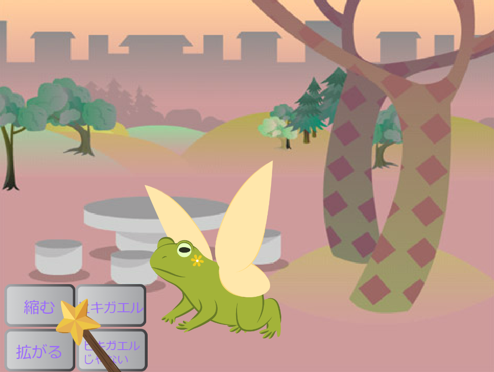
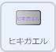
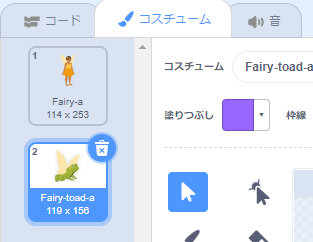
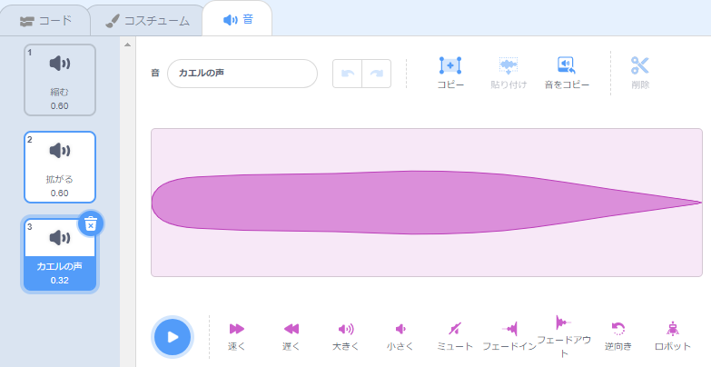
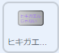
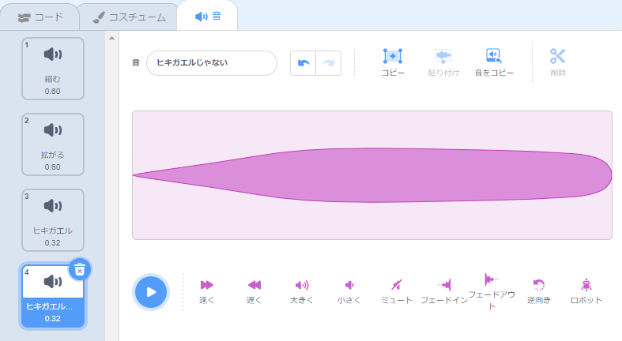

## ヒキガエルに変身

<div style="display: flex; flex-wrap: wrap">
<div style="flex-basis: 200px; flex-grow: 1; margin-right: 15px;">
今度は別の呪文の時間です。 今回は、** Fairy **スプライトをヒキガエルに変える `ヒキガエル` {:class="block3events "}メッセージを送って変身呪文を唱えます。 

たぶん、彼女はヒキガエルであることがより役立つ冒険に出かけているでしょう。
</div>
<div>
{:width="300px"}
</div>
</div>

--- task ---

**ヒキガエル** ボタンスプライトにスクリプトを追加して、「ヒキガエル」メッセージを送信します。



```blocks3 
when this sprite clicked
broadcast [toad v]
```

--- /task ---

--- task ---

**Fairy** スプライトを選択し、 **コスチューム** タブをクリックします。

**Fairy** スプライトをヒキガエルに変換するには、 **Fairy-a** と **Fairy-tode-a** のコスチュームを使用します。



--- /task ---

--- task ---

**コード** タブをクリックし、`フラグが押されたとき{:class="block3events"}`のスクリプトの最後に `コスチュームを(・・・v)にする`{:class="block3looks"}ブロックを追加して、プロジェクトを実行するときに妖精が人間のような姿になるようにします。


```blocks3
when flag clicked
set size to [100] %
+ switch costume to [Fairy-a v]
```

--- /task ---

--- task ---

**Fairy** スプライトにヒキガエルに変身させる新しいスクリプトを追加します。


```blocks3  
when I receive [toad v]
switch costume to [Fairy-toad-a v]
```

--- /task ---

--- task ---

**Croak**音を **Wand**スプライトに追加します。

音の名前を `ヒキガエル`に変更します:




--- /task ---

--- task ---

**Wand** スプライトにスクリプトを追加して、ヒキガエルの呪文が唱えられたときに `ヒキガエル`{:class="block3sound"}音を再生します。


```blocks3  
when I receive [toad v]
play sound [toad v] until done
```

--- /task ---

--- task ---

**テスト：** **ヒキガエル** ボタンをクリックすると、 **Fairy** が効果音付きでヒキガエルに変身することをテストします。 緑の旗をもう一度クリックして、 **Fairy** スプライトを人間に戻します。


--- /task ---

「ヒキガエル」呪文の反対は「ヒキガエルじゃない」呪文です。

--- task ---

**ヒキガエルじゃない** ボタンスプライトにスクリプトを追加して 'ヒキガエルじゃない' {:class="block3events"}メッセージを `送る`{:class="block3events"}ようにします：



```blocks3 
when this sprite clicked
broadcast [untoad v]
```

--- /task ---

--- task ---

**Fairy**スプライトを`ヒキガエルじゃない`{:class="block3events"}ようにする 新しいスクリプトを追加します。


```blocks3  
when I receive [untoad v]
switch costume to [Fairy-a v]
```

--- /task ---

--- task ---

**Wand** スプライトを選択し、**音**タブをクリックします。

**ヒキガエル**音を**複製** し、名前を `ヒキガエルじゃない`に変更する。

**逆向き**アイコンをクリックして、**ヒキガエルじゃない**音が逆方向に再生されるようにします。




--- /task ---

--- task ---

**Wand** スプライトに `ヒキガエルじゃない`{:class="block3sound"}音を再生するスクリプトを 追加します。


```blocks3  
when I receive [untoad v]
play sound [untoad v] until done
```

--- /task ---

--- task ---

**テスト：** **ヒキガエル** と **ヒキガエルじゃない** の呪文を試し、 **Fairy** がヒキガエルの形になったら **縮む**と**拡がる**を試します。

--- /task ---

--- save ---
