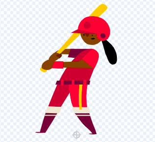

## 別のキャラクターを追加する

呪文に反応する、あなたの選んだスプライトを手に入れてください。 スプライトのヒキガエルコスチュームの「マッシュアップ」を作成し、呪文メッセージが送られたときにコスチュームが変わるようにコードを追加する必要があります。

{:width="300px"}

--- task ---

**Fairy**スプライトを複製します。

**Fairy-a**と**Fairy-toad-a** のコスチュームを削除します。 **toad**コスチュームが残ります。

**新しいスプライト**に選択したコスチュームを追加します。

ここでは**Batter**を選択しました：

スプライトが指している方向を変更したい場合があります。

**ヒント：** スプライトが上下逆になった場合は、スプライトのプロパティペインで、またはコードブロックを使って、その `回転方法`{:class="block3motion"}を `左右のみ`{:class="block3motion"}に変更します。

--- /task ---

スプライトを拡げたり縮めたりしても、足は同じ場所に留めておきたいです。

--- task ---

最初に **選択**（矢印）ツールを使用してコスチュームの周りに長方形を描き、次に **グループ化**を使用します。 次に、キャラクターを十字線の上にドラッグします。

--- /task ---

--- task ---

**toad** コスチュームをクリックします。

スプライトに合わせてコスチュームの名前を変更します。ここでは **Batter-toad-a**としました。

--- /task ---

--- task ---

ヒキガエルのコスチュームがメインのコスチュームと反対の方向を向いている場合は、 **左右反転**を使用します。

--- /task ---

次に、ヒキガエルを元のキャラクターのように見せなければなりません。 このように2つのコスチュームを組み合わせることは、「マッシュアップ」と呼ばれています。

--- task ---

ペイントエディタで、一部の色などの細かいディテールを追加したり、サングラスや帽子をコピーして貼り付けたりします。

**ヒント：**キャラクターのスプライトに任意のコスチュームを追加できます。 **選択**（矢印）ツールを使用して、 **コピー** または **貼り付け**をクリックします。

**ヒント：** コスチューム内のすべてのオブジェクトをグループ化できます。 それらを選択し（ **選択** ツールまたは <kbd>Ctrl-a </kbd>を使用）、**グループ化**をクリックします。

私たちのバッターヒキガエルは次のようになります： 

--- /task ---

--- task ---

新しいスプライトの**コード**タブに切り替えます。

`コスチュームを(・・・v)にする`{:class="block3looks"}ブロックをすべて変更して、新しいスプライトに正しいコスチュームを使用します。

`緑の旗が押されたとき`{:class="block3events"}、スプライトの最初の `大きさ`{:class="block3looks"}を変更することもできます。

--- /task ---

--- task ---

**テスト：** 呪文ボタンをクリックします—両方のキャラクターが呪文発信に応答する必要があります。

**デバッグ：** 新しいスプライトの `コスチュームを(・・・v)にする`{:class="block3looks"}ブロックのコスチュームを変更したことを確認します。

--- /task ---

--- save ---
