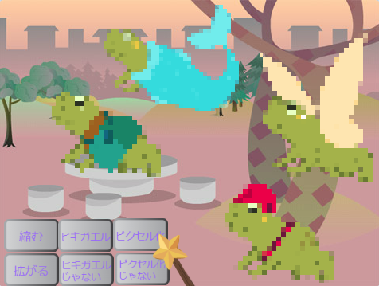
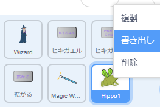
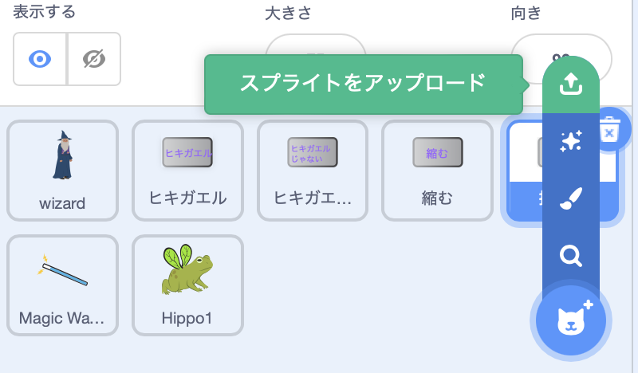

## プロジェクトをアップグレードする

魔法の世界をどのように拡大しますか？ こんなことができます:
+ 別のキャラクターを追加する
+ 杖にさまざまな音と視覚効果を追加する。
+ さらに呪文を追加します—`隠す`{:class="block3looks"}と`表示する`{:class="block3looks"}を使ってキャラクターを消したり、また表示したりすることができます。視覚効果を適用したり、上下逆さまにすることもできます。

友達とキャラクターを入れ替えてみませんか？ まず、プロジェクトのリンクを友達と交換して、お互いのスプライトを確認します。 スプライトを保存するには、Scratchバックパックを使用するか、スプライトを共有領域にダウンロードします。 次に、プロジェクトに戻り、保存したスプライトを追加します。

[[[scratch-backpack]]]

--- collapse ---
---
title: スプライトをダウンロードする
---

プロジェクトからスプライトをダウンロードすることで、スプライトをコンピューターに保存できます。 スプライトリストでスプライトを右クリックし、書き出しを選択します。

スプライトをプロジェクトにロードするには、[スプライトを選ぶ] メニューから[スプライトをアップロード] オプションを選択します。

--- /collapse ---

友達と一緒にさらに呪文を作成し、キャラクターに追加します。 作成する呪文を決定します。 発信するメッセージには、両方がまったく同じ名前を使用していることを確認してください。

--- collapse ---
---
title: 完成したプロジェクト
---

[完成したプロジェクトはこちら](https://scratch.mit.edu/projects/706346262/){:target="_blank"}で確認できます。

--- /collapse ---

--- save ---
