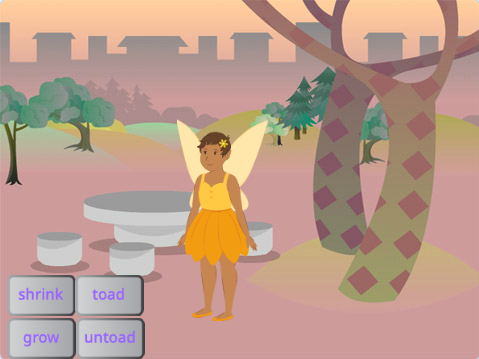
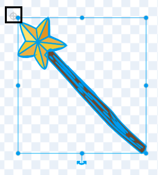

## ನಿಮ್ಮ ಮಾಂತ್ರಿಕ ದಂಡವನ್ನು ಆಯ್ಕೆ ಮಾಡಿಕೊಳ್ಳಿ

<div style="display: flex; flex-wrap: wrap">
<div style="flex-basis: 200px; flex-grow: 1; margin-right: 15px;">
ಈ ಹಂತದಲ್ಲಿ, ನೀವು ದೃಶ್ಯವನ್ನು ಹೊಂದಿಸುವಿರಿ, ನಿಮ್ಮ ಮಾಂತ್ರಿಕ ದಂಡವನ್ನು ಆಯ್ಕೆ ಮಾಡುವಿರಿ ಮತ್ತು ನಿಮ್ಮದೇ ಆದ ಕಂಪ್ಯೂಟರ್-ರಚಿತ ಜಾದೂವನ್ನು ರಚನೆಮಾಡುತ್ತೀರಿ.
  
</div>
<div>
{:width="300px"}
</div>
</div>

<p style="border-left: solid; border-width:10px; border-color: #0faeb0; background-color: aliceblue; padding: 10px;">
<span style="color: #0faeb0">**ಕಂಪ್ಯೂಟರ್‌-ರಚಿತ ಚಿತ್ರಣ (CGI)**</span>ವನ್ನು ನಿಜ ಜಗತ್ತಿನಲ್ಲಿ ಸಂಭವಿಸದೇ ಇರುವ ವಿಶೇಷ ಪರಿಣಾಮಗಳನ್ನು ರಚಿಸಲು ಉಪಯೋಗಿಸಬಹುದು. ಆಧುನಿಕ ಫ್ಯಾಂಟಸಿ ಚಲನಚಿತ್ರ ಅಥವಾ ಅನಿಮೇಷನ್‌ ಮಾಡುವುದು ಬಹಳಷ್ಟು ಕೋಡ್‌ ಮತ್ತು ಕಂಪ್ಯೂಟರ್‌ ಕಲೆಗಳನ್ನು ಒಳಗೊಂಡಿರುತ್ತದೆ.
</p>

--- task ---

[Broadcasting spells starter project](https://scratch.mit.edu/projects/518441891/editor){:target="_blank"} ತೆರೆಯಿರಿ. ಸ್ಕ್ರಾಚ್ ಇನ್ನೊಂದು ಬ್ರೌಸರ್ ಟ್ಯಾಬ್‌ನಲ್ಲಿ ತೆರೆಯುತ್ತದೆ.

[[[working-offline]]]

--- /task ---

--- task ---

ನೀವು ಅರಣ್ಯಪ್ರದೇಶದಲ್ಲಿ ಯಕ್ಷಿಣಿಯನ್ನು ನೋಡಬೇಕು.



--- /task ---

ಮಂತ್ರವನ್ನು ಬಿತ್ತರಿಸಲು ನಿಮಗೆ ಮಾಂತ್ರಿಕ ದಂಡ ಬೇಕು.

--- task ---

**Choose a Sprite** ಕ್ಲಿಕ್‌ ಮಾಡಿ ಮತ್ತು ಸರ್ಚ್‌ ಬಾಕ್ಸ್‌ನಲ್ಲಿ `wand` ಟೈಪ್‌ ಮಾಡಿ:


**ಆಯ್ದುಕೊಳ್ಳಿ:** ನಿಮ್ಮ ಆಯ್ಕೆಯ ಮಾಂತ್ರಿಕ ದಂಡವನ್ನು ನಿಮ್ಮ ಪ್ರಾಜೆಕ್ಟ್‌ಗೆ ಸೇರಿಸಿ.

--- /task ---

--- task ---

**Wand** ಸ್ಪ್ರೈಟ್ `mouse pointer`ನ್ನು ಅನುಸರಿಸುವಂತೆ ಮಾಡಲು {:class="block3motion"} ಕೋಡ್ ಮತ್ತು ಬಟನ್‌ಗಳ ಮುಂದೆ ಇರಲು `front`{:class="block3looks"} ಕೋಡ್‌ ಸೇರಿಸಿ:


```blocks3
when flag clicked
forever
go to (mouse-pointer v) //change from 'random position'     
go to [front v] layer // in front of the buttons
end
```

--- /task ---

--- task ---

**ಪರೀಕ್ಷೆ:** ನಿಮ್ಮ ಪ್ರಾಜೆಕ್ಟ್‌ ರನ್‌ ಮಾಡಲು ಹಸಿರು ಬಾವುಟದ ಮೇಲೆ ಕ್ಲಿಕ್‌ ಮಾಡಿ. ಮಾಂತ್ರಿಕ ದಂಡ ನಿಮ್ಮ ಮೌಸ್‌ ಪಾಯಿಂಟರ್‌ನ್ನು ಅನುಸರಿಸುತ್ತದೆ.

--- /task ---

ನೀವು ದಂಡವನ್ನು ನಿಜವಾಗಿಯೂ ಉಪಯೋಗಿಸುತ್ತಿರುವಂತೆ ಅದನ್ನು ದೊಡ್ಡದು ಮಾಡಿ ಮತ್ತು ವಾಲಿಸಿ.

--- task ---

ಮಾಂತ್ರಿಕ ದಂಡವನ್ನು ದೊಡ್ಡದು ಮಾಡಲು Sprite ಫಲಕಕ್ಕೆ ಹೋಗಿ ಮತ್ತು **Size** ಗುಣಲಕ್ಷಣವನ್ನು `200` ಕ್ಕೆ ಬದಲಾಯಿಸಿ:


--- /task ---

--- task ---

ಪೇಂಟ್‌ ಎಡಿಟರ್‌ನಲ್ಲಿ ಮಾಂತ್ರಿಕ ದಂಡದ ಉಡುಪನ್ನು ತೆರೆಯಲು **Costumes** ಟ್ಯಾಬ್‌ ಮೇಲೆ ಕ್ಲಿಕ್‌ ಮಾಡಿ.

**Select** (ಬಾಣ) ಟೂಲ್‌ ಮೇಲೆ ಕ್ಲಿಕ್‌ ಮಾಡಿ ಮತ್ತು ನಂತರ ಉಡುಪಿನ ಎಲ್ಲಾ ಭಾಗಗಳನ್ನು ಆಯ್ಕೆಮಾಡಲು ಸಂಪೂರ್ಣ ಮಾಂತ್ರಿಕ ದಂಡದ ಸುತ್ತ ಆಯತವನ್ನು ಚಿತ್ರಿಸಿ.


ನಂತರ ಮಾಂತ್ರಿಕ ದಂಡದ ಭಾಗಗಳನ್ನು ಒಗ್ಗೂಡಿಸಲು **Group** ಐಕಾನ್‌ ಮೇಲೆ ಕ್ಲಿಕ್‌ ಮಾಡಿ.


--- /task ---

--- task ---

ಮಾಂತ್ರಿಕ ದಂಡದ ಮೇಲೆ **Rotate** ಟೂಲ್‌ ಉಪಯೋಗಿಸಿ ಅದನ್ನು ಒಂದು ಕೋನದಲ್ಲಿ ಇರಿಸಿ.


**ಸಲಹೆ:** ನಿಮಗೆ **Rotate** ಟೂಲ್‌ ಕಾಣಿಸದಿದ್ದರೆ, ದೊಡ್ಡದು ಮಾಡಲು Paint ಎಡಿಟರ್‌ನ ಕೆಳಗಡೆ ಇರುವ **Zoom out** (-) ಟೂಲ್‌ ಕ್ಲಿಕ್‌ ಮಾಡಿ.

--- /task ---

ನೀವು ಬಟನ್‌ಗಳನ್ನು ಕ್ಲಿಕ್‌ ಮಾಡಲು ಪ್ರಯತ್ನಿಸಿದಾಗ **Wand** ಉಡುಪು ನಿಮ್ಮ ಮೌಸ್‌ ಕರ್ಸರ್‌ಗೆ ಅಡ್ಡ ಬರುತ್ತದೆ.

--- task ---

ಮಾಂತ್ರಿಕ ದಂಡದ ತುದಿಯು ಮಧ್ಯದಲ್ಲಿರುವ ಕ್ರಾಸ ಹೇರ್‌ನಿಂದ ಸ್ವಲ್ಪವೇ ದೂರದಲ್ಲಿರುವಂತೆ ಅದನ್ನು ಸರಿಸಿ.



--- /task ---

--- task ---

**ಪರೀಕ್ಷೆ:** ಹಸಿರು ಬಾವುಟವನ್ನು ಕ್ಲಿಕ್‌ ಮಾಡಿ ಮತ್ತು Stage ನ ಸುತ್ತ ಮೌಸ್‌ ಚಲಿಸಿ. ಮಾಂತ್ರಿಕ ದಂಡವು ಅನುಸರಿಸಬೇಕು.

--- /task ---

--- task ---

ನಿಮ್ಮ Scratch ಖಾತೆಗೆ ನೀವು ಸೈನ್ ಇನ್ ಆಗಿದ್ದರೆ, ಹಸಿರು Remix ಬಟನ್ ಕ್ಲಿಕ್ ಮಾಡಿ. ಇದು ಪ್ರಾಜೆಕ್ಟ್‌ನ ನಕಲನ್ನು ನಿಮ್ಮ Scratch ಖಾತೆಗೆ ಉಳಿಸುತ್ತದೆ(ಸೇವ್‌ ಮಾಡುತ್ತದೆ).


ನೀವು ನಿಮ್ಮ ಪ್ರಾಜೆಕ್ಟ್‌ನ ಶೀರ್ಷಿಕೆಯನ್ನು ಬದಲಾಯಿಸಬಹುದು.


**ಸಲಹೆ:** ನಿಮ್ಮ ಪ್ರಾಜೆಕ್ಟ್‌ಗಳಿಗೆ ಸಹಾಯಕವಾಗುವ ಹೆಸರುಗಳನ್ನು ನೀಡಿ ಇದರಿಂದ ನೀವು ಸಾಕಷ್ಟು ಯೋಜನೆಗಳನ್ನು ಹೊಂದಿರುವಾಗ ಅವುಗಳನ್ನು ಸುಲಭವಾಗಿ ಹುಡುಕಬಹುದು.

ನೀವು Scratch ಖಾತೆ ಹೊಂದಿಲ್ಲವಾದರೆ, ನೀವು ಪ್ರಾಜೆಕ್ಟ್‌ನ ನಕಲನ್ನು ಉಳಿಸಿಕೊಳ್ಳಲು **File**ಮೇಲೆ ಕ್ಲಿಕ್‌ ಮಾಡಿ ನಂತರ **Save to your computer** ಮೇಲೆ ಕ್ಲಿಕ್‌ ಮಾಡಿ.

--- /task ---

--- save ---
