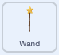

## ಕುಗ್ಗಿಸುವ ಮಂತ್ರ

<div style="display: flex; flex-wrap: wrap">
<div style="flex-basis: 200px; flex-grow: 1; margin-right: 15px;">
ಈಗ ನೀವು ಕುಗ್ಗಿಸುವ ಬಟನ್‌ ಮೇಲೆ ಕ್ಲಿಕ್‌ ಮಾಡಿದಾಗ ಕುಗ್ಗಿರುವ ಯಕ್ಷಿಣಿಯನ್ನು ಪಡೆಯುತ್ತೀರಿ.
</div>
<div>
{:width="300px"}
</div>
</div>

--- task ---

Stage ಕೆಳಗಿನ Sprite ಲಿಸ್ಟ್‌ನಲ್ಲಿ **shrink** ಸ್ಪ್ರೈಟ್‌ ಕ್ಲಿಕ್ ಮಾಡಿ.

`when this sprite clicked`{:class="block3events"}‌ ಬ್ಲಾಕ್‌ನ್ನು ಸೇರಿಸಿ:


```blocks3
when this sprite clicked
```

--- /task ---

ನೀವು ಕುಗ್ಗಿಸುವ ಬಟನ್‌ ಮೇಲೆ ಕ್ಲಿಕ್‌ ಮಾಡಿದಾಗ, ನಿಮಗೆ **Fairy** ಸ್ಪ್ರೈಟ್‌ ಕುಗ್ಗಬೇಕು.

**shrink** ಸ್ಪ್ರೈಟ್ ಒಂದು `message`{:class="block3events"}ನ್ನು `broadcast`{:class="block3events"} ಮಾಡಬೇಕು, ಅದರಿಂದ **Fairy** ಸ್ಪ್ರೈಟ್‌ಗೆ ಕುಗ್ಗಿಸುವ ಮಂತ್ರ ಬಿತ್ತರಿಸಲಾಗಿದೆ ಎಂದು ತಿಳಿಯುತ್ತದೆ.

--- task ---

`broadcast`{:class="block3events"} ಬ್ಲಾಕ್‌ ಸೇರಿಸಿ:


```blocks3
when this sprite clicked
+ broadcast (message1 v)
```

--- /task ---

--- task ---

`message1`{:class="block3events"} ಮೇಲೆ ಕ್ಲಿಕ್‌ ಮಾಡಿ ಮತ್ತು 'New message' ಆಯ್ದುಕೊಳ್ಳಿ. ಹೊಸ ಸಂದೇಶವನ್ನು `shrink` ಎಂದು ಹೆಸರಿಸಿ.


ನಿಮ್ಮ ಕೋಡ್ ಈ ರೀತಿ ಇರಬೇಕು:


```blocks3
when this sprite clicked
broadcast (shrink v)
```

--- /task ---

ಈಗ ನೀವು **shrink** ಬಟನ್‌ ಮೇಲೆ ಕ್ಲಿಕ್‌ ಮಾಡಿದಾಗ, Scratch `shrink`{:class="block3events"}‌ ಸಂದೇಶವನ್ನು `broadcast`{:class="block3events"} ಮಾಡುತ್ತದೆ, ಆದರೆ ಇನ್ನೂ ಏನೂ ಆಗುವುದಿಲ್ಲ.

--- task ---

**Fairy** ಸ್ಪ್ರೈಟ್‌ಗೆ ಅದು `shrink`{:class="block3events"} ಸಂದೇಶವನ್ನು ಸ್ವೀಕರಿಸಿದಾಗ ಕುಗ್ಗಲು ಕೋಡ್‌ ಸೇರಿಸಿ:


```blocks3
when I receive [shrink v]
change size by [-10] // ಋಣಾತ್ಮಕ ಸಂಖ್ಯೆಗಳು ಗಾತ್ರವನ್ನು ಕಡಿಮೆ ಮಾಡುತ್ತವೆ
```

--- /task ---

--- task ---

**ಪರೀಕ್ಷೆ:** **Fairy** ಸ್ಪ್ರೈಟ್‌ನ್ನು ಕುಗ್ಗಿಸಲು **shrink** ಬಟನ್‌ ಮೇಲೆ ಕ್ಲಿಕ್‌ ಮಾಡಿ. ನೀವು ಬಯಸುವಷ್ಟು ಸಮಯ ಇದನ್ನು ಮಾಡಿ.

**ಡಿಬಗ್:** ನಿಮ್ಮ **Fairy** ಸ್ಪ್ರೈಟ್‌ ಕುಗ್ಗುವ ಬದಲು ಬೆಳೆದರೆ, ಋಣಾತ್ಮಕ ಸಂಖ್ಯೆ ಮಾಡಲು `10`ರ ಹಿಂದೆ ಋಣಾತ್ಮಕ ಚಿನ್ಹೆಯನ್ನು `-` ಸೇರಿಸಿ.

--- /task ---

--- task ---

`when the green flag`{:class="block3events"}ನ್ನು ಕ್ಲಿಕ್‌ ಮಾಡಿದಾಗ **Fairy** ಸ್ಪ್ರೈಟ್‌ನ್ನು ಸಾಮಾನ್ಯ ಗಾತ್ರಕ್ಕೆ ಹೊಂದಿಸಲು ಬರಹ ಸೇರಿಸಿ:


```blocks3
when flag clicked
set size to [100] %
```

--- /task ---

ಸಂದೇಶಗಳನ್ನು `broadcast`{:class="block3events"} ಮಾಡಿದಾಗ ಅವುಗಳನ್ನು ಎಲ್ಲಾ ಸ್ಪ್ರೈಟ್‌ಗಳೂ ಸ್ವೀಕರಿಸಬಹುದು. `shrink`{:class="block3events"} ಸಂದೇಶವನ್ನು **Wand** `receives`{:class="block3events"} ಮಾಡಿದಾಗ ಅದು `play a sound`{:class="block3sound"}.

--- task ---

**Wand** ಸ್ಪ್ರೈಟ್‌ ಮೇಲೆ ಕ್ಲಿಕ್‌ ಮಾಡಿ ಮತ್ತು ನಂತರ **Sounds** ಟ್ಯಾಬ್‌ ಮೇಲೆ ಕ್ಲಿಕ್‌ ಮಾಡಿ.

**Slide Whistle** ಧ್ವನಿಯನ್ನು ಸೇರಿಸಿ.

ಸುಲಭವಾಗಿ ಪತ್ತೆ ಮಾಡಲು ಧ್ವನಿಯನ್ನು `shrink` ಎಂದು ಮರುನಾಮಕರಣ ಮಾಡಿ.




--- /task ---

--- task ---

ಧ್ವನಿಯನ್ನು ನುಡಿಸಲು ಬರಹ ಸೇರಿಸಿ:


```blocks3
when I receive [shrink v]
play sound [shrink v] until done

```

--- /task ---

--- task ---

**ಪರೀಕ್ಷೆ:** ನಿಮ್ಮ ಪ್ರಾಜೆಕ್ಟ್‌ ರನ್‌ ಮಾಡಲು ಹಸಿರು ಬಾವುಟದ ಮೇಲೆ ಕ್ಲಿಕ್‌ ಮಾಡಿ. ಧ್ವನಿಯನ್ನು ಕೇಳಿಸಿಕೊಳ್ಳಲು ಮತ್ತು **Fairy** ಕುಗ್ಗುವುದನ್ನು ನೋಡಲು **shrink** ಬಟನ್‌ ಮೇಲೆ ಕ್ಲಿಕ್‌ ಮಾಡಿ.

--- /task ---

`shrink`{:class="block3events"} ಸಂದೇಶವನ್ನು **shrink** button `broadcast`{:class="block3events"} ಮಾಡುತ್ತದೆ. **Fairy** ಮತ್ತು **Wand** ಸ್ಪ್ರೈಟ್‌ ಎರಡೂ ಸಂದೇಶವನ್ನು `received`{:class="block3events"} ಮತ್ತು ಪ್ರತಿಕ್ರಿಯಿಸಿದವು.

--- save ---
