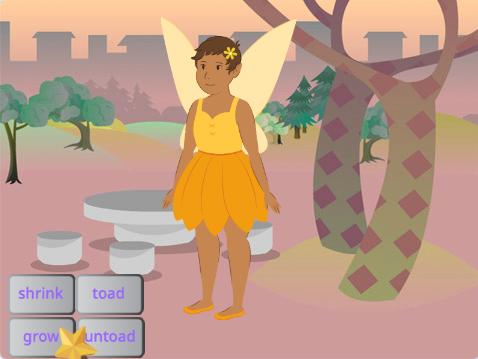
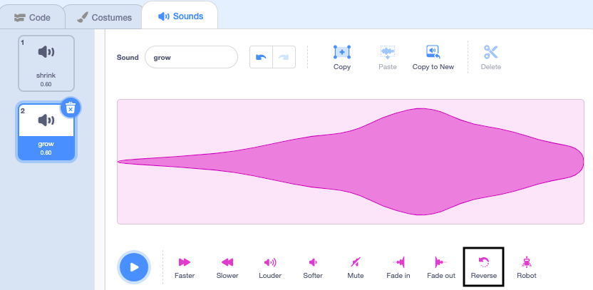

## ಬೆಳೆಸುವ ಮಂತ್ರ

<div style="display: flex; flex-wrap: wrap">
<div style="flex-basis: 200px; flex-grow: 1; margin-right: 15px;">
**Fairy** ಸ್ಪ್ರೈಟ್‌ನ್ನು ಸಾಮಾನ್ಯ ಗಾತ್ರಕ್ಕೆ ಹಿಂತಿರುಗಿಸಲು ಅಥವಾ ಬೃಹತ್‌ ಯಕ್ಷಿಣಿ ಮಾಡಲು ನಿಮಗೆ ಬೆಳೆಸುವ ಮಂತ್ರವೂ ಬೇಕು!
</div>
<div>
{:width="300px"}
</div>
</div>

**ಸಲಹೆ:** ಈ ಹಂತದಲ್ಲಿ, ನೀವು ಮೂರು ಬೇರೆ ಬೇರೆ ಸ್ಪ್ರೈಟ್‌ಗಳಿಗೆ ಕೋಡ್‌ ಸೇರಿಸುತ್ತೀರಿ. Stage ಕೆಳಗಿರುವ Sprite ಲಿಸ್ಟ್‌ನಿಂದ ಸರಿಯಾದ ಸ್ಪ್ರೈಟ್‌ ಆಯ್ಕೆ ಮಾಡಿ ಮತ್ತು **Code** ಟ್ಯಾಬ್‌ ಮೇಲೆ ಕ್ಲಿಕ್‌ ಮಾಡಿ.

--- task ---

`grow`{:class="block3events"} ಸಂದೇಶವನ್ನು `broadcast`{:class="block3events"} ಮಾಡಲು **grow** ಬಟನ್‌ ಸ್ಪ್ರೈಟ್‌ಗೆ ಬರಹ ಸೇರಿಸಿ:


```blocks3
when this sprite clicked
broadcast (grow v)
```

--- /task ---

--- task ---

**Fairy** ಸ್ಪ್ರೈಟ್‌ ಬೆಳೆಯುವಂತೆ ಮಾಡಲು ಬರಹ ಸೇರಿಸಿ:


```blocks3
when I receive [grow v]
change size by [10] // positive numbers increase the size
```

--- /task ---

'grow'' ಧ್ವನಿಯನ್ನು ಮಾಡಲು ನೀವು shrink' ಧ್ವನಿಯನ್ನು ವಿರುದ್ಧವಾಗಿಸಬಹುದು!

<p style="border-left: solid; border-width:10px; border-color: #0faeb0; background-color: aliceblue; padding: 10px;">
<span style="color: #0faeb0">**ಹಾಡುಗಳನ್ನು ಹಿಮ್ಮುಖವಾಗಿ ನುಡಿಸುವ ರಸಪ್ರಶ್ನೆಗಳು**</span> ಗಳು ತಿರುಚಿರುವ ಸಂಗೀತದ ರಸಪ್ರಶ್ನೆಗಳು. ಹಾಡುಗಳನ್ನು ತಿರುಗುಮುರುಗು ಮಾಡಲಾಗಿದೆ, ಮತ್ತು ಸ್ಪರ್ಧಿಗಳು ಮೂಲ ಹಾಡನ್ನು ಊಹೆ ಮಾಡಬೇಕು — ಅದು ಅಂದುಕೊಂಡಷ್ಟು ಸುಲಭವಲ್ಲ. 
</p>

--- task ---

**Wand** ಸ್ಪ್ರೈಟ್‌ ಆಯ್ಕೆ ಮಾಡಿ ಮತ್ತು **Sounds** ಟ್ಯಾಬ್‌ ಮೇಲೆ ಕ್ಲಿಕ್‌ ಮಾಡಿ.

**shrink** ಧ್ವನಿಯನ್ನು ರೈಟ್-ಕ್ಲಿಕ್‌ ಮಾಡಿ (ಅಥವಾ ಟ್ಯಾಪ್‌ ಮಾಡಿ ಹಿಡಿದುಕೊಳ್ಳಿ) ಮತ್ತು **duplicate** ಆಯ್ದುಕೊಳ್ಳಿ.


ನಕಲನ್ನು `grow` ಎಂದು ಹೆಸರಿಸಿ.

ಧ್ವನಿಯು ಹಿಮ್ಮುಖವಾಗಿ ನುಡಿಸಲು **Reverse** ಐಕಾನ್‌ ಮೇಲೆ ಕ್ಲಿಕ್‌ ಮಾಡಿ.



--- /task ---

--- task ---

`grow`{:class="block3events"} ಸಂದೇಶವನ್ನು ಸ್ವೀಕರಿಸಿದಾಗ `grow`{:class="block3sound"} ಧ್ವನಿಯನ್ನು ನುಡಿಸಲು **Wand** ಸ್ಪ್ರೈಟ್‌ಗೆ ಬರಹವನ್ನು ಸೇರಿಸಿ:


```blocks3
when I receive [grow v]
play sound [grow v] until done
```

--- /task ---

--- task ---

**ಪರೀಕ್ಷೆ:** ನೀವು ಬಯಸುವಷ್ಟು ಸಲ ಮಂತ್ರಗಳನ್ನು ಬಿತ್ತರಿಸಲು **shrink** ಮತ್ತು **grow** ಮಂತ್ರಗಳ ಬಟನ್‌ ಮೇಲೆ ಕ್ಲಿಕ್‌ ಮಾಡಿ.

--- /task ---

--- save ---

