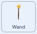

## ನೆಲಗಪ್ಪೆಯ ರೂಪಾಂತರ

<div style="display: flex; flex-wrap: wrap">
<div style="flex-basis: 200px; flex-grow: 1; margin-right: 15px;">
ಈಗ ಮತ್ತೊಂದು ಮಂತ್ರದ ಸಮಯ. ಈ ಬಾರಿ ನೀವು `toad`{:class="block3events"} ಸಂದೇಶವನ್ನು ಪ್ರಸಾರ ಮಾಡಿ **Fairy** ಸ್ಪ್ರೈಟ್‌ ನೆಲಗಪ್ಪೆಯಾಗಿ ಪರಿವರ್ತಿಸುವ ರೂಪಾಂತರ ಮಂತ್ರವನ್ನು ಬಿತ್ತರಿಸುತ್ತೀರಿ i! 

ಅವಳು ನೆಲಗಪ್ಪೆಯಾಗಿರುವುದೇ ಹೆಚ್ಚು ಅನುಕೂಲಕರ ಎನ್ನುವ ಸಾಹಸಕ್ಕೆ ಅವಳು ಕೈ ಹಾಕುತ್ತಿರಬಹುದು.
</div>
<div>
{:width="300px"}
</div>
</div>

--- task ---

'toad' ಸಂದೇಶವನ್ನು ಪ್ರಸಾರ ಮಾಡಲು **toad** ಬಟನ್‌ ಸ್ಪ್ರೈಟ್‌ಗೆ ಬರಹ ಸೇರಿಸಿ:


```blocks3 
when this sprite clicked
broadcast [toad v]
```

--- /task ---

--- task ---

**Fairy** ಸ್ಪ್ರೈಟ್‌ ಆಯ್ಕೆ ಮಾಡಿ ಮತ್ತು **Costumes** ಟ್ಯಾಬ್‌ ಮೇಲೆ ಕ್ಲಿಕ್‌ ಮಾಡಿ.

**Fairy** ಸ್ಪ್ರೈಟ್‌ನ್ನು ನೆಲಗಪ್ಪೆಯಾಗಿ ರೂಪಾಂತರಿಸಲು ನೀವು **Fairy-a** ಮತ್ತು **Fairy-toad-a** ಉಡುಪುಗಳನ್ನು ಉಪಯೋಗಿಸುತ್ತೀರಿ.


--- /task ---

--- task ---

**Code** ಟ್ಯಾಬ್‌ ಮೇಲೆ ಕ್ಲಿಕ್‌ ಮಾಡಿ ಮತ್ತು `switch costume to`{:class="block3looks"} ಬ್ಲಾಕ್‌ನ್ನು ಅಸ್ತಿತ್ವದಲ್ಲಿರುವ ನಿಮ್ಮ `when flag clicked`{:class="block3events"} ಬರಹಕ್ಕೆ ಕೊನೆಯಲ್ಲಿ ಸೇರಿಸಿ, ಇದರಿಂದ ನೀವು ಪ್ರಾಜೆಕ್ಟ್‌ ರನ್‌ ಮಾಡಿದಾಗ ಯಕ್ಷಿಣಿಯು ಮಾನವ ರೂಪದಲ್ಲಿರುತ್ತಾಳೆ:


```blocks3
when flag clicked
set size to [100] %
+ switch costume to [Fairy-a v]
```

--- /task ---

--- task ---

**Fairy** ಸ್ಪ್ರೈಟ್‌ ಗೆ ನೆಲಗಪ್ಪೆಯಾಗಿ ಪರಿವರ್ತನೆಯಾಗಲು ಹೊಸ ಬರಹವನ್ನು ಸೇರಿಸಿ:


```blocks3  
when I receive [toad v]
switch costume to [Fairy-toad-a v]
```

--- /task ---

--- task ---

**Croak** ಧ್ವನಿಯನ್ನು **Wand** ಸ್ಪ್ರೈಟ್‌ಗೆ ಸೇರಿಸಿ.

ಧ್ವನಿಯನ್ನು `toad` ಎಂದು ಮರುನಾಮಕರಣ ಮಾಡಿ:




--- /task ---

--- task ---

ನೆಲಗಪ್ಪೆ ಮಂತ್ರವನ್ನು ಬಿತ್ತರಿಸಿದಾಗ `toad`{:class="block3sound"} ಧ್ವನಿಯನ್ನು ನುಡಿಸಲು **Wand** ಸ್ಪ್ರೈಟ್‌ಗೆ ಬರಹವನ್ನು ಸೇರಿಸಿ:


```blocks3  
when I receive [toad v]
play sound [toad v] until done
```

--- /task ---

--- task ---

**ಪರೀಕ್ಷೆ:** ನೀವು **toad** ಬಟನ್‌ ಕ್ಲಿಕ್‌ ಮಾಡಿದಾಗ **Fairy** ಯನ್ನು ಧ್ವನಿ ಪರಿಣಾಮದೊಂದಿಗೆ ನೆಲಗಪ್ಪೆಯಾಗಿ ಬದಲಾಯಿಸಬಹುದು ಎಂದು ಪರೀಕ್ಷಿಸಿ. **Fairy** ಸ್ಪ್ರೈಟ್‌ನ್ನು ಮಾನವಳಾಗಿ ಮರು ಪರಿವರ್ತನೆ ಮಾಡಲು ಮತ್ತೆ ಹಸಿರು ಬಾವುಟದ ಮೇಲೆ ಕ್ಲಿಕ್‌ ಮಾಡಿ.


--- /task ---

'toad' ಮಂತ್ರದ ವಿರುದ್ಧಾರ್ಥ 'untoad' ಮಂತ್ರ.

--- task ---

**untoad** ಬಟನ್‌ ಸ್ಪ್ರೈಟ್‌ಗೆ 'untoad'{:class="block3events"} ಸಂದೇಶವನ್ನು `broadcast`{:class="block3events"} ಮಾಡಲು ಬರಹವನ್ನು ಸೇರಿಸಿ:


```blocks3 
when this sprite clicked
broadcast [untoad v]
```

--- /task ---

--- task ---

**Fairy** ಸ್ಪ್ರೈಟ್‌ಗೆ `untoad`{:class="block3events"} ಹೊಸ ಬರಹವನ್ನು ಸೇರಿಸಿ:


```blocks3  
when I receive [untoad v]
switch costume to [Fairy-a v]
```

--- /task ---

--- task ---

**Wand** ಸ್ಪ್ರೈಟ್‌ ಆಯ್ಕೆ ಮಾಡಿ ಮತ್ತು **Sounds** ಟ್ಯಾಬ್‌ ಗೆ ಬದಲಿಸಿ.

**toad** ಧ್ವನಿಯನ್ನು **Duplicate** ಮಾಡಿ ಮತ್ತು ಅದನ್ನು `untoad` ಎಂದು ಮರುನಾಮಕರಣ ಮಾಡಿ.

**untoad** ಧ್ವನಿಯು ಹಿಮ್ಮುಖವಾಗಿ ನುಡಿಸಲು **Reverse** ಐಕಾನ್‌ ಮೇಲೆ ಕ್ಲಿಕ್‌ ಮಾಡಿ.


--- /task ---

--- task ---

`untoad`{:class="block3sound"} ಧ್ವನಿಯನ್ನು ನುಡಿಸಲು **Wand** ಸ್ಪ್ರೈಟ್‌ಗೆ ಬರಹವನ್ನು ಸೇರಿಸಿ:


```blocks3  
when I receive [untoad v]
play sound [untoad v] until done
```

--- /task ---

--- task ---

**ಪರೀಕ್ಷೆ:** **Fairy** ನೆಲಗಪ್ಪೆಯ ರೂಪದಲ್ಲಿರುವಾಗ **toad** ಮತ್ತು **untoad** ಮಂತ್ರಗಳನ್ನು ಮತ್ತು **shrink** ಮತ್ತು **grow** ಗಳನ್ನು ಪ್ರಯತ್ನಿಸಿ.

--- /task ---

--- save ---
