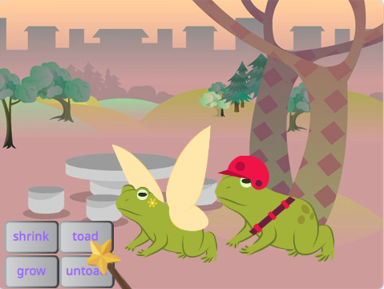
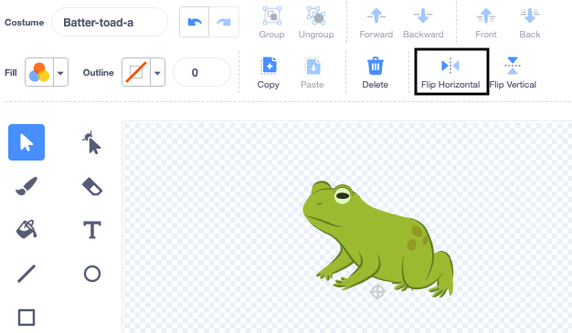

## ಇನ್ನೊಂದು ಪಾತ್ರವನ್ನು ಸೇರಿಸಿ

ಮಂತ್ರಗಳಿಗೆ ಪ್ರತಿಕ್ರಿಯಿಸಲು ನಿಮ್ಮ ಆಯ್ಕೆಯ ಸ್ಪ್ರೈಟ್‌ನ್ನು ಪಡೆಯಿರಿ. ನೀವು ಸ್ಪ್ರೈಟ್‌ ಗೆ ನೆಲಗಪ್ಪೆಯ ಉಡುಪಿನ 'mash-up' ರಚಿಸಬೇಕಾಗುತ್ತದೆ, ಮತ್ತು, ಮಂತ್ರದ ಸಂದೇಶಗಳು ಪ್ರಸಾರವಾದಾಗ ಉಡುಪುಗಳು ಬದಲಾವಣೆಯಾಗಲು ಕೋಡ್‌ ಸೇರಿಸಿ.

{:width="300px"}

--- task ---

**Fairy** ಸ್ಪ್ರೈಟ್‌ ನಕಲು ಮಾಡಿ.

**Fairy-a** ಮತ್ತು **Fairy-toad-a** ಉಡುಪುಗಳನ್ನು ಅಳಿಸಿ. ನಿಮ್ಮ ಬಳಿ **toad** ಉಡುಪು ಉಳಿಯುತ್ತದೆ.

**new sprite**ಗೆ ನಿಮ್ಮ ಆಯ್ಕೆಯ ಉಡುಪನ್ನು ಸೇರಿಸಿ.

ನಾವು **Batter** ಆಯ್ದುಕೊಂಡಿದ್ದೇವೆ:

ಸ್ಪ್ರೈಟ್‌ ಸೂಚಿಸುತ್ತಿರುವ ದಿಕ್ಕನ್ನು ನೀವು ಬದಲಾಯಿಸಲು ಬಯಸಬಹುದು.

**ಸಲಹೆ:** ನಿಮ್ಮ ಸ್ಪ್ರೈಟ್‌ ತಲೆಕೆಳಗಾಗಿ ಹೋಗುತ್ತಿದ್ದರೆ ನೀವು ಅದರ `rotation-style`{:class="block3motion"} ನ್ನು `left-right`{:class="block3motion"} ಗೆ ಸ್ಪ್ರೈಟ್‌ ಗುಣಲಕ್ಷಣಗಳ ಫಲಕ ಅಥವಾ ಕೋಡ್‌ ಬ್ಲಾಕ್ ಉಪಯೋಗಿಸಿ ಬದಲಾಯಿಸಬಹುದು.

--- /task ---

ನೀವು ಸ್ಪ್ರೈಟ್‌ನ್ನು ಬೆಳೆಸಿದಾಗ ಅಥವಾ ಕುಗ್ಗಿಸಿದಾಗ, ನಿಮಗೆ ಅದರ ಪಾದಗಳು ಅದೇ ಜಾಗದಲ್ಲಿ ಇರಬೇಕು.

--- task ---

ಮೊದಲಿಗೆ **Select** (ಬಾಣ) ಟೂಲ್‌ ಉಪಯೋಗಿಸಿ ಉಡುಪಿನ ಸುತ್ತ ಆಯತ ಚಿತ್ರಿಸಿ ಮತ್ತು ನಂತರ ಅದನ್ನು **Group** ಮಾಡಿ. ನಂತರ ನಿಮ್ಮ ಪಾತ್ರವನ್ನು ಕ್ರಾಸ್‌ಹೇರ್‌ ಮೇಲ್ಗಡೆ ಎಳೆಯಿರಿ.

--- /task ---

--- task ---

**toad** ಉಡುಪಿನ ಮೇಲೆ ಕ್ಲಿಕ್‌ ಮಾಡಿ.

ನಿಮ್ಮ ಸ್ಪ್ರೈಟ್‌ಗೆ ಹೊಂದಿಸಲು ಉಡುಪನ್ನು ಮರುನಾಮಕರಣ ಮಾಡಿ, ನಾವು **Batter-toad-a** ಉಪಯೋಗಿಸಿದ್ದೇವೆ.

--- /task ---

--- task ---

ನೆಲಗಪ್ಪೆ ಉಡುಪು ಮುಖ್ಯ ಉಡುಪಿನ ವಿರುದ್ಧವಾಗಿ ಮುಖಮಾಡಿದ್ದರೆ ನೀವು **Flip Horizontal** ಉಪಯೋಗಿಸಬಹುದು.

--- /task ---

ನೀವು ಈಗ ನೆಲಗಪ್ಪೆಯು ಪಾತ್ರದ ಹಾಗೆ ಕಾಣುವಂತೆ ಮಾಡಬೇಕು. ಈ ರೀತಿಯಲ್ಲಿ ಎರಡು ಉಡುಪುಗಳನ್ನು ಸಂಯೋಜಿಸುವುದನ್ನು 'mash-up' ಎಂದು ಕರೆಯುತ್ತಾರೆ.

--- task ---

ನೀವು ಬಣ್ಣಗಳ ಎರಚುವಿಕೆ ಅಥವಾ ಸನ್‌ಗ್ಲಾಸ್‌ಗಳ ನಕಲುಮಾಡಿ ಅಂಟಿಸಿ ಅಥವಾ Paint ಎಡಿಟರ್‌ನಲ್ಲಿ ಟೋಪಿ ಇಂತಹ ಕೆಲವು ವಿವರಗಳನ್ನು ನೀವು ಸೇರಿಸಬಹುದು.

**ಸಲಹೆ:** ನೀವು ನಿಮ್ಮ ಪಾತ್ರದ ಸ್ಪ್ರೈಟ್‌ಗೆ ಯಾವುದಾದರೂ ಉಡುಪನ್ನು ಸೇರಿಸಬಹುದು. **Select** (ಬಾಣ) ಟೂಲ್‌ನ್ನು ಕ್ಲಿಕ್‌ ಮಾಡಿ ನಂತರ **Copy** ಅಥವಾ **Paste** ಮೇಲೆ ಕ್ಲಿಕ್‌ ಮಾಡಿ.

**ಸಲಹೆ:** ನೀವು ಉಡುಪಿನಲ್ಲಿನ ಎಲ್ಲಾ ವಸ್ತುಗಳನ್ನೂ ಗುಂಪು ಮಾಡಬಹುದು. ಅವುಗಳನ್ನು (with the **Select** tool or <kbd> Ctrl-a</kbd>) ಯಿಂದ ಆಯ್ಕೆ ಮಾಡಿ ಮತ್ತು ನಂತರ **Group** ಕ್ಲಿಕ್‌ ಮಾಡಿ.

ನಮ್ಮ Batter ನೆಲಗಪ್ಪೆ ಈ ರೀತಿ ಕಾಣುತ್ತದೆ: 

--- /task ---

--- task ---

ಹೊಸ ಸ್ಪ್ರೈಟ್‌ಗೆ **Code** ಟ್ಯಾಬ್‌ ಬದಲಾಯಿಸಿ.

ನಿಮ್ಮ ಹೊಸ ಸ್ಪ್ರೈಟ್‌ಗೆ ಸರಿಯಾದ ಉಡುಪುಗಳನ್ನು ಉಪಯೋಗಿಸಲು `switch costume`{:class="block3looks"} ಎಲ್ಲಾ ಬ್ಲಾಕ್‌ಗಳನ್ನು ಬದಲಾಯಿಸಿ.

ನೀವು ಸ್ಪ್ರೈಟ್‌ನ `when green flag clicked`{:class="block3events"}ನ `size`{:class="block3looks"}ಪ್ರಾರಂಭವನ್ನು ಸಹ ಬದಲಾಯಿಸಲು ಬಯಸಬಹದು.

--- /task ---

--- task ---

**ಪರೀಕ್ಷೆ:** ಮಂತ್ರಗಳ ಬಟನ್‌ಗಳ ಮೇಲೆ ಕ್ಲಿಕ್‌ ಮಾಡಿ — ಮಂತ್ರದ ಪ್ರಸಾರಗಳಿಗೆ ಎರಡೂ ಪಾತ್ರಗಳೂ ಪ್ರತಿಕ್ರಿಯಿಸಬೇಕು.

**ಡಿಬಗ್:** ನಿಮ್ಮ ಹೊಸ ಸ್ಪ್ರೈಟ್‌ನ ಉಡುಪನ್ನು `switch costume`{:class="block3looks"}ಬ್ಲಾಕ್‌ಗಳಲ್ಲಿ ಬದಲಾಯಿಸಿರುವುದನ್ನು ಪರಿಶೀಲಿಸಿ.

--- /task ---

--- save ---
