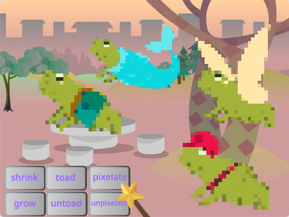

## ನಿಮ್ಮ ಪ್ರಾಜೆಕ್ಟ್‌ ಅಪ್‌ಗ್ರೇಡ್‌ ಮಾಡಿ

ನಿಮ್ಮ ಮಾಂತ್ರಿಕ ಜಗತ್ತನ್ನು ನೀವು ಹೇಗೆ ವಿಸ್ತರಿಸುತ್ತೀರಿ? ನೀವು:
+ ಇನ್ನಷ್ಟು ಪಾತ್ರಗಳನ್ನು ಸೇರಿಸಬಹುದು
+ ಮಾಂತ್ರಿಕ ದಂಡಕ್ಕೆ ಬೇರೆ ಬೇರೆ ಧ್ವನಿಗಳನ್ನು ಮತ್ತು ದೃಶ್ಯ ಪರಿಣಾಮಗಳನ್ನು ಸೇರಿಸಬಹದು.
+ ಇನ್ನಷ್ಟು ಮಂತ್ರಗಳನ್ನು ಸೇರಿಸಬಹುದು — ನೀವು `hide`{:class="block3looks"} ಮತ್ತು `show`{:class="block3looks"} ಗಳೊಂದಿಗೆ ಪಾತ್ರಗಳು ಮರೆಯಾಗುವಂತೆ ಮತ್ತು ಮತ್ತೆ ಕಾಣಿಸಿಕೊಳ್ಳುವಂತೆ ಮಾಡಬಹುದು, ದೃಶ್ಯ ಪರಿಣಾಮಗಳನ್ನು ಅನ್ವಯಿಸಬಹುದು ಅಥವಾ ಅವುಗಳನ್ನು ತಲೆಕೆಳಗಾಗಿ ತಿರುಗಿಸಬಹುದು.

ನೀವು ಗೆಳೆಯರೊಂದಿಗೆ ಪಾತ್ರಗಳನ್ನು ಏಕೆ ವಿನಿಮಯ ಮಾಡಿಕೊಳ್ಳಬಾರದು? ಮೊದಲಿಗೆ, ಪರಸ್ಪರ ಒಬ್ಬರಿಗೊಬ್ಬರ ಸ್ಪ್ರೈಟ್‌ಗಳನ್ನು ನೋಡಲು ಗೆಳೆಯನೊಂದಿಗೆ ಪ್ರಾಜೆಕ್ಟ್‌ ಲಿಂಕ್‌ ವಿನಿಮಯ ಮಾಡಿಕೊಳ್ಳಿ. ಅವರ ಸ್ಪ್ರೈಟ್‌ಗಳನ್ನು ಸೇವ್‌ ಮಾಡಲು, ನಿಮ್ಮ Scratch backpack ಉಪಯೋಗಿಸಿ ಅಥವಾ ಹಂಚಿಕೊಂಡ ಪ್ರದೇಶಕ್ಕೆ ಸ್ಪ್ರೈಟ್‌ಗಳನ್ನು ಡೌನ್‌ಲೋಡ್‌ ಮಾಡಿಕೊಳ್ಳಿ. ನಂತರ ನಿಮ್ಮ ಪ್ರಾಜೆಕ್ಟ್‌ಗೆ ಹಿಂತಿರುಗಿ ಮತ್ತು ಸೇವ್‌ ಮಾಡಿದ ಸ್ಪ್ರೈಟ್‌ಗಳನ್ನು ಸೇರಿಸಿ.

[[[scratch-backpack]]]

--- collapse ---
---
title: ಸ್ಪ್ರೈಟ್‌ನ್ನು ಡೌನ್‌ಲೋಡ್ ಮಾಡಿ
---

ನೀವು ನಿಮ್ಮ ಕಂಪ್ಯೂಟರ್‌ಗೆ ಸ್ಪ್ರೈಟ್‌ಗಳನ್ನು ನಿಮ್ಮ ಪ್ರಾಜೆಕ್ಟ್‌ನಿಂದ ಡೌನ್‌ಲೋಡ್‌ ಮಾಡಿಕೊಂಡು ಸೇವ್‌ ಮಾಡಬಹದು. Sprite ಲಿಸ್ಟ್‌ಲ್ಲಿ ಸ್ಪ್ರೈಟ್‌ ಮೇಲೆ ರೈಟ್‌-ಕ್ಲಿಕ್‌ ಮಾಡಿ export ಆಯ್ದುಕೊಳ್ಳಿ.

ಪ್ರಾಜೆಕ್ಟ್‌ಗೆ ಸ್ಪ್ರೈಟ್‌ ಲೋಡ್‌ ಮಾಡಲು, 'Choose a Sprite' ಮೆನುನಿಂದ 'Upload a Sprite' ಆಯ್ಕೆ ಮಾಡಿಕೊಳ್ಳಿ.

--- /collapse ---

ನಿಮ್ಮ ಗೆಳೆಯನೊಂದಿಗೆ ಹೆಚ್ಚು ಮಂತ್ರಗಳನ್ನು ರಚಿಸಿ ಮತ್ತು ಅವುಗಳನ್ನುನಿಮ್ಮ ಪಾತ್ರಗಳಿಗೆ ಸೇರಿಸಿ. ಯಾವ ಮಂತ್ರಗಳನ್ನು ರಚಿಸಬೇಕೆಂದು ತೀರ್ಮಾನಿಸಿ. ನೀವು ಪ್ರಸಾರ ಮಾಡುವ ಸಂದೇಶಗಳಿಗೆ ನಿವಿಬ್ಬರೂ ನಿಖರವಾಗಿ ಒಂದೇ ಹೆಸರನ್ನು ಉಪಯೋಗಿಸುವದನ್ನು ಖಚಿತಪಡಿಸಿಕೊಳ್ಳಿ.

--- collapse ---
---
title: ಪೂರ್ಣಗೊಂಡ ಪ್ರಾಜೆಕ್ಟ್
---

ನೀವು [ಇಲ್ಲಿ ಪೂರ್ಣಗೊಂಡ ಪ್ರಾಜೆಕ್ಟ್ ನೋಡಬಹುದು](https://scratch.mit.edu/projects/660079360/){:target="_blank"}.

--- /collapse ---

--- save ---
