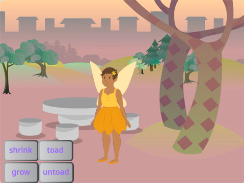
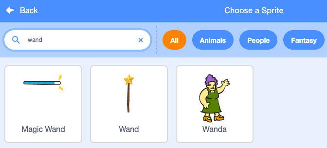

## तुमची कांडी निवडा

<div style="display: flex; flex-wrap: wrap">
<div style="flex-basis: 200px; flex-grow: 1; margin-right: 15px;">
या टप्प्यात, तुम्ही सीन तयार कराल, तुमची कांडी निवडा आणि तुमची स्वतःची कंप्युटर-निर्मीत जादू तयार करा.
  
</div>
<div>
{:width="300px"}
</div>
</div>

<p style="border-left: solid; border-width:10px; border-color: #0faeb0; background-color: aliceblue; padding: 10px;">
<span style="color: #0faeb0">**Computer-generated imagery (CGI)**</span> चा वास्तव जगात घडणार नाही असे विशेष परिणाम तयार करण्यासाठी वापर केला जाऊ शकतो. आधुनिक कल्पनारम्य मूवी किंवा ऍनिमेशन तयार करण्यामध्ये भरपूर कोड आणि कंप्युटर आर्टचा समावेश असतो.
</p>

--- task ---

[स्पेल्स स्टार्टर प्रोजेक्ट ब्रॉडकास्ट करणे](https://scratch.mit.edu/projects/518441891/editor){:target="_blank"} उघडा. Scratch दुसऱ्या ब्राऊजर टॅब मध्ये उघडेल.

[[[working-offline]]]

--- /task ---

--- task ---

तुम्हाला जंगलात एक परी दिसायला हवी.



--- /task ---

तुम्हाला स्पेल कास्ट करण्यासाठी कांडीची आवश्यकता आहे.

--- task ---

**Choose a Sprite** वर क्लिक करा आणि सर्च बॉक्समध्ये `wand` टाईप करा:




**निवडा:** तुमच्या आवडती कांडी तुमच्या प्रोजेक्टमध्ये जोडा.

--- /task ---

--- task ---

**Wand** स्प्राईट तयार करण्यासाठी कोड जोडा `mouse pointer`{:class="block3motion"} फॉलो करा आणि बटनच्या `front`{:class="block3looks"} रहा:


```blocks3
when flag clicked
forever
go to (mouse-pointer v) //'random position' मधून बदला     
go to [front v] layer // बटनच्या समोर
end
```

--- /task ---

--- task ---

**चाचणी:** तुमचा प्रोजेक्ट रन करण्यासाठी हिरव्या झेंड्यावर क्लिक करा. कांडी तुमच्या माऊस पॉइंटरला फॉलो करेल.

--- /task ---

तुम्ही खरोखरच वापरत आहात याप्रमाणे कांडी मोठी आणि तिरपी करा.

--- task ---

Sprite pane वर जा आणि कांडी मोठी करण्यासाठी **Size** प्रॉपर्टी `200` मध्ये बदला:


--- /task ---

--- task ---

Paint एडिटरमध्ये Wand कॉश्चुम उघडण्यासाठी **Costumes** टॅबवर क्लिक करा.

**Select** (ऍरो) टूलवर क्लिक करा आणि त्यानंतर कॉश्चुमचे सर्व भाग निवडण्यासाठी पूर्ण कांडी भोवती आयत काढा.


त्यानंतर कांडीचे भाग एकत्र करण्यासाठी **Group** आयकॉनवर क्लिक करा.


--- /task ---

--- task ---

कांडीला कोनात पोजिशन करण्यासाठी **Rotate** टूल वापरा.


**टीप:** तुम्हाला **Rotate** टूल दिसू शकला नाही, तर झूम आऊट करण्यासाठी Paint एडिटरच्या खालील **Zoom out** (-) टूलवर क्लिक करा.

--- /task ---

तुम्ही बटनवर क्लिक करण्याचा प्रयत्न करता तेव्हा **Wand** कॉश्चुम माऊस कर्सरच्या मार्गात येतो.

--- task ---

कांडी हलवा जेणेकरून तीचे टोक मध्यभागी असलेल्या क्रॉसहेअरच्या दूर असेल.


--- /task ---

--- task ---

**चाचणी:** हिरव्या झेंड्यावर क्लिक करा आणि Stage च्या भोवती माऊस फिरवा. कांडीने फॉलो करावे.

--- /task ---

--- task ---

तुम्ही तुमच्या Scratch अकाऊंटला साइन इन केल्यावर, हिरव्या Remix बटनवर क्लिक करा. यामुळे तुमच्या प्रोजेक्टची कॉपी तुमच्या Scratch अकाऊंटला सेव होईल.


तुम्ही तुमच्या प्रोजेक्टचे शीर्षक बदलवू शकता.


**टीप:** तुमच्या प्रोजेक्टला उपयुक्त नावे द्या जेणेकरून तुमच्याकडे भरपूर प्रोजेक्ट असल्यावर तुम्ही तो सहजतेने शोधू शकता.

तुमच्याकडे Scratch अकाऊंट नसल्यास, तुम्ही प्रोजेक्टची कॉपी सेव करण्यासाठी **File** वर क्लिक करून त्यानंतर **Save to your computer** करू शकता.

--- /task ---

--- save ---
