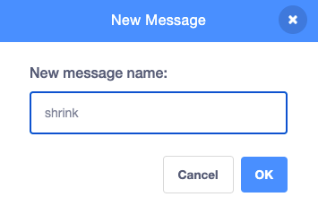
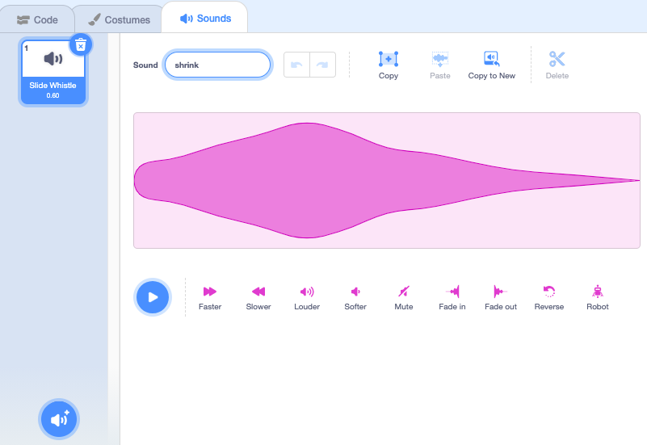

## स्पेल श्रींक करा

<div style="display: flex; flex-wrap: wrap">
<div style="flex-basis: 200px; flex-grow: 1; margin-right: 15px;">
तुम्ही shrink बटनवर क्लिक केल्यावर आता तुम्हाला श्रींक करण्यासाठी परी मिळेल.
</div>
<div>
{:width="300px"}
</div>
</div>

--- task ---

Stage च्या खालील Sprite लीस्टमध्ये **shrink** स्प्राईटवर क्लिक करा.

`when this sprite clicked`{:class="block3events"} ब्लॉक जोडा:


```blocks3
when this sprite clicked
```

--- /task ---

तुम्ही shrink बटनवर क्लिक केल्यावर, तुम्हाला **Fairy** स्प्राईट श्रींक करण्यासाठी हवा आहे.

**shrink** स्प्राईटला `broadcast`{:class="block3events"} `message`{:class="block3events"} करण्याची आवश्यकता आहे जेणेकरून **Fairy** स्प्राईटला माहिती असते की shrink स्पेल कास्ट केल्या गेला आहे.

--- task ---

`broadcast`{:class="block3events"} ब्लॉक जोडा:


```blocks3
when this sprite clicked
+ broadcast (message1 v)
```

--- /task ---

--- task ---

`message1`{:class="block3events"} वर क्लिक करा आणि 'New message' निवडा. नवीन मेसेजला नाव द्या `shrink`.



आपला कोड असा दिसला पाहिजे:


```blocks3
when this sprite clicked
broadcast (shrink v)
```

--- /task ---

आता, जेव्हा तुम्ही **shrink** बटनवर क्लिक करता, Scratch `broadcast`{:class="block3events"} करेल `shrink`{:class="block3events"} मेसेज, परंतु काहीही होणार नाही.

--- task ---

श्रींक करण्यासाठी **Fairy** स्प्राईटला कोड जोडा जेव्हा त्याला`shrink`{:class="block3events"} मेसेज प्राप्त होतो:


```blocks3
when I receive [shrink v]
change size by [-10] // negative numbers decrease the size
```

--- /task ---

--- task ---

**चाचणी:** **shrink** बटनवर क्लिक करा **Fairy** स्प्राईट श्रींक करण्यासाठी. हे तुम्हाला पाहिजे तितक्या वेळा करा.

**डीबग:** जर तुमचा **Fairy** स्प्राईट shrinks ऐवजी grows असल्यास, वजा `-` जोडा संख्या `10` च्या आधी ऋण संख्या `-10` तयार करण्यासाठी.

--- /task ---

--- task ---

**Fairy** स्प्राईट सेट करण्यासाठी `when the green flag`{:class="block3events"} क्लिक केल्यावर सामान्य साईजला स्क्रिप्ट जोडा:


```blocks3
when flag clicked
set size to [100] %
```

--- /task ---

मेसेज जेव्हा `broadcast`{:class="block3events"} असतात तेव्हा ते सर्व स्प्राईट्स कडून प्राप्त होऊ शकतात. जेव्हा **Wand** `receives`{:class="block3events"} `shrink`{:class="block3events"} मेसेज तो `play a sound`{:class="block3sound"}.

--- task ---

**Wand** स्प्राईटवर आणि त्यानंतर **Sounds** टॅबवर क्लिक करा.

**Slide Whistle** साऊंड जोडा.

`shrink` असे रीनेम करा जेणेकरून तो शोधण्यास सोपा होईल.




--- /task ---

--- task ---

साऊंड प्ले करण्यासाठी स्क्रिप्ट जोडा:


```blocks3
when I receive [shrink v]
play sound [shrink v] until done

```

--- /task ---

--- task ---

**चाचणी:** तुमचा प्रोजेक्ट रन करण्यासाठी हिरव्या झेंड्यावर क्लिक करा. साऊंड ऐकण्यासाठी **shrink** बटनवर क्लिक करा आणि **Fairy** श्रींक बघा.

--- /task ---

**shrink** बटन `broadcast`{:class="block3events"} `shrink`{:class="block3events"} मेसेज. **Fairy** आणि **Wand** स्प्राईट दोन्हींना `received`{:class="block3events"} मेसेज आणि उत्तर दिले.

--- save ---
