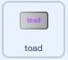

## टोड परिवर्तन

<div style="display: flex; flex-wrap: wrap">
<div style="flex-basis: 200px; flex-grow: 1; margin-right: 15px;">
आता ही दुसऱ्या स्पेलची वेळ आहे. `toad`{:class="block3events"} मेसेज ब्रॉडकास्ट करून परिवर्तन स्पेल कास्ट करण्याची ही वेळ आहे जो **Fairy** स्प्राईटला toad मध्ये वळवतो! 

कदाचित ती एक साहसी कार्य करत आहे जिथे एक toad बनणे अधिक उपयुक्त असेल.
</div>
<div>
{:width="300px"}
</div>
</div>

--- task ---

'toad' मेसेज ब्रॉडकास्ट करण्यासाठी **toad** बटन स्प्राईटला स्क्रिप्ट जोडा:



```blocks3 
when this sprite clicked
broadcast [toad v]
```

--- /task ---

--- task ---

**Fairy** स्प्राईट निवडा आणि **Costumes** टॅबवर क्लिक करा.

**Fairy** स्प्राईट टोडमध्ये परिवर्तन करण्यासाठी तुम्ही **Fairy-a** आणि **Fairy-toad-a** कॉश्चुम वापराल.


--- /task ---

--- task ---

**Code** टॅबवर क्लिक करा आणि `switch costume to`{:class="block3looks"} ब्लॉक तुमच्या आधीच्या `when flag clicked`{:class="block3events"} स्क्रिप्टच्या शेवटी जोडा जेणेकरून जेव्हा तुम्ही तुमचा प्रोजेक्ट रन करता तेव्हा परी मानवी रूपात असेल:


```blocks3
when flag clicked
set size to [100] %
+ switch costume to [Fairy-a v]
```

--- /task ---

--- task ---

टोड मध्ये वळवण्यासाठी नवीन स्क्रिप्ट **Fairy** स्प्राईटला जोडा:


```blocks3  
when I receive [toad v]
switch costume to [Fairy-toad-a v]
```

--- /task ---

--- task ---

**Croak** साऊंड **Wand** स्प्राईटला जोडा.

`toad` असे रीनेम करा:


--- /task ---

--- task ---

**Wand** स्प्राईटला toad स्पेल कास्ट केल्यावर स्क्रिप्ट जोडा `toad`{:class="block3sound"} साऊंड प्ले करण्यासाठी:


```blocks3  
when I receive [toad v]
play sound [toad v] until done
```

--- /task ---

--- task ---

**चाचणी:** तुम्ही **Fairy** toad मध्ये साऊंड इफेक्टसह रूपांतरीत करू शकता का याची चाचणी करा, जेव्हा तुम्ही **toad** बटनवर क्लिक करता. **Fairy** स्प्राईट मानवामध्ये परत वळवण्यासाठी हिरव्या झेंड्यावर क्लिक करा.


--- /task ---

'toad' स्पेलचे विरूद्ध 'untoad' स्पेल आहे.

--- task ---

**untoad** बटन स्प्राईटला स्क्रिप्ट जोडा `broadcast`{:class="block3events"} 'untoad'{:class="block3events"} मेसेजसाठी:


```blocks3 
when this sprite clicked
broadcast [untoad v]
```

--- /task ---

--- task ---

`untoad`{:class="block3events"} **Fairy** स्प्राईटसाठी नवीन स्क्रिप्ट जोडा:


```blocks3  
when I receive [untoad v]
switch costume to [Fairy-a v]
```

--- /task ---

--- task ---

**Wand** स्प्राईट निवडा आणि **Sounds** टॅबला बदला.

**Duplicate** करा **toad** साऊंड आणि त्याला `untoad` असे रीनेम करा.

**Reverse** आयकॉनवर क्लिक करा जेणेकरून **untoad** साऊंड मागे प्ले करेल.


--- /task ---

--- task ---

**Wand** स्प्राईटला स्क्रिप्ट जोडा `untoad`{:class="block3sound"} साऊंड प्ले करण्यासाठी:


```blocks3  
when I receive [untoad v]
play sound [untoad v] until done
```

--- /task ---

--- task ---

**चाचणी:** **toad** आणि **untoad** स्पेल्सचा प्रयत्न करा, आणि प्रयत्न करा **shrink** आणि **grow** जेव्हा **Fairy** toad रूपात असते.

--- /task ---

--- save ---
