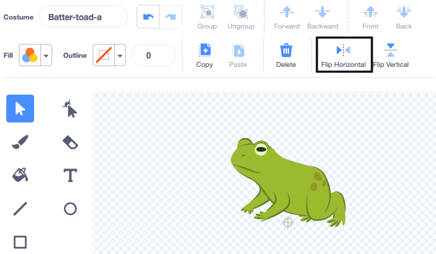

## दुसरे कॅरेक्टर जोडा

स्पेलला प्रतिसाद देण्यासाठी तुमच्या आवडीचा एक स्प्राइट मिळवा. तुम्ही स्प्राईटसाठी टोड कॉश्चुम मॅश-अप तयार करण्याची आणि कोड जोडण्याची आवश्यकता असेल जेणेकरून स्पेल मेसेज ब्रॉडकास्ट झाल्यावर कॉश्चुम बदलेल.

{:width="300px"}

--- task ---

**Fairy** स्प्राईट डुप्लीकेट करा.

**Fairy-a** आणि **Fairy-toad-a** कॉश्चुम डिलीट करा. तुमच्याकडे **toad** कॉश्चुम शिल्लक असेल.

**नवीन स्प्राईट** ला तुमच्या आवडीचा कॉश्चुम जोडा.

आपण **Batter** निवडलात:

स्प्राईट ज्या दिशेकडे निर्देश करत आहे ती तुम्हाला बदलायची असेल.

**टीप:** तुमचा स्प्राईट वरच्या भागात खाली जात असल्यास तुम्ही त्याची `rotation-style`{:class="block3motion"} हे Sprite properties pane मध्ये `left-right`{:class="block3motion"} बदलवू शकता किंवा कोड ब्लॉकचा वापर करू शकता.

--- /task ---

तुम्ही स्प्राईटला ग्रो किंवा श्रींक करता तेव्हा तुम्हाला त्याच ठिकाणी रहाण्यासाठी पाय हवे असतात.

--- task ---

प्रथम कॉश्चुम भोवती आयत काढण्यासाठी **Select** (ऍरो) टूल वापरा त्यानंतर तो **Group** करा. त्यानंतर क्रॉसहेअरच्या वर तुमचे कॅरेक्टर ड्रॅग करा.

--- /task ---

--- task ---

**toad** कॉश्चुमवर क्लिक करा.

तुमचा स्प्राईट जुळवण्यासाठी कॉश्चुम रीनेम करा, आपण **Batter-toad-a** वापरले.

--- /task ---

--- task ---

Toad कॉश्चुम मुख्य कॉश्चुमच्या विरूद्ध दिशेत असल्यास तुम्ही वापरू शकता **Flip Horizontal**.

--- /task ---

आता, तुम्हाला कॅरेक्टरसारखे दिसणारे टोड बनवायची आवश्यकता आहे. याप्रमाणे दोन कॉश्चुम एकत्र करण्याला 'मॅश-अप' म्हणतात.

--- task ---

तुम्ही काही तपशील जोडू शकता, जसेकी, रंगांचा शिडकावा, किंवा सनग्लासेस कॉपी आणि पेस्ट किंवा Paint एडिटर मध्ये हॅट.

**टीप:** तुम्ही कॅरेक्टर स्प्राईटला कोणताही कॉश्चुम जोडू शकता. **Select** (ऍरो) टूल वापरा त्यानंतर **Copy** किंवा **Paste** वर क्लिक करा.

**टीप:** तुम्ही कॉश्चुममधील सर्व वस्तू ग्रुप करू शकता. (**Select** टूल किंवा <kbd> Ctrl-a</kbd>सह) ते निवडा आणि त्यानंतर **Group** वर क्लिक करा.

आमचा Batter toad यासारखा दिसतो: 

--- /task ---

--- task ---

तुमच्या नवीन स्प्राईटसाठी **Code** टॅबला बदला.

तुमच्या नवीन स्प्राईटसाठी योग्य कॉश्चुम वापरण्यासाठी `switch costume`{:class="block3looks"} सर्व ब्लॉक्स बदला.

तुम्हाला कदाचीत स्प्राईटचा सुरूवात `size`{:class="block3looks"} बदलायचा असू शकतो `when green flag clicked`{:class="block3events"}.

--- /task ---

--- task ---

**चाचणी:** स्पेल बटनवर क्लिक करा - दोन्ही कॅरेक्टरने स्पेल ब्रॉडकास्टला प्रतिसाद द्यायला हवा.

**डीबर:** तुमच्या नवीन स्प्राईटसाठी तुम्ही `switch costume`{:class="block3looks"} ब्लॉक्समधील कॉश्चुम बदलले का ते तपासा.

--- /task ---

--- save ---
