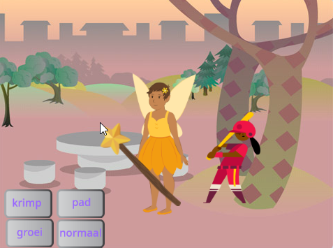

## You will make

Maak een app waarin je een toverstaf gebruikt om sprites in padden te veranderen en ze te laten groeien en verkleinen.

Je gaat:
+ Knoppen maken die berichten `uitzenden`{:class="block3events"} naar andere sprites
+ Meerdere sprites laten reageren wanneer ze hetzelfde bericht `ontvangen`{:class="block3events"}
+ De `geluiden`{:class="block3sound"}-editor gebruiken om een geluid om te keren

**Broadcasting** and **receiving** messages is like a **call and response** pattern in music.
 
 
  "P3T3 P3T3 is een traditioneel lied uit Ghana, West-Afrika. It is performed by one lead person who **calls** and a group that **respond** by repeating a key phrase when they hear the call." - Kwame Bakoji-Hume, Afrikaanse activiteiten CIC

<audio controls><source src="images/Pete-Pete.mp3" type="audio/wav"></audio>  

--- no-print ---

### Play ▶️

--- task ---

  
Gebruik de toverstaf om op de knoppen te klikken en spreuken uit te spreken. Wat doet elke spreuk met de personages?

  <iframe allowtransparency="true" width="485" height="402" src="https://scratch.mit.edu/projects/embed/518413238/?autostart=false" frameborder="0"></iframe>

--- /task--- --- /no-print ---

--- print-only ---

--- /print-only ---

