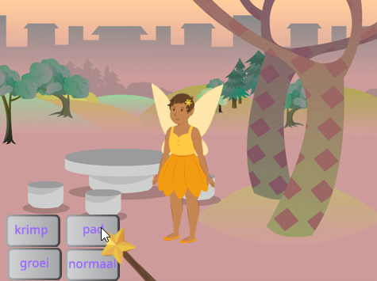
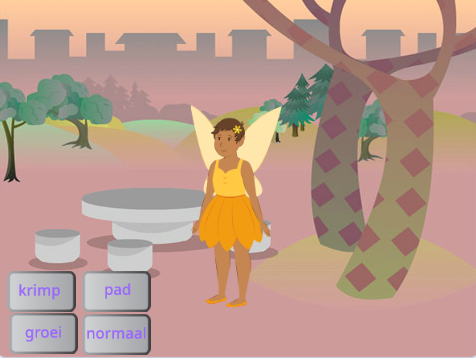
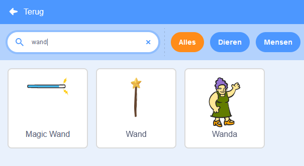
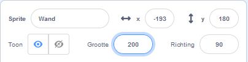
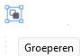
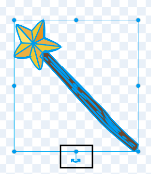
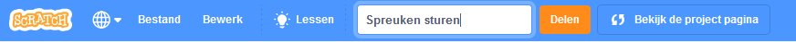

## Kies je toverstaf

<div style="display: flex; flex-wrap: wrap">
<div style="flex-basis: 200px; flex-grow: 1; margin-right: 15px;">
In deze stap maak je het speelveld, kies je je toverstaf en creëer je je eigen door de computer gegenereerde magie.
  
</div>
<div>
{:width="300px"}
</div>
</div>

<p style="border-left: solid; border-width:10px; border-color: #0faeb0; background-color: aliceblue; padding: 10px;">
<span style="color: #0faeb0">**Computer-generated imagery (CGI)**</span> (computer-generereerd afbeeldingen) kan worden gebruikt om speciale effecten te creëren die in de echte wereld niet voorkomen. Bij het maken van een moderne fantasiefilm of animatie komt veel code en computerkunst kijken.
</p>

--- task ---

Open het [Zend spreuken start-project](https://scratch.mit.edu/projects/518441891/editor){:target="_blank"}. Scratch wordt in een nieuw browsertabblad geopend.

[[[working-offline]]]

--- /task ---

--- task ---

Je zou een fee in een bos moeten zien.



--- /task ---

Je hebt een toverstaf nodig om een spreuk uit te spreken.

--- task ---

Klik op **Kies een Sprite** en typ `wand` (toverstaf) in het zoekvak:




**Kies:** Voeg de toverstaf die je wilt gebruiken toe aan je project.

--- /task ---

--- task ---

Voeg code toe om ervoor te zorgen dat de **Wand** sprite de `muisaanwijzer`{:class="block3motion"} volgt en `voor`{:class="block3looks"} de knoppen blijft:


```blocks3
when flag clicked
forever
go to (mouse-pointer v) //wijzigen van 'willekeurige positie'     
go to [front v] layer // voor de knoppen
end
```

--- /task ---

--- task ---

**Test:** Klik op de groene vlag om je project uit te voeren. De toverstaf volgt je muisaanwijzer.

--- /task ---

Maak de toverstaf groter en kantel hem, alsof je hem echt gebruikt.

--- task ---

Ga naar het Sprite-paneel en verander de eigenschap **Grootte** in `200` om de toverstaf groter te maken:



--- /task ---

--- task ---

Klik op het tabblad **Uiterlijken** om het toverstok uiterlijk te openen in de Teken-editor.

Klik op het gereedschap **Selecteer** (pijl) en teken vervolgens een rechthoek rond de hele toverstaf om alle onderdelen van het uiterlijk te selecteren.


Klik vervolgens op het **Groep**-pictogram om de toverstaf onderdelen te combineren.



--- /task ---

--- task ---

Gebruik het gereedschap **Draaien** op de toverstaf onder een hoek te plaatsen.



**Tip:** Als je het gereedschap **Draaien** niet kunt zien, klik je op het gereedschap **Uitzoomen** (-) onder aan de Teken-editor om uit te zoomen.

--- /task ---

Het **Wand**-uiterlijk zit de muiscursor in de weg wanneer je op de knoppen probeert te klikken.

--- task ---

Verplaats de toverstaf zodanig de punt net niet op het dradenkruis in het midden staat.


--- /task ---

--- task ---

**Test:** Klik op de groene vlag en beweeg de muis over het toneel. De toverstaf moet volgen.

--- /task ---

--- task ---

Als je bent ingelogd op je Scratch-account, klik je op de groene Remix-knop. Hiermee wordt een kopie van het project opgeslagen in je Scratch-account.


Je kunt de titel van je project wijzigen.



**Tip:** Geef je projecten nuttige namen zodat je ze gemakkelijk terug kunt vinden als je veel projecten hebt.

Als je geen Scratch-account hebt, kunt je klikken op **Bestand** en vervolgens op **Opslaan op je computer** om een kopie van het project op te slaan.

--- /task ---

--- save ---
