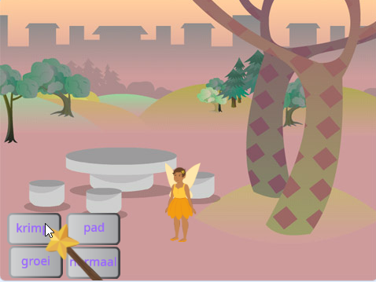
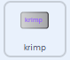
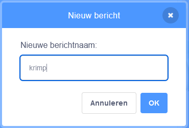
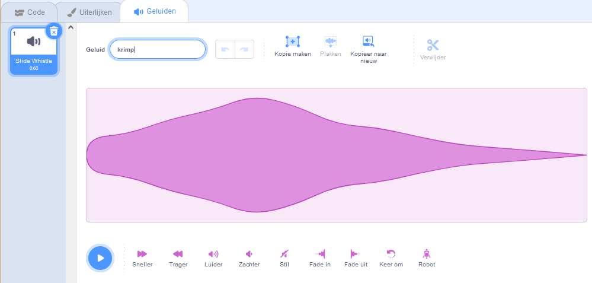

## De krimpspreuk

<div style="display: flex; flex-wrap: wrap">
<div style="flex-basis: 200px; flex-grow: 1; margin-right: 15px;">
Nu laat je de Fairy (fee) krimpen als je op de krimpknop klikt.
</div>
<div>
{:width="300px"}
</div>
</div>

--- task ---

Klik op de sprite **krimp** in de Sprite lijst onder het werkgebied.

Voeg een `wanneer op deze sprite wordt geklikt`{:class="block3events"} blok toe:



```blocks3
when this sprite clicked
```

--- /task ---

Als je op de krimpknop klikt, wil je dat de sprite **Fairy** krimpt.

De **krimp** sprite moet een `signaal zenden`{:class="block3events"} met een `bericht`{:class="block3events"} zodat de sprite **Fairy** weet dat de krimpspreuk is uitgesproken.

--- task ---

Voeg een `zend signaal`{:class="block3events"} blok toe:


```blocks3
when this sprite clicked
+ broadcast (message1 v)
```

--- /task ---

--- task ---

Klik op `bericht1`{:class="block3events"} en kies 'Nieuw bericht'. Geef het nieuwe bericht de naam `krimp`.



Je code zou er als volgt uit moeten zien:


```blocks3
when this sprite clicked
broadcast (krimpen v)
```

--- /task ---

Als je nu op de **krimp** knop klikt, `verzendt`{:class="block3events"} Scratch een `krimp`{:class="block3events"} bericht, maar er gebeurt nog niets.

--- task ---

Voeg code toe aan de **Fairy** sprite om te verkleinen wanneer deze een `krimp`{:class="block3events"} bericht ontvangt:


```blocks3
when I receive [krimpen v]
change size by [-10] // negatieve getallen verkleinen de grootte
```

--- /task ---

--- task ---

**Test:** Klik op de knop **krimp** om de sprite **Fairy** te verkleinen. Doe dit zo vaak als je wilt.

**Debuggen:** Als je **Fairy** sprite groeit in plaats van krimpt, voeg dan een min `-` teken toe voor het getal `10` om een negatief getal `-10` te maken.

--- /task ---

--- task ---

Voeg een script toe om de sprite **Fairy** in te stellen op normale grootte `wanneer op de groene vlag`{:class="block3events"} wordt geklikt:


```blocks3
when flag clicked
set size to [100] %
```

--- /task ---

Wanneer berichten worden`verzonden`{:class="block3events"}, kunnen ze door alle sprites worden ontvangen. Wanneer de **toverstaf** ``{:class="block3events"} het`krimp`{:class="block3events"}-bericht ontvangt, moet het`een geluid`{:class="block3sound"} afspelen.

--- task ---

Klik op de **Wand** sprite en vervolgens op het tabblad **Geluiden**.

Voeg het **Slide Whistle**-geluid toe.

Hernoem het geluid naar `krimp` zodat het gemakkelijk te vinden is.




--- /task ---

--- task ---

Voeg een script toe om het geluid af te spelen:


```blocks3
when I receive [krimpen v]
play sound [krimpen v] until done

```

--- /task ---

--- task ---

**Test:** Klik op de groene vlag om je project uit te voeren. Klik op de **krimp** knop om het geluid te horen en zie de **Fairy** krimpen.

--- /task ---

De **krimp** knop `zendt`{:class="block3events"} een `krimp`{:class="block3events"} bericht uit. Zowel de **Fairy** als de **Wand** sprite `ontvingen`{:class="block3events"} het bericht en reageerden.

--- save ---
