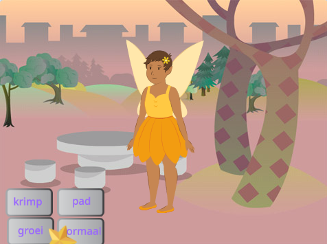
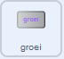
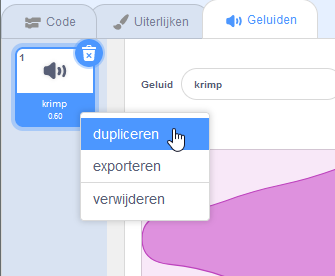
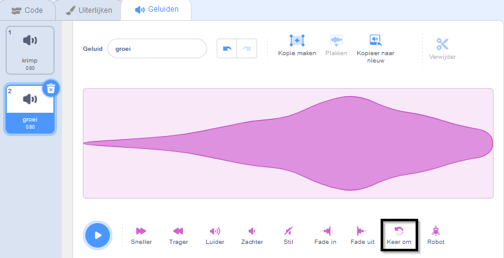

## De groeispreuk

<div style="display: flex; flex-wrap: wrap">
<div style="flex-basis: 200px; flex-grow: 1; margin-right: 15px;">
Je hebt ook een groeispreuk nodig om de **Fee** sprite weer normaal te maken of om een enorme fee te maken!
</div>
<div>
{:width="300px"}
</div>
</div>

**Tip:** In deze stap voeg je code toe aan drie verschillende sprites. Zorg ervoor dat je de juiste sprite selecteert in de Sprite-lijst onder het speelveld en klik op het tabblad **Code**.

--- task ---

Voeg een script toe aan het **groei**-knop sprite om een `groei`{:class="block3events"} bericht te `verzenden`{:class="block3events"}:



```blocks3
when this sprite clicked
broadcast (grow v)
```

--- /task ---

--- task ---

Voeg een script toe om de sprite **Fairy** te laten groeien:


```blocks3
when I receive [grow v]
change size by [10] // positive numbers increase the size
```

--- /task ---

Je kunt het 'krimp'-geluid omkeren om een 'groei'-geluid te maken!

<p style="border-left: solid; border-width:10px; border-color: #0faeb0; background-color: aliceblue; padding: 10px;">
<span style="color: #0faeb0">**Liedjes achterstevoren gespeeld quizzen**</span> zijn muziekquizzen met een twist. De nummers zijn omgekeerd en de deelnemers moeten het originele nummer raden - het is niet zo eenvoudig als het klinkt. 
</p>

--- task ---

Selecteer de **Wand** sprite en klik op het tabblad **Geluiden**.

Klik met de rechtermuisknop (of tik en houd vast) op het **krimp** geluid en kies **dupliceren**.




Noem de kopie `groei`.

Klik op het **Keer om** pictogram om het geluid achteruit af te spelen.



--- /task ---

--- task ---

Voeg een script toe aan de **Wand**-sprite om het `groei`{:class="block3sound"}-geluid af te spelen wanneer het `groei`{:class="block3events"}-bericht wordt ontvangen:


```blocks3
when I receive [grow v]
play sound [grow v] until done
```

--- /task ---

--- task ---

**Test:** Klik op de **krimp** en **groei** knoppen om de spreuken zo vaak uit te spreken als je wilt.

--- /task ---

--- save ---

