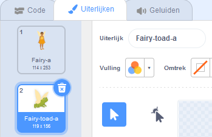

## Pad transformatie

<div style="display: flex; flex-wrap: wrap">
<div style="flex-basis: 200px; flex-grow: 1; margin-right: 15px;">
Nu is het tijd voor een andere spreuk. Deze keer ga je een transformatiespreuk uitspreken door een `pad`{:class="block3events"}-bericht uit te zenden dat de **Fee** sprite in een pad verandert! 

Misschien gaat ze op avontuur waar het nuttiger is om een pad te zijn.
</div>
<div>
{:width="300px"}
</div>
</div>

--- task ---

Voeg een script toe aan de **pad**-knop sprite om het 'pad'-bericht uit te zenden:


```blocks3 
when this sprite clicked
broadcast [pad v]
```

--- /task ---

--- task ---

Selecteer de **pad** sprite en klik op het tabblad **Uiterlijken**.

Om de **Fairy** sprite in een pad te veranderen, gebruik je **Fairy-a** en **Fairy-toad-a** uiterlijken.



--- /task ---

--- task ---

Klik op het **Code**-tabblad en voeg een `verander uiterlijk naar`{:class="block3looks"}-blok toe aan het einde van je bestaande `wanneer op de vlag wordt geklikt`{:class="block3events"}-script zodat de Fee een normaal uiterlijk krijgt wanneer je jouw project uitvoert:


```blocks3
when flag clicked
set size to [100] %
+ switch costume to [Fairy-a v]
```

--- /task ---

--- task ---

Voeg een nieuw script toe aan de **Fairy** sprite om in een pad te veranderen:


```blocks3  
when I receive [pad v]
switch costume to [Fairy-toad-a v]
```

--- /task ---

--- task ---

Voeg het **Croak** geluid toe aan de **Wand** sprite.

Hernoem het geluid naar `pad`:


--- /task ---

--- task ---

Voeg een script toe aan de **Wand** sprite om het `pad`{:class="block3sound"}-geluid af te spelen wanneer de pad spreuk wordt uitgezonden:


```blocks3  
when I receive [pad v]
play sound [pad v] until done
```

--- /task ---

--- task ---

**Test:** Test dat je de **Fairy** in een pad kunt veranderen, met een geluidseffect, als je op de **pad**-knop klikt. Klik op de groene vlag om de **Fairy** sprite weer in een mens te veranderen.


--- /task ---

Het tegenovergestelde van een 'pad'-spreuk is een 'normaal'-spreuk.

--- task ---

Voeg een script toe aan de **normaal**-knop sprite om het 'normaal'{:class="block3events"} bericht `te verzenden`{:class="block3events"}:


```blocks3 
when this sprite clicked
broadcast [normaal v]
```

--- /task ---

--- task ---

Voeg een nieuw script toe om de **Fairy** sprite weer `normaal`{:class="block3events"} te laten worden:


```blocks3  
when I receive [normaal v]
switch costume to [Fairy-a v]
```

--- /task ---

--- task ---

Selecteer de **Wand** sprite en ga naar het tabblad **Geluiden**.

**Dupliceer** het **pad** geluid en hernoem het naar `normaal`.

Klik op het **Keer om** pictogram zodat het **pad** geluid achterstevoren wordt afgespeeld.


--- /task ---

--- task ---

Voeg een script toe aan de **Wand** sprite om het `normaal`{:class="block3sound"} geluid af te spelen wanneer de normaal spreuk wordt uitgezonden:


```blocks3  
when I receive [normaal v]
play sound [normaal v] until done
```

--- /task ---

--- task ---

**Test:** Probeer de **pad** en **normaal** spreuken en probeer **krimp** en **groei** wanneer de **Fee** de pad-vorm heeft.

--- /task ---

--- save ---
