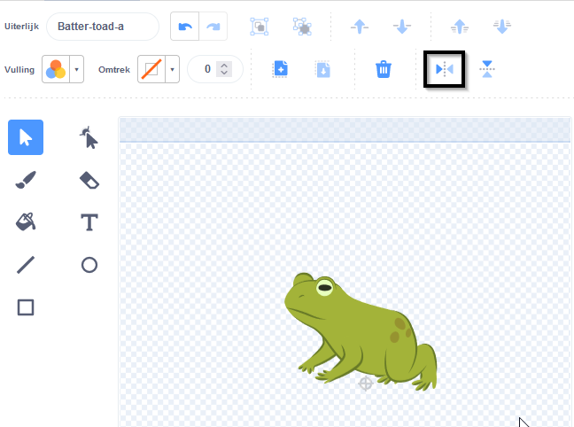

## Voeg nog een personage toe

Gebruik een sprite naar keuze om op de spreuken te reageren. Je moet een padden uiterlijk 'samenstellen' voor de sprite en code toevoegen zodat het uiterlijk verandert wanneer de spreuk-berichten worden uitgezonden.

{:width="300px"}

--- task ---

Dupliceer de **Fairy** sprite.

Verwijder de **Fairy-a** en **Fairy-toad-a** uiterlijken. Er blijft een **toad** uiterlijk over.

Voeg een uiterlijk naar keuze toe aan de **nieuwe sprite**.

We kozen voor een **Batter** (slagman):

Misschien wil je de richting waarin de sprite wijst veranderen.

**Tip:** Als je sprite ondersteboven gaat, kun je de `draaistijl`{:class="block3motion"} veranderen in `links-rechts`{:class="block3motion"} in het Sprite-eigenschappen venster of met een code-blok.

--- /task ---

Wanneer je een sprite laat groeien of krimpen, wil je dat de voeten op dezelfde plek blijven.

--- task ---

Gebruik eerst het gereedschap **Selecteren** (pijl) om een rechthoek rond het uiterlijk te tekenen en **Groepeer** het vervolgens. Sleep vervolgens je personage boven het dradenkruis.

--- /task ---

--- task ---

Klik op het **toad** uiterlijk.

Hernoem het uiterlijk zodat het overeenkomt met je sprite, we gebruikten **Batter-toad-a**.

--- /task ---

--- task ---

Als het padden-uiterlijk in de tegenovergestelde richting van het beginuiterlijk staat, kun je **links rechts omdraaien**gebruiken.

--- /task ---

Nu moet je de pad op het personage laten lijken. Het op deze manier combineren van twee kostuums wordt een 'mash-up' genoemd.

--- task ---

Je kunt een klein detail toevoegen, zoals een andere kleur, of een zonnebril of hoed kopiëren en plakken in de Teken-editor.

**Tip:** Je kunt elk uiterlijk aan je personage-sprite toevoegen. Gebruik het gereedschap **Selecteren** (pijltje) en klik vervolgens op **Kopie maken** of **Plakken**.

**Tip:** Je kunt alle objecten in een uiterlijk groeperen. Selecteer ze (met de tool **Selecteren** of <kbd> Ctrl-a</kbd>) en klik vervolgens op **Groeperen**.

Onze slagman-pad ziet eruit als: 

--- /task ---

--- task ---

Schakel over naar het tabblad **Code** voor je nieuwe sprite.

Verander alle `verander uiterlijk naar`{:class="block3looks"} blokken om de juiste uiterlijken voor je nieuwe sprite te gebruiken.

Misschien wil je ook de start `grootte`{:class="block3looks"} van de sprite wijzigen `wanneer op de groene vlag`{:class="block3events"} wordt geklikt.

--- /task ---

--- task ---

**Test:** Klik op de spreuk knoppen — beide personages zouden moeten reageren op de spreuk-uitzendingen.

**Debuggen:** Controleer of je de uiterlijken in de `verander uiterlijk naar`{:class="block3looks"} blokken voor je nieuwe sprite hebt gewijzigd.

--- /task ---

--- save ---
