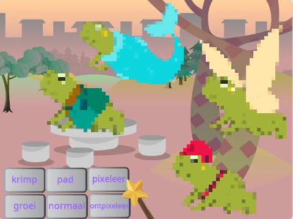
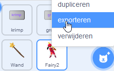
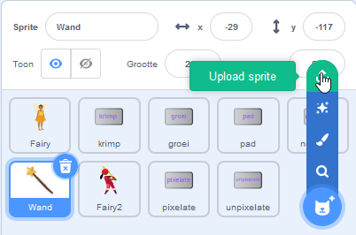

## Verbeter je project

Hoe ga je je magische wereld uitbreiden? Je zou:
+ Meer sprites kunnen toevoegen
+ Verschillende geluids- en visuele effecten toevoegen aan de toverstaf.
+ Meer spreuken toevoegen — je zou sprites kunnen laten verdwijnen en weer laten verschijnen met `verdwijn`{:class="block3looks"} en `verschijn`{:class="block3looks"}, visuele effecten toepassen of ze ondersteboven zetten.

Waarom ruil je geen sprites met een vriend? Wissel eerst projectlinks uit met een vriend om elkaars sprites te zien. Om hun sprites op te slaan, gebruik je je Scratch-rugzak of download je de sprites naar een gedeeld gebied. Ga dan terug naar je project en voeg de opgeslagen sprites toe.

[[[scratch-backpack]]]

--- collapse ---
---
title: Download een sprite
---

Je kunt sprites op je computer opslaan door ze uit je project te downloaden. Klik met de rechtermuisknop op een sprite in de Sprite-lijst en kies exporteren.

Om een sprite in een project te laden, kies je de optie 'Upload Sprite' in het menu 'Kies een Sprite'.

--- /collapse ---

Maak meer spreuken met een vriend en voeg ze toe aan je sprites. Bepaal welke spreuken je wilt maken. Zorg ervoor dat je allebei exact dezelfde naam gebruikt voor de berichten die je uitzendt.

--- collapse ---
---
title: Voltooid project
---

Je kunt het [voltooide project hier](https://scratch.mit.edu/projects/657522973/){:target="_blank"} bekijken.

--- /collapse ---

--- save ---
