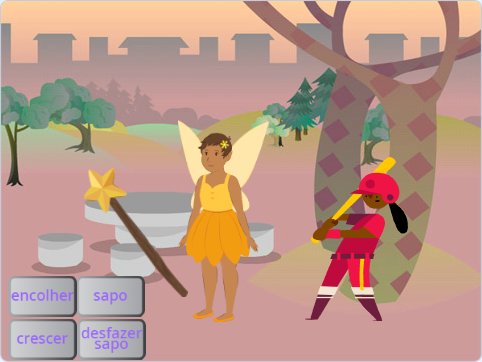

## O que você vai fazer

Crie uma aplicação em que você usa uma varinha mágica para transformar atores em sapos e fazê-los aumentar e diminuir de tamanho.

Você deve:
+ Criar botões que `transmitam`{:class="block3events"} mensagens para outros atores
+ Faça com que vários atores respondam quando `receberem`{:class="block3events"} a mesma mensagem
+ Use o editor do bloco `Som`{:class="block3sound"} para reverter sons

**Transmitir** e **receber** mensagens é como um padrão de **chamada e resposta** na música.
 
 
  "P3T3 P3T3 é uma canção tradicional de Gana, na África Ocidental. É realizado por um líder que **chama** e um grupo que **responde** repetindo uma frase-chave quando ouve a chamada." - Kwame Bakoji-Hume, Atividades Africanas CIC

<audio controls><source src="images/Pete-Pete.mp3" type="audio/wav"></audio>  

--- no-print ---

### Jogar ▶️

--- task ---

  
Use a varinha mágica para clicar nos botões e lançar feitiços. O que cada feitiço faz com os personagens?

  <iframe allowtransparency="true" width="485" height="402" src="https://scratch.mit.edu/projects/embed/518413238/?autostart=false" frameborder="0"></iframe>

--- /task--- --- /no-print ---

--- print-only ---

--- /print-only ---

