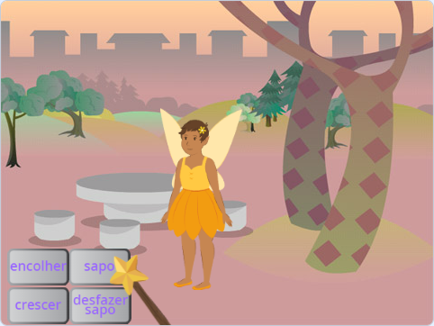
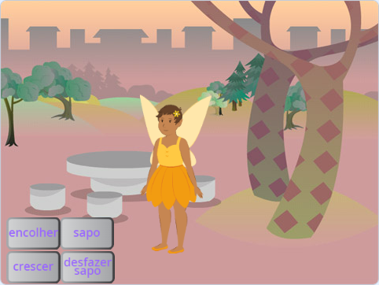
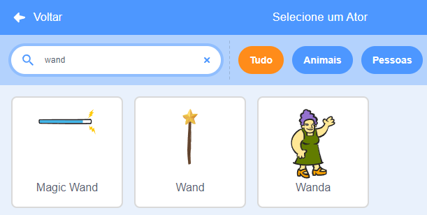
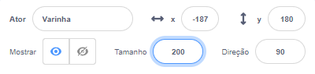
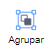

## Escolha sua varinha

<div style="display: flex; flex-wrap: wrap">
<div style="flex-basis: 200px; flex-grow: 1; margin-right: 15px;">
Nesta etapa, você definirá o cenário, escolherá sua varinha e criará sua própria magia gerada por computador.
  
</div>
<div>
{:width="300px"}
</div>
</div>

<p style="border-left: solid; border-width:10px; border-color: #0faeb0; background-color: aliceblue; padding: 10px;">
<span style="color: #0faeb0">**Imagens geradas por computador (CGI)**</span> podem ser usadas para criar efeitos especiais que não acontecem no mundo real. Fazer um filme ou animação de fantasia moderna envolve muita programação e arte computacional.
</p>

--- task ---

Abra o [Transmitindo feitiços projeto inicial](https://scratch.mit.edu/projects/518441891/editor){:target="_ blank"}. O Scratch será aberto em outra aba do navegador.

[[[working-offline]]]

--- /task ---

--- task ---

Você deverá ver uma fada em uma floresta.



--- /task ---

Você precisa de uma varinha para lançar um feitiço.

--- task ---

Clique em **Selecione um Ator** e digite `wand` na caixa de pesquisa:




**Escolha:** Adicione a varinha de sua preferência ao seu projeto.

--- /task ---

--- task ---

Adicione o código para fazer o ator **Varinha** seguir o ponteiro `ponteiro do mouse`{:class="block3motion"} e ficar na frente ``{:class="block3looks"} dos botões:


```blocks3
when flag clicked
forever
go to (mouse-pointer v) //change from 'random position'     
go to [front v] layer // in front of the buttons
end
```

--- /task ---

--- task ---

**Teste:** Clique na bandeira verde e teste o seu projeto. A varinha seguirá o ponteiro do mouse.

--- /task ---

Deixe a varinha maior e inclinada, como se você realmente a estivesse usando.

--- task ---

Vá para o painel do Ator e altere a propriedade **Tamanho** para `200` para aumentar a varinha:



--- /task ---

--- task ---

Clique na aba **Fantasias** para abrir a fantasia da Varinha no editor Paint.

Clique na ferramenta **Selecionar** (Seta) e desenhe um retângulo ao redor de toda a varinha para selecionar todas as partes da fantasia.


Em seguida, clique no ícone **Agrupar** para combinar as partes da varinha.



--- /task ---

--- task ---

Use a ferramenta **Girar** na varinha para posicionar a varinha em um ângulo.


**Dica:** Se você não conseguir ver a ferramenta **Girar**, clique na ferramenta **Reduzir zoom** (-) na parte inferior do editor Paint para diminuir o zoom.

--- /task ---

A fantasia da **Varinha** atrapalha o cursor do mouse quando você tenta clicar nos botões.

--- task ---

Mova a varinha para que sua ponta fique um pouco afastada da mira no centro.


--- /task ---

--- task ---

**Teste:** Clique na bandeira verde e mova o mouse pelo Palco. A varinha deve seguir.

--- /task ---

--- task ---

Se você estiver conectado à sua conta Scratch, clique no botão verde Remix. Isso salvará uma cópia do projeto em sua conta Scratch.


Você pode mudar o título do seu projeto.


**Dica:** Dê nomes úteis aos seus projetos para que você possa encontrá-los facilmente quando tiver muitos projetos.

Se você não possui uma conta Scratch, você pode clicar em **Arquivo** e depois **Baixar para o seu computador** para salvar uma cópia do projeto.

--- /task ---

--- save ---
