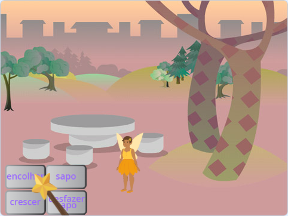
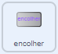
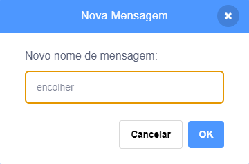
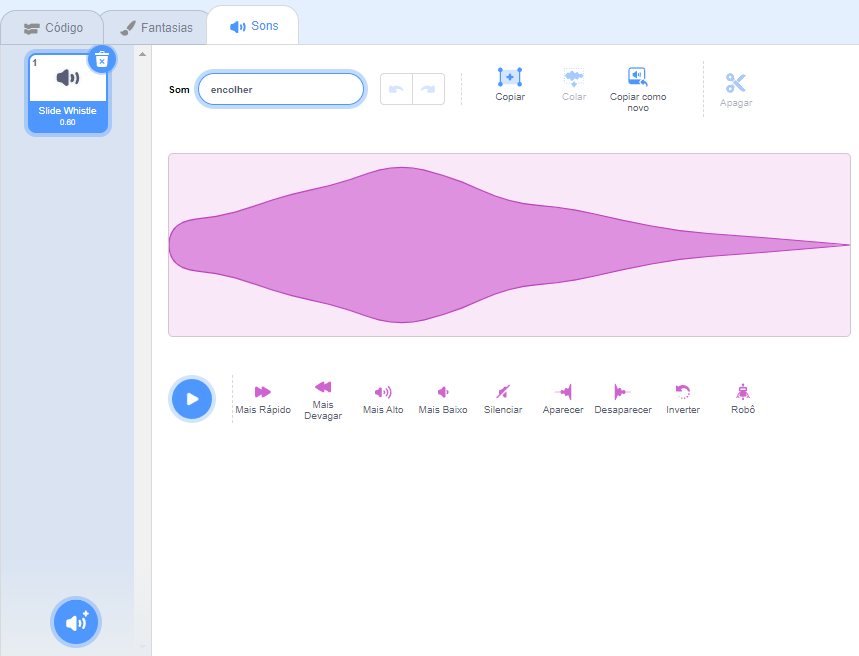

## O feitiço de encolhimento

<div style="display: flex; flex-wrap: wrap">
<div style="flex-basis: 200px; flex-grow: 1; margin-right: 15px;">
Agora você fará com que a Fada encolha ao clicar no botão encolher.
</div>
<div>
{:width="300px"}
</div>
</div>

--- task ---

Clique no ator **encolher** na lista de Atores abaixo do palco.

Adicione o bloco `quando este ator for clicado` {:class="block3events"}:



```blocks3
when this sprite clicked
```

--- /task ---

Ao clicar no botão encolher, você quer que a atriz **Fada** encolha.

O ator **encolher** precisa `transmitir`{:class="block3events"} uma `mensagem`{:class="block3events"} para que a atriz **Fada** saiba que o feitiço de encolher foi lançado.

--- task ---

Adicione um bloco `transmita`{:class="block3events"}:


```blocks3
when this sprite clicked
+ broadcast (message1 v)
```

--- /task ---

--- task ---

Clique em `mensagem 1`{:class="block3events"} e escolha 'Nova mensagem'. Nomeie a nova mensagem `encolher`.



Seu código deve ficar assim:


```blocks3
when this sprite clicked
broadcast (shrink v)
```

--- /task ---

Agora, quando você clicar no botão **encolher**, o Scratch irá `transmitir`{:class="block3events"} a mensagem `encolher`{:class="block3events"}, mas nada acontecerá ainda.

--- task ---

Adicione na atriz **Fada** o código para encolher quando receber uma mensagem `encolher`{:class="block3events"}:


```blocks3
when I receive [shrink v]
change size by [-10] // negative numbers decrease the size
```

--- /task ---

--- task ---

**Teste:** Clique no botão **encolher** para diminuir a atriz **Fada**. Faça isso quantas vezes quiser.

**Depurar:** Se a sua atriz **Fada** crescer em vez de encolher, adicione um menos `-` antes do número `10` para formar um número negativo `-10`.

--- /task ---

--- task ---

Adicione um script para voltar a atriz **Fada** para o tamanho normal `quando a bandeira verde`{:class="block3events"} for clicada:


```blocks3
when flag clicked
set size to [100] %
```

--- /task ---

Quando as mensagens são `transmitidas`{:class="block3events"} elas podem ser recebidas por todos os atores. Quando a **Varinha ** `receber`{:class="block3events"} a mensagem `encolher`{:class="block3events"} ela deve `tocar um som`{:class="block3sound"}.

--- task ---

Clique no ator **Varinha** e depois na aba **Sons**.

Adicione o som **Slide Whistle**.

Renomeie o som para `encolher` assim será mais fácil de encontrá-lo.




--- /task ---

--- task ---

Adicione um script para tocar o som:


```blocks3
when I receive [shrink v]
play sound [shrink v] until done

```

--- /task ---

--- task ---

**Teste:** Clique na bandeira verde para executar seu projeto. Clique no botão **encolher** para ouvir o som e ver a **Fada** encolher.

--- /task ---

O botão **encolher** `transmite`{:class="block3events"} uma mensagem `encolher`{:class="block3events"}. Tanto a **Fada** quanto a **Varinha** `receberam`{:class="block3events"} a mensagem e responderam.

--- save ---
