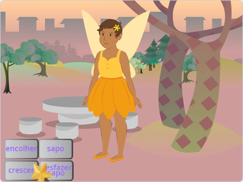
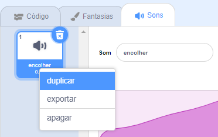
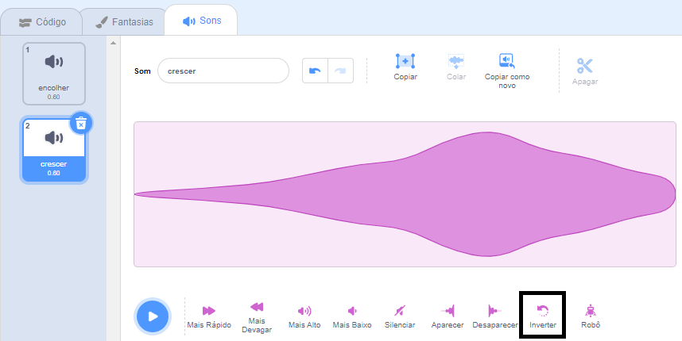

## O feitiço de crescimento

<div style="display: flex; flex-wrap: wrap">
<div style="flex-basis: 200px; flex-grow: 1; margin-right: 15px;">
Você também precisa de um feitiço de crescimento para retornar a atriz **Fada** ao tamanho normal ou para fazer uma fada enorme!
</div>
<div>
{:width="300px"}
</div>
</div>

**Dica:** Nesta etapa, você adicionará código a três atores diferentes. Certifique-se de selecionar o ator correto na lista de Atores abaixo do Palco e clique na guia **Código**.

--- task ---

Adicione um script ao ator do botão **crescer** para `transmitir`{:class="block3events"} uma mensagem `crescer`{:class="block3events"}:


```blocks3
when this sprite clicked
broadcast (crescer v)
```

--- /task ---

--- task ---

Adicione um script para fazer a atriz **Fada** crescer:


```blocks3
when I receive [crescer v]
change size by [10] // números positivos aumentam o tamanho
```

--- /task ---

Você pode inverter o som de 'encolher' para fazer um som de 'crescer'!

<p style="border-left: solid; border-width:10px; border-color: #0faeb0; background-color: aliceblue; padding: 10px;">
<span style="color: #0faeb0">**Testes de músicas tocadas ao contrário**</span> são testes de música com um toque especial. As faixas estão invertidas e os competidores precisam adivinhar a música original — não é tão fácil quanto parece. 
</p>

--- task ---

Selecione o ator **Varinha** e clique na aba **Sons**.

Clique com o botão direito (ou toque e segure) no som **encolher** e escolha **duplicar**.




Nomeie a cópia `crescer`.

Clique no ícone **Inverter** para fazer o som ser reproduzido ao contrário.



--- /task ---

--- task ---

Adicione um script ao ator **Varinha** para tocar o som `crescer`{:class="block3sound"} quando a mensagem `crescer`{:class="block3events"} for recebida:


```blocks3
when I receive [crescer v]
play sound [crescer v] until done
```

--- /task ---

--- task ---

**Teste:** Clique nos botões **encolher** e **crescer** para lançar os feitiços quantas vezes quiser.

--- /task ---

--- save ---

