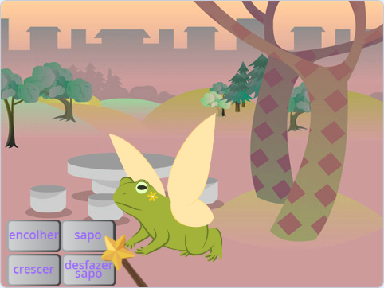
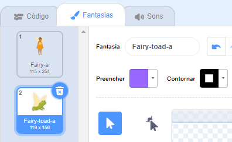
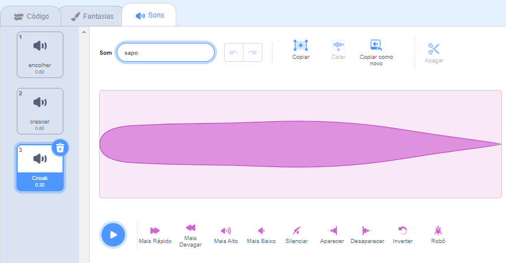
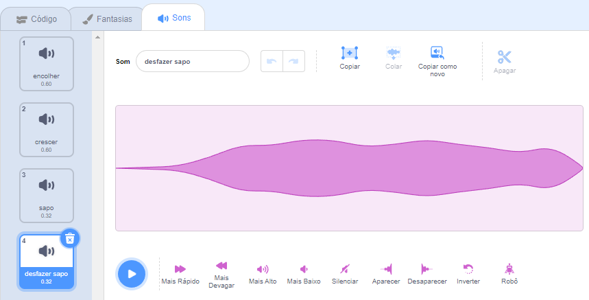

## Transformar em sapo

<div style="display: flex; flex-wrap: wrap">
<div style="flex-basis: 200px; flex-grow: 1; margin-right: 15px;">
Agora é hora para outro feitiço. Desta vez você lançará um feitiço de transformação transmitindo uma mensagem `sapo`{:class="block3events"} que transforma a atriz **Fada** em um sapo! 

Talvez ela esteja embarcando em uma aventura onde ser sapo será mais útil.
</div>
<div>
{:width="300px"}
</div>
</div>

--- task ---

Adicione um script ao botão **sapo** para transmitir a mensagem 'sapo':


```blocks3 
when this sprite clicked
broadcast [toad v]
```

--- /task ---

--- task ---

Selecione a atriz **Fada** e clique na aba **Fantasias**.

Para transformar a atriz **Fada** em um sapo você usará as fantasias **Fairy-a** e **Fairy-toad-a**.



--- /task ---

--- task ---

Clique na guia **Código** e adicione o bloco `mude para a fantasia`{:class="block3looks"} ao final do seu script `quando a bandeira verde for clicada`{:class="block3events"} para que a Fada fique humana quando você executar seu projeto:


```blocks3
when flag clicked
set size to [100] %
+ switch costume to [Fairy-a v]
```

--- /task ---

--- task ---

Adicione um novo script a atriz **Fada** para transformá-la em um sapo:


```blocks3  
when I receive [toad v]
switch costume to [Fairy-toad-a v]
```

--- /task ---

--- task ---

Adicione o som **Croak** ao ator **Varinha**.

Renomeie o som para `sapo`:




--- /task ---

--- task ---

Adicione um script ao ator **Varinha** para tocar o som `sapo`{:class="block3sound"} quando o feitiço for lançado:


```blocks3  
when I receive [toad v]
play sound [toad v] until done
```

--- /task ---

--- task ---

Teste **:** Teste se você consegue transformar a **Fada** em um sapo, com o efeito sonoro, ao clicar no botão **sapo**. Clique na bandeira verde novamente para transformar a atriz **Fada** novamente em humana.


--- /task ---

O oposto de um feitiço 'sapo' é um feitiço 'desfazer sapo'.

--- task ---

Adicione um script ao ator do botão **desfazer sapo** para `transmitir`{:class="block3events"} a mensagem 'desfazer sapo'{:class="block3events"}:


```blocks3 
when this sprite clicked
broadcast [untoad v]
```

--- /task ---

--- task ---

Adicione um novo script para `desfazer a transformação de sapo`{:class="block3events"} da atriz **Fada**:


```blocks3  
when I receive [untoad v]
switch costume to [Fairy-a v]
```

--- /task ---

--- task ---

Selecione o ator **Varinha** e troque para a aba **Sons**.

**Duplique** o som **sapo** e renomeie-o para `desfazer sapo`.

Clique no ícone **Inverter** para que o som **desfazer sapo** seja reproduzido ao contrário.




--- /task ---

--- task ---

Adicione um script ao ator **Varinha** para reproduzir o som `desfazer sapo`{:class="block3sound"}:


```blocks3  
when I receive [untoad v]
play sound [untoad v] until done
```

--- /task ---

--- task ---

Teste **:** Experimente os feitiços **sapo** e **desfazer sapo**, e tente **encolher** e **crescer** quando a **Fada** estiver na forma de sapo.

--- /task ---

--- save ---
