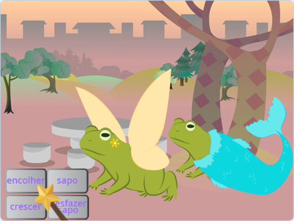
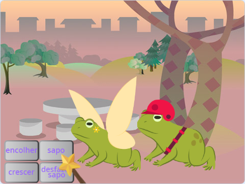
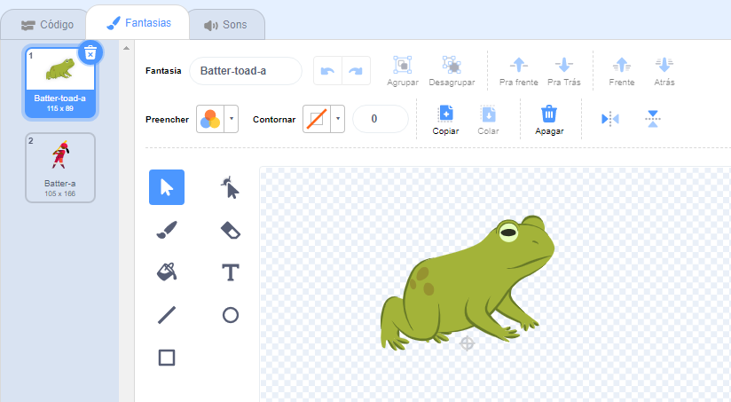
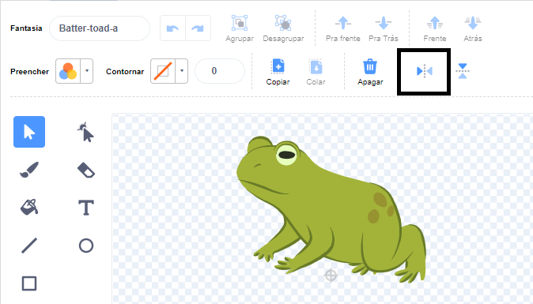

## Adicione outro personagem

Escolha um ator de sua preferência para responder aos feitiços. Você terá que criar uma 'mistura' para a fantasia de sapo do ator e adicionar código para que a fantasia mude quando as mensagens de feitiço forem transmitidas.

{:width="300px"}

--- task ---

Duplique a atriz **Fada**.

Apague as fantasias **Fairy-a** e **Fairy-toad-a**. Só restará a fantasia de **sapo**.

Adicione uma fantasia de sua escolha ao **novo ator**.

Escolhemos o **Batter**:

Você pode querer mudar a direção para a qual o ator está apontando.

**Dica:** Se o seu ator ficar de cabeça para baixo, você pode alterar seu `estilo de rotação`{:class="block3motion"} para `esquerda-direita`{:class="block3motion"} no painel de propriedades do Ator ou utilizando um bloco de código.

--- /task ---

Ao crescer ou encolher um ator, você deseja que os pés permaneçam no mesmo lugar.

--- task ---

Primeiro use a ferramenta **Selecionar** (seta) para desenhar um retângulo ao redor da fantasia e depois **Agrupar**. Em seguida, arraste seu personagem acima da mira.

--- /task ---

--- task ---

Clique na fantasia de **sapo**.

Renomeie a fantasia para combinar com seu ator, usamos **Batter-toad-a**.

--- /task ---

--- task ---

Se a fantasia de sapo estiver voltada para o lado oposto da fantasia principal, você pode usar **Espelhar Horizontal**.

--- /task ---

Agora você precisa fazer o sapo se parecer com o personagem. Combinar duas fantasias desta forma é chamado 'mash-up'.

--- task ---

Você pode adicionar um detalhe, como um toque de cor, ou copiar e colar óculos de sol ou um chapéu no editor Paint.

**Dica:** Você pode adicionar qualquer fantasia ao seu ator. Use a ferramenta **Selecionar** (seta) e clique em **Copiar** ou **Colar**.

**Dica:** Você pode agrupar todos os objetos em uma fantasia. Selecione-os (com a ferramenta **Selecionar** ou <kbd>Ctrl-a</kbd>) e clique em **Agrupar**.

A aparência do nosso sapo batedor: 

--- /task ---

--- task ---

Mude para a guia **Código** para seu novo ator.

Altere todos os blocos `mude para a fantasia`{:class="block3looks"} para usar as fantasias corretas para seu novo ator.

Você também pode querer alterar o `tamanho`{:class="block3looks"} inicial do ator `quando a bandeira verde for clicada`{:class="block3events"}.

--- /task ---

--- task ---

**Teste:** Clique nos botões de feitiço — ambos os personagens devem responder às transmissões de feitiço.

**Depurar:** Verifique se você mudou as fantasias nos blocos `mude para a fantasia`{:class="block3looks"} para seu novo ator.

--- /task ---

--- save ---
