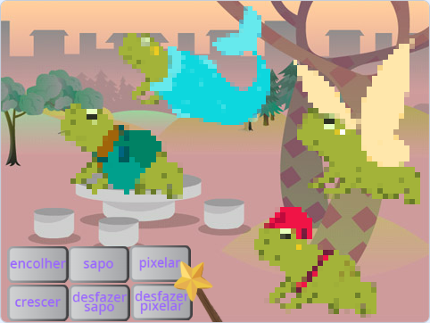
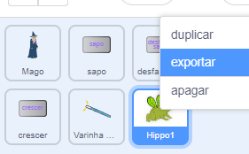
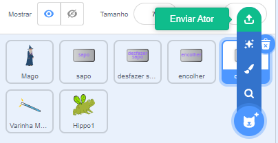

## Melhore o seu projeto

Como você expandirá seu mundo mágico? Você poderia:
+ Adicionar mais personagens
+ Adicionar diferentes efeitos sonoros e visuais à varinha.
+ Adicionar mais feitiços — você poderia fazer os personagens desaparecerem e reaparecerem com `esconda`{:class="block3looks"} e `mostre`{:class="block3looks"}, aplicar efeitos visuais ou virá-los de cabeça para baixo.

Por que não trocar personagens com um amigo? Primeiro, troque os links do projeto com um amigo para ver os atores um do outro. Para salvar seus atores, use sua mochila do Scratch ou baixe os atores em uma área compartilhada. Em seguida, volte ao seu projeto e adicione os atores salvos.

[[[scratch-backpack]]]

--- collapse ---
---
title: Baixe um ator
---

Você pode salvar atores em seu computador baixando-os de seu projeto. Clique com o botão direito em um ator na lista de Atores e escolha exportar.

Para carregar um ator em um projeto, escolha a opção ‘Enviar Ator’ no menu ‘Selecione um Ator’.

--- /collapse ---

Crie mais feitiços com um amigo e adicione-os aos seus personagens. Decida quais feitiços criar. Certifique-se de que ambos usem exatamente o mesmo nome para as mensagens transmitidas.

--- collapse ---
---
title: Projeto concluído
---

Você pode ver o [projeto concluído aqui](https://scratch.mit.edu/projects/1043074509/){:target="_blank"}.

--- /collapse ---

--- save ---
