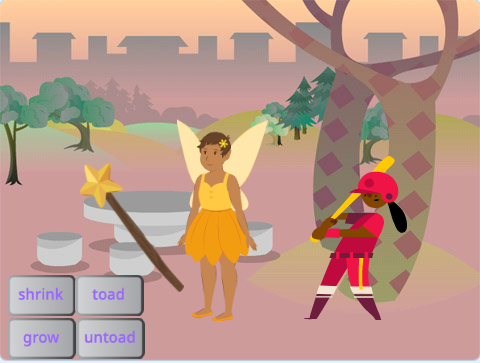

## You will make

Sprite లను చిరుకప్పలుగా మార్చడానికి మీరు మ్యాజిక్ మంత్రదండంని ఉపయోగించే యాప్‌ను రూపొందించండి మరియు వాటిని పెద్దగా చేయండి మరియు కుదించండి.

మీరు:
+ ఇతర sprite లకు సందేశాలను`broadcast`{: class = "block3events"} చేసే బటన్లను సృష్టించండి
+ `receive`{:class="block3events"} సందేశాన్ని స్వీకరించినప్పుడు మరిన్ని sprite లు ప్రతిస్పందించేలా చూడండి
+ శబ్దాలను రివర్స్ చేయడానికి `Sound`{:class="block3sound"} బ్లాక్స్ మెనుని ఉపయోగించండి

**Broadcasting** and **receiving** messages is like a **call and response** pattern in music.
 
 
  "P3T3 P3T3 అనేది పశ్చిమ ఆఫ్రికాలోని ఘనా నుండి వచ్చిన సాంప్రదాయ పాట. It is performed by one lead person who **calls** and a group that **respond** by repeating a key phrase when they hear the call." - Kwame Bakoji Hume, ఆఫ్రికన్ కార్యకలాపాలు CIC

<audio controls><source src="images/Pete-Pete.mp3" type="audio/wav"></audio>  

--- no-print ---

### Play ▶️

--- task ---

  
బటన్‌లపై క్లిక్ చేసి మంత్రాలు వేయడానికి మంత్రదండం ఉపయోగించండి. ప్రతి మంత్రం కారెక్టర్ లకు ఏమి చేస్తుంది?

  <iframe allowtransparency="true" width="485" height="402" src="https://scratch.mit.edu/projects/embed/518413238/?autostart=false" frameborder="0"></iframe>

--- /task--- --- /no-print ---

--- print-only ---

--- /print-only ---

