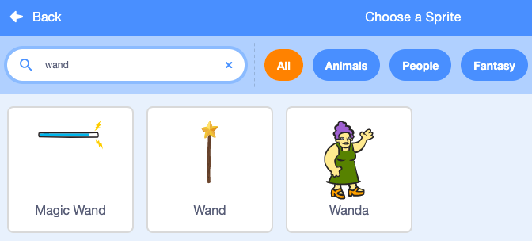
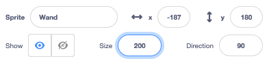

## మీ మంత్రదండం ఎంచుకోండి

<div style="display: flex; flex-wrap: wrap">
<div style="flex-basis: 200px; flex-grow: 1; margin-right: 15px;">
ఈ దశలో, మీరు సన్నివేశాన్ని సెట్ చేస్తారు, మీ మంత్రదండం ఎంచుకోండి మరియు మీ స్వంత కంప్యూటర్-తో చేయబడిన మ్యాజిక్‌ను సృష్టిస్తారు.
  
</div>
<div>
{:width="300px"}
</div>
</div>

<p style="border-left: solid; border-width:10px; border-color: #0faeb0; background-color: aliceblue; padding: 10px;">
<span style="color: #0faeb0">**Computer-generated imagery (CGI)**</span> వాస్తవ ప్రపంచంలో జరగని ప్రత్యేక ప్రభావాలను సృష్టించడానికి ఉపయోగించవచ్చు. ఆధునిక ఫాంటసీ చలనచిత్రం లేదా యానిమేషన్‌ను రూపొందించడంలో చాలా కోడ్ మరియు కంప్యూటర్ ఆర్ట్ ఉంటుంది.
</p>

--- task ---

[బ్రాడ్‌కాస్టింగ్ స్పెల్స్ స్టార్టర్ ప్రాజెక్ట్](https://scratch.mit.edu/projects/518441891/editor){:target="_blank"}ని తెరవండి. Scratch మరొక బ్రౌజర్ ట్యాబ్‌లో తెరవబడుతుంది.

[[[working-offline]]]

--- /task ---

--- task ---

మీరు అడవిలో ఒక దేవదూతను చూడాలి.


--- /task ---

మంత్రం వేయడానికి మీకు మంత్రదండం అవసరం.

--- task ---

క్లిక్ **Choose a Sprite** మీద క్లిక్ చేయండి మరియు సెర్చ్ బాక్సులో `wand` అని టైప్ చేయండి:




**ఎంచుకోండి:** మీ ప్రాజెక్ట్‌కు మీరు ఇష్టపడే మంత్రదండం జోడించండి.

--- /task ---

--- task ---

**Wand** sprite `mouse pointer`{:class="block3motion"}ని అనుసరించేలా మరియు బటన్ల `front`{:class="block3looks"} లో ఉండేలా చేయడానికి కోడ్‌ని జోడించండి:


```blocks3
when flag clicked
forever
go to (mouse-pointer v) //'random position' నుండి మార్పు     
go to [front v] layer // బటన్ల ముందు
end
```

--- /task ---

--- task ---

**పరీక్ష:** మీ ప్రాజెక్ట్‌ను అమలు చేయడానికి ఆకుపచ్చ జెండాపై క్లిక్ చేయండి. మంత్రదండం మీ మౌస్ పాయింటర్‌ను అనుసరిస్తుంది.

--- /task ---

మీరు నిజంగా ఉపయోగిస్తున్నట్లుగా, మంత్రదండం పెద్దదిగా మరియు వంపుగా చేయండి.

--- task ---

Sprite పేన్‌కి వెళ్లి, మంత్రదండం పెద్దదిగా చేయడానికి **Size** ప్రాపర్టీని `200` కి మార్పు చేయండి:



--- /task ---

--- task ---

Paint editor లో Wand costume ను తెరవడానికి **Costumes** ట్యాబ్‌పై క్లిక్ చేయండి.

**Select** (బాణం) సాధనంపై క్లిక్ చేసి, ఆపై దుస్తులు యొక్క అన్ని భాగాలను ఎంచుకోవడానికి మొత్తం మంత్రదండం చుట్టూ దీర్ఘచతురస్రాన్ని గీయండి.


ఆపై మంత్రదండం భాగాలను కలపడానికి **Group** చిహ్నంపై క్లిక్ చేయండి.


--- /task ---

--- task ---

మంత్రదండం ఒక కోణంలో ఉంచడానికి మంత్రదండంపై **Rotate** సాధనాన్ని ఉపయోగించండి.


**చిట్కా:** **Rotate** సాధనాన్ని చూడలేకపోతే, **Zoom out** చేయడానికి Paint editor దిగువన (-) సాధనాన్ని ఉపయోగించండి.

--- /task ---

మీరు బటన్‌లను క్లిక్ చేయడానికి ప్రయత్నించినప్పుడు **Wand** costume మౌస్ కర్సర్‌కి అడ్డు వస్తుంది.

--- task ---

మంత్రదండం మధ్యలో ఉన్న క్రాస్‌హైర్‌కు దూరంగా ఉండేలా దానిని తరలించండి.


--- /task ---

--- task ---

**పరీక్ష:** ఆకుపచ్చ జెండాపై క్లిక్ చేసి, Stage చుట్టూ మౌస్‌ని తరలించండి. మంత్రదండం అనుసరించాలి.

--- /task ---

--- task ---

మీరు మీ Scratch ఖాతాకు సైన్ ఇన్ చేసి ఉంటే, ఆకుపచ్చ Remix బటన్‌పై క్లిక్ చేయండి. ఇది ప్రాజెక్ట్ కాపీని మీ Scratch ఖాతాలో సేవ్ చేస్తుంది.


మీరు మీ ప్రాజెక్ట్ యొక్క టైటిల్ ను మార్చవచ్చు.


**Tip:** మీ ప్రాజెక్ట్‌లకు ఉపయోగకరమైన పేర్లను ఇవ్వండి, తద్వారా మీరు చాలా ప్రాజెక్ట్‌లను కలిగి ఉన్నప్పుడు వాటిని సులభంగా కనుగొనవచ్చు.

మీకు Scratch ఖాతా లేకుంటే, మీరు ప్రాజెక్ట్ కాపీని **File** ఆపై **Save your computer** పై క్లిక్ చేసి, సేవ్ చేయవచ్చు.

--- /task ---

--- save ---
