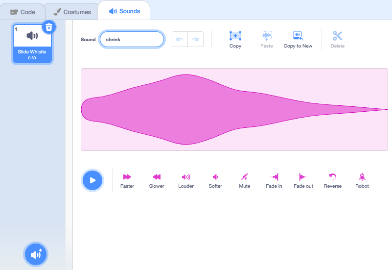

## Shrink స్పెల్

<div style="display: flex; flex-wrap: wrap">
<div style="flex-basis: 200px; flex-grow: 1; margin-right: 15px;">
ఇప్పుడు మీరు shrink బటన్‌పై క్లిక్ చేసినప్పుడు Fairy చిన్నగా అయిపోతుంది.
</div>
<div>
{:width="300px"}
</div>
</div>

--- task ---

Stage దిగువన ఉన్న Sprite లిస్ట్‌లో **shrink** sprite పై క్లిక్ చేయండి.

`when this sprite clicked`{:class="block3events"} బ్లాక్‌ని జోడించండి:


```blocks3
when this sprite clicked
```

--- /task ---

మీరు shrink బటన్‌పై క్లిక్ చేసినప్పుడు, మీరు **Fairy** sprite కుదించబడాలి.

**shrink** sprite కి `broadcast`{:class="block3events"} `message`{:class="block3events"} అవసరం, తద్వారా **Fairy** sprite, shrink స్పెల్ ప్రసారం చేయబడిందని తెలుసుకుంటుంది.

--- task ---

`broadcast`{:class="block3events"} బ్లాక్‌ని జోడించండి:


```blocks3
when this sprite clicked
+ broadcast (message1 v)
```

--- /task ---

--- task ---

`message1`{:class="block3events"}పై క్లిక్ చేసి, 'New message' ఎంచుకోండి. కొత్త సందేశానికి `shrink` అని పేరు పెట్టండి.


మీ కోడ్ ఇలా కనిపించాలి:


```blocks3
when this sprite clicked
broadcast (shrink v)
```

--- /task ---

ఇప్పుడు మీరు **shrink** బటన్‌పై క్లిక్ చేసినప్పుడు, Scratch `shrink`{:class="block3events"} సందేశాన్ని `broadcast`{:class="block3events"} చేస్తుంది, కానీ ఇంకా ఏమీ జరగదు.

--- task ---

**Fairy** sprite, `shrink`{:class="block3events"} సందేశాన్ని అందుకున్నప్పుడు కుదించ బడడానికి దానికి కోడ్‌ని జోడించండి:


```blocks3
when I receive [shrink v]
change size by [-10] // ఋణ సంఖ్యలు పరిమాణాన్ని తగ్గిస్తాయి
```

--- /task ---

--- task ---

**పరీక్ష:** **Fairy** sprite ను కుదించడానికి **shrink** బటన్‌పై క్లిక్ చేయండి. మీకు నచ్చినన్ని సార్లు ఇలా చేయండి.

**డీబగ్:** మీ **Fairy** sprite పరిమాణం తగ్గిపోవడానికి బదులుగా పెరిగితే, `10` సంఖ్యకు ముందు `-` జోడించి `-10` ఋణ సంఖ్యగా చేయండి.

--- /task ---

--- task ---

`when the green flag clicked`{:class="block3events"} బ్లాక్ కి **Fairy** sprite ను సాధారణ పరిమాణం కి సెట్ చేయడానికి స్క్రిప్ట్‌ను జోడించండి:


```blocks3
when flag clicked
set size to [100] %
```

--- /task ---

సందేశాలు `broadcast`{:class="block3events"} అయినప్పుడు వాటిని అన్ని sprite లు స్వీకరించవచ్చు. **Wand** `shrink`{:class="block3events"} సందేశాన్ని `receives`{:class="block3events"} చేసినప్పుడు అది ఒక `play a sound`{:class="block3sound"} ని ప్లే చేయాలి.

--- task ---

**Wand** sprite మరియు **Sounds** ట్యాబ్‌పై క్లిక్ చేయండి.

**Slide Whistle** ధ్వనిని జోడించండి.

`shrink` కి మార్చండి, తద్వారా దానిని కనుగొనడం సులభం.




--- /task ---

--- task ---

ధ్వనిని ప్లే చేయడానికి స్క్రిప్ట్‌ను జోడించండి:


```blocks3
when I receive [shrink v]
play sound [shrink v] until done

```

--- /task ---

--- task ---

**పరీక్ష:** మీ ప్రాజెక్ట్‌ను అమలు చేయడానికి ఆకుపచ్చ జెండాపై క్లిక్ చేయండి. ధ్వనిని వినడానికి **shrink** బటన్‌పై క్లిక్ చేయండి **Fairy** చిన్నగా అవడం చూడండి.

--- /task ---

**shrink** బటన్ `shrink`{:class="block3events"} సందేశాన్ని `broadcast`{:class="block3events"} చేస్తుంది. **Fairy** మరియు **Wand** sprite, `received`{:class="block3events"} సందేశాన్ని స్వీకరించాయి మరియు ప్రతిస్పందించాయి.

--- save ---
