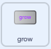

## Grow స్పెల్

<div style="display: flex; flex-wrap: wrap">
<div style="flex-basis: 200px; flex-grow: 1; margin-right: 15px;">
**Fairy** sprite ను సాధారణ పరిమాణానికి తిరిగి తీసుకురావడానికి లేదా భారీ fairy ని చేయడానికి మీకు Grow స్పెల్ కూడా అవసరం!
</div>
<div>
{:width="300px"}
</div>
</div>

**చిట్కా:** ఈ దశలో, మీరు మూడు వేర్వేరు sprite లకు కోడ్‌ని జోడిస్తారు. మీరు Stage దిగువన ఉన్న Sprite జాబితా నుండి సరైన spriteని ఎంచుకున్నారని నిర్ధారించుకోండి మరియు **Code** ట్యాబ్‌పై క్లిక్ చేయండి.

--- task ---

**grow** బటన్ sprite కి `grow`{:class="block3events"} సందేశాన్ని `broadcast`{:class="block3events"} చేయడానికి కోడ్ ని జోడించండి:



```blocks3
when this sprite clicked
broadcast (grow v)
```

--- /task ---

--- task ---

**Fairy** sprite సైజు పెరగడానికి స్క్రిప్ట్‌ను జోడించండి:


```blocks3
when I receive [grow v]
change size by [10] // positive numbers increase the size
```

--- /task ---

మీరు 'grow' సౌండ్ చేయడానికి 'shrink' ధ్వనిని రివర్స్ చేయవచ్చు!

<p style="border-left: solid; border-width:10px; border-color: #0faeb0; background-color: aliceblue; padding: 10px;">
<span style="color: #0faeb0">**Songs played backwards quizzes**</span> ట్విస్ట్‌తో కూడిన మ్యూజిక్ క్విజ్‌లు. ట్రాక్‌లు రివర్స్ చేయబడ్డాయి మరియు పోటీదారులు అసలు పాటను ఊహించవలసి ఉంటుంది — ఇది వినిపించినంత సులభం కాదు. 
</p>

--- task ---

**Wand** sprite ని ఎంచుకుని, **Sounds** ట్యాబ్‌పై క్లిక్ చేయండి.

**shrink** సౌండ్‌ని రైట్-క్లిక్ (లేదా నొక్కి పట్టుకోండి) మరియు **duplicate** ను ఎంచుకోండి.


కాపీ చేయబడిన దానికి `grow` అని పేరు పెట్టండి.

ధ్వని వెనుకకు ప్లే చేయడానికి **Reverse** చిహ్నంపై క్లిక్ చేయండి.


--- /task ---

--- task ---

`grow`{:class="block3events"} సందేశం అందుకొన్నప్పుడు `grow`{:class="block3sound"} ధ్వనిని ప్లే చేయడానికి **Wand** sprite కి స్క్రిప్ట్‌ను జోడించండి:


```blocks3
when I receive [grow v]
play sound [grow v] until done
```

--- /task ---

--- task ---

**పరీక్ష:** మీకు నచ్చినన్ని సార్లు స్పెల్స్ వేయడానికి **shrink** మరియు **grow** స్పెల్ బటన్‌లపై క్లిక్ చేయండి.

--- /task ---

--- save ---

