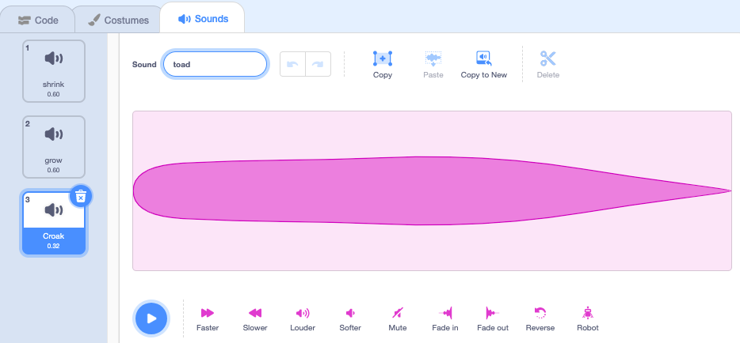

## చిరుకప్ప రూపాంతరం

<div style="display: flex; flex-wrap: wrap">
<div style="flex-basis: 200px; flex-grow: 1; margin-right: 15px;">
ఇప్పుడు మరో స్పెల్ కోసం సమయం వచ్చింది. ఈసారి మీరు **Fairy** spriteను చిరుకప్పగా మార్చే `toad`{:class="block3events"} సందేశాన్ని ప్రసారం చేయడం ద్వారా ట్రాన్స్ ఫర్మేషన్స్ స్పెల్స్ ప్రయోగించబోతున్నారు! 

బహుశా ఆమె ఒక టోడ్‌గా ఉండటం మరింత ఉపయోగకరంగా ఉంటుందని సాహసం చేస్తుండవచ్చు.
</div>
<div>
{:width="300px"}
</div>
</div>

--- task ---

'toad' సందేశాన్ని ప్రసారం చేయడానికి **toad** బటన్ sprite కు స్క్రిప్ట్‌ను జోడించండి:


```blocks3 
when this sprite clicked
broadcast [toad v]
```

--- /task ---

--- task ---

**Fairy** sprite ని ఎంచుకుని, **Costumes** ట్యాబ్‌పై క్లిక్ చేయండి.

మీరు **Fairy** sprite ను టోడ్‌గా మార్చడానికి **Fairy-a** మరియు **Fairy-toad-a** costume లను ఉపయోగిస్తారు.


--- /task ---

--- task ---

**Code** ట్యాబ్‌పై క్లిక్ చేసి, `switch costume`{:class="block3looks"} బ్లాక్‌ని, మీ ప్రస్తుత `when flag clicked`{:class="block3events"} స్క్రిప్ట్ చివరకి జోడించండి తద్వారా మీరు మీ ప్రాజెక్ట్‌ని అమలు చేసినప్పుడు Fairy మానవ రూపంలో ఉంటుంది:


```blocks3
when flag clicked
set size to [100] %
+ switch costume to [Fairy-a v]
```

--- /task ---

--- task ---

టోడ్‌గా మారడానికి **Fairy** sprite కి కొత్త స్క్రిప్ట్‌ని జోడించండి:


```blocks3  
when I receive [toad v]
switch costume to [Fairy-toad-a v]
```

--- /task ---

--- task ---

**Wand** sprite కి **Croak** సౌండ్‌ని జోడించండి.

ధ్వని పేరును `toad` అని మార్చండి:




--- /task ---

--- task ---

Toad స్పెల్ ప్రయోగించబడినపుడు `toad`{:class="block3sound"} ధ్వనిని ప్లే చేయడానికి **Wand** sprite కు స్క్రిప్ట్‌ను జోడించండి:


```blocks3  
when I receive [toad v]
play sound [toad v] until done
```

--- /task ---

--- task ---

**పరీక్ష:** **toad** బటన్‌ను క్లిక్ చేసినప్పుడు సౌండ్ ఎఫెక్ట్‌తో **Fairy** టోడ్‌గా మారగలదని పరీక్షించండి. **Fairy** sprite ను తిరిగి మానవ రూపంలో మార్చడానికి ఆకుపచ్చ జెండాపై మళ్లీ క్లిక్ చేయండి.


--- /task ---

'toad' స్పెల్‌కి వ్యతిరేకం 'untoad' స్పెల్.

--- task ---

**untoad** బటన్ sprite కి `untoad`{:class="block3events"} సందేశాన్ని `broadcast`{:class="block3events"} చేయడానికి స్క్రిప్ట్ ని జోడించండి:


```blocks3 
when this sprite clicked
broadcast [untoad v]
```

--- /task ---

--- task ---

`untoad`{:class="block3events"} చేయడానికి **Fairy** sprite కి కొత్త స్క్రిప్ట్‌ని జోడించండి:


```blocks3  
when I receive [untoad v]
switch costume to [Fairy-a v]
```

--- /task ---

--- task ---

**Wand** spriteని ఎంచుకుని, **Sounds** ట్యాబ్‌కు స్విఛ్ అవండి.

**toad** ధ్వనిని **duplicate** చేసి మరియు దాని పేరును `untoad` గా మార్చండి.

**Reverse** చిహ్నంపై క్లిక్ చేయండి, తద్వారా **untoad** ధ్వని వెనుకకు ప్లే అవుతుంది.


--- /task ---

--- task ---

`untoad`{:class="block3sound"} ధ్వనిని ప్లే చేయడానికి **Wand** sprite కు స్క్రిప్ట్‌ను జోడించండి:


```blocks3  
when I receive [untoad v]
play sound [untoad v] until done
```

--- /task ---

--- task ---

**పరీక్ష:** **toad** మరియు **untoad** స్పెల్‌లను ప్రయత్నించండి మరియు **Fairy** టోడ్ రూపంలో ఉన్నప్పుడు **shrink** ఇంకా **grow** లను కూడా ప్రయత్నించండి.

--- /task ---

--- save ---
