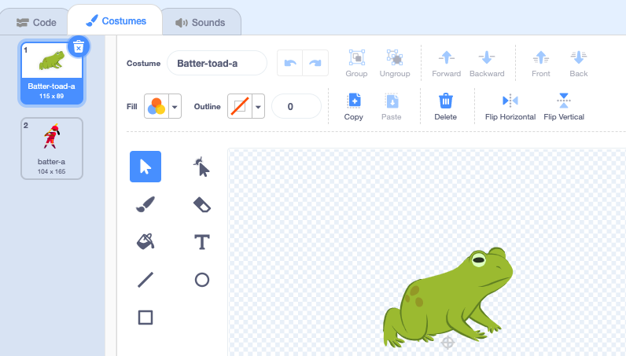

## మరొక కారెక్టర్ ను జోడించండి

స్పెల్స్ లకు ప్రతిస్పందించడానికి మీకు నచ్చిన sprite ను పొందండి. మీరు sprite కోసం toad costume 'mash-up'ని సృష్టించాలి మరియు స్పెల్ సందేశాలు ప్రసారం చేయబడినప్పుడు costume మారేలా కోడ్‌ను జోడించాలి.

{:width="300px"}

--- task ---

**Fairy** sprite ను నకలు చేయండి.

**Fairy-a** మరియు **Fairy-toad-a** costume లను తొలగించండి. మీకు **toad** costume మిగిలి ఉంటుంది.

**New sprite** కి మీకు నచ్చిన costume లను జోడించండి.

మనము **Batter** ని ఎంచుకున్నాము:

మీరు sprite సూచించే దిశను మార్చాలనుకోవచ్చు.

**చిట్కా:** మీ sprite తలక్రిందులుగా ఉంటే, మీరు దాని `rotation-style`{:class="block3motion"}ని `left-right`{:class="block3motion"} కి Sprite ప్రాపర్టీస్ పేన్‌లో లేదా కోడ్‌ బ్లాక్ ని ఉపయోగించి మార్చవచ్చు.

--- /task ---

మీరు sprite పెరిగినప్పుడు లేదా కుదించబడినప్పుడు, పాదాలు ఒకే స్థలంలో ఉండాలని మీరు కోరుకుంటారు.

--- task ---

ముందుగా **Select** (బాణం) సాధనాన్ని ఉపయోగించండి మరియు దానిని **Group** చేయండి. ఆపై మీ పాత్రను క్రాస్‌హైర్ పైకి లాగండి.

--- /task ---

--- task ---

**toad** costume పై క్లిక్ చేయండి.

మీ sprite కి సరిపోయేలా costume పేరు మార్చండి, మనము **Batter-toad-a** ని ఉపయోగించాము.

--- /task ---

--- task ---

Toad costume, ప్రధాన costume కు వ్యతిరేక మార్గంలో ఉన్నట్లయితే మీరు **Flip Horizontal** ని ఉపయోగించ వచ్చు.

--- /task ---

ఇప్పుడు మీరు, టోడ్ ఒక కారెక్టర్ లాగా కనిపించేలా చేయాలి. ఇలా రెండు costumes కలపడాన్ని 'mash-up' అంటారు.

--- task ---

మీరు రంగుల స్ప్లాష్ వంటి చిన్న వివరాలను జోడించవచ్చు లేదా Paint editor లో సన్ గ్లాసెస్ లేదా టోపీని కాపీ చేసి పేస్ట్ చేయవచ్చు.

**చిట్కా:** మీరు మీ క్యారెక్టర్ sprite కి ఏదైనా costume లను జోడించవచ్చు. **Select** (బాణం) సాధనాన్ని ఉపయోగించండి ఆపై **Copy** లేదా **Paste** పై క్లిక్ చేయండి.

**చిట్కా:** మీరు costume లలో అన్ని వస్తువులను సమూహపరచవచ్చు. ( **Select** టూల్ లేదా <kbd> Ctrl-a</kbd>) ని ఎంచుకోండి ఆపై **Group** మీద క్లిక్ చేయండి.

మన Batter toad ఇలా కనిపిస్తుంది: 

--- /task ---

--- task ---

మీ కొత్త sprite కోసం **Code** ట్యాబ్‌కు మారండి.

మీ కొత్త sprite కోసం సరైన costume లను ఉపయోగించడానికి `switch costume`{:class="block3looks"} బ్లాక్‌లన్నింటినీ మార్చండి.

`when green flag clicked`{:class="block3events"} క్లిక్ చేసి, మీరు sprite యొక్క ప్రారంభ `size`{:class="block3looks"}ని కూడా మార్చాలనుకోవచ్చు.

--- /task ---

--- task ---

**పరీక్ష:** స్పెల్ బటన్‌లపై క్లిక్ చేయండి — రెండు కారెక్టర్ లు స్పెల్ ప్రసారాలకు ప్రతిస్పందించాలి.

**డీబగ్:** `switch costume`{:class="block3looks"} బ్లాక్‌లలో మీ కొత్త sprite లకు costume లను మార్చారని తనిఖీ చేయండి.

--- /task ---

--- save ---
