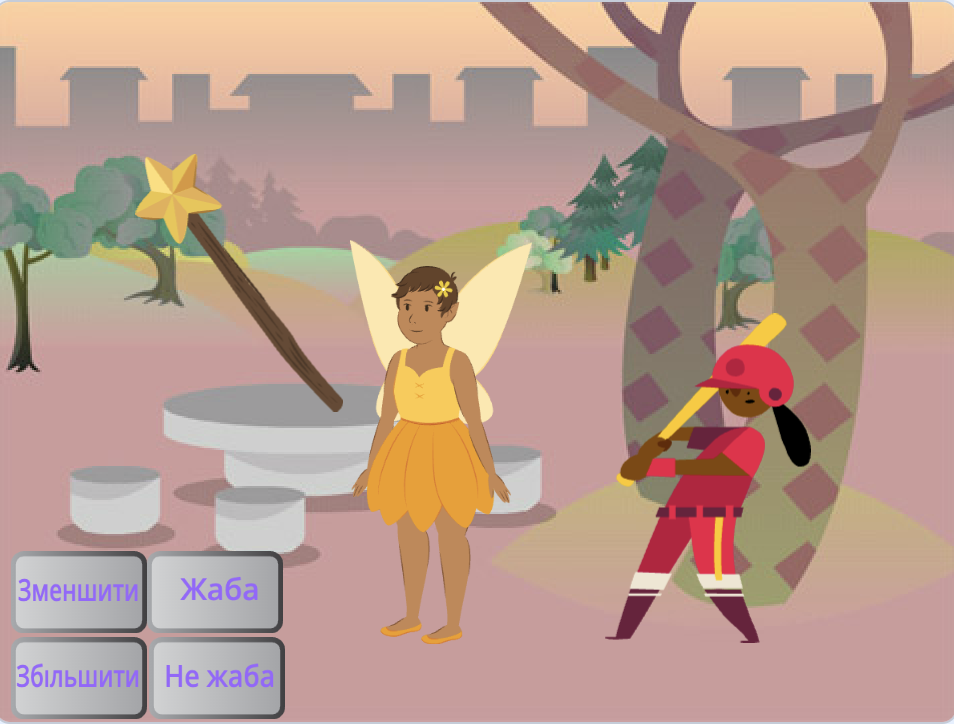

## Що ти зробиш

Створи застосунок, у якому ти за допомогою чарівної палички перетворюватимеш спрайти на жаб, а також змінюватимеш їхній розмір.

Ти:
+ створиш кнопки, які `оповіщуватимуть`{:class="block3events"} спрайти про повідомлення;
+ зробиш так, щоб декілька спрайтів відповідали, коли вони `отримують`{:class="block3events"} одне й те ж повідомлення;
+ використовуватимеш меню блоків `Звуки`{:class="block3sound"}, щоб програвати звуки у зворотному напрямку.

**Оповіщення** та **отримання** повідомлень схоже на принцип **заклику й відповіді** в музиці.
 
 
  «P3T3 P3T3 — традиційна пісня з Гани, Західна Африка. Вона виконується однією головною особою, яка **закликає**, і групою, яка  **відповідає**, повторюючи ключову фразу, коли чує заклик»,  — Кваме Бакоджі-Хюме, неурядова організація African Activities.

<audio controls><source src="images/Pete-Pete.mp3" type="audio/wav"></audio>  

--- no-print ---

### Грати ▶️

--- task ---

  
Натискай на кнопки чарівною паличкою та накладай заклинання. Що кожне заклинання робить із персонажами?

  <iframe allowtransparency="true" width="485" height="402" src="https://scratch.mit.edu/projects/embed/518413238/?autostart=false" frameborder="0"></iframe>

--- /task--- --- /no-print ---

--- print-only ---

--- /print-only ---

