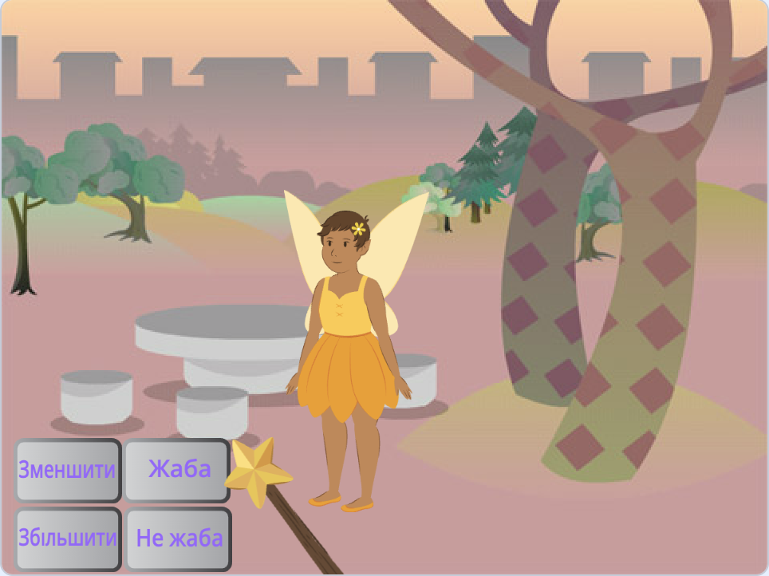
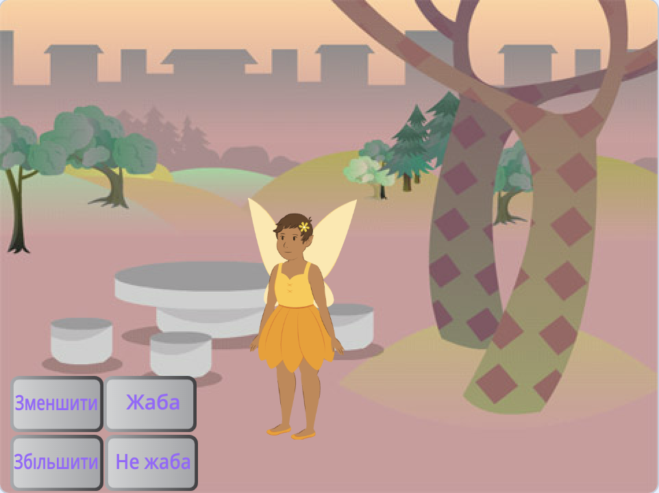
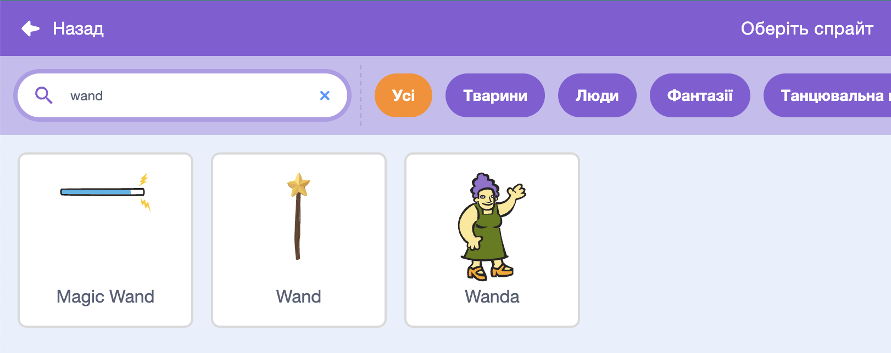
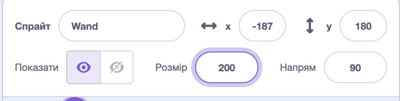
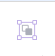

## Вибери свою чарівну паличку

<div style="display: flex; flex-wrap: wrap">
<div style="flex-basis: 200px; flex-grow: 1; margin-right: 15px;">
У цій частині ти підготуєш сцену, вибереш чарівну паличку і створиш власну компʼютерну магію.
  
</div>
<div>
{:width="300px"}
</div>
</div>

<p style="border-left: solid; border-width:10px; border-color: #0faeb0; background-color: aliceblue; padding: 10px;">
<span style="color: #0faeb0">**Компʼютерна графіка**</span> використовується для створення спеціальних ефектів, які не існують у реальному світі. Під час створення сучасного фентезійного фільму або мультфільму використовується багато програмування та компʼютерної графіки.
</p>

--- task ---

Відкрий [стартовий проєкт «Чарівні оповіщення»](https://scratch.mit.edu/projects/1013258858/editor){:target="_blank"}. Скретч відкриється у новій вкладці браузера.

[[[working-offline]]]

--- /task ---

--- task ---

Ти маєш побачити фею серед лісу.



--- /task ---

Щоб накласти заклинання, тобі потрібна чарівна паличка.

--- task ---

Клацни на **Обрати спрайт** та введи у полі пошуку `wand` («чарівна паличка» англійською):




**Вибери:** додай до проєкту чарівну паличку, яка тобі сподобалась.

--- /task ---

--- task ---

Додай код, щоб спрайт **Wand** слідував за `вказівником`{:class="block3motion"} миші та залишався на `передньому`{:class="block3looks"} плані перед кнопками:


```blocks3
when flag clicked
forever
go to (вказівник v) // зміни з «випадкової позиції» 
go to [передній v] layer // перед кнопками
end
```

--- /task ---

--- task ---

**Тест:** клацни на зелений прапорець, щоб запустити свій проєкт. Чарівна паличка буде слідувати за вказівником миші.

--- /task ---

Збільш і нахили паличку, ніби ти справді нею користуєшся.

--- task ---

Перейди до панелі спрайтів і зміни властивість **Розміру** до `200`, щоби збільшити чарівну паличку:



--- /task ---

--- task ---

Клацни на вкладку **Образи**, щоб відкрити образ палички Wand у редакторі малювання.

Вибери інструмент **Обрати** (стрілочка) і накресли прямокутник навколо всієї палички, щоб вибрати всі елементи образу.


Потім клацни на іконку **Групувати**, щоб обʼєднати частини палички.



--- /task ---

--- task ---

Використовуй інструмент **Поворот** на паличці, щоб нахилити її під кутом.


**Порада:** якщо ти не бачиш інструмент **Поворот**, натисни на інструмент **Зменшити** (-) в нижній частині редактора малювання, щоб зменшити розмір поля.

--- /task ---

Образ **Wand** заважає вказівникові миші, коли ти намагаєшся натиснути на кнопки.

--- task ---

Перемісти паличку таким чином, щоб її кінчик знаходився трохи далі від прицілу в центрі.


--- /task ---

--- task ---

**Тест:** натисни на зелений прапорець та переміщуй мишу по Сцені. Чарівна паличка повинна слідувати за нею.

--- /task ---

--- task ---

Якщо ти увійшов до свого облікового запису Скретчу, натисни на зелену кнопку Ремікс. Це збереже копію проєкту у твоєму обліковому записі Скретчу.


Ти можеш змінити назву свого проєкту.


**Порада:** давай проєктам зрозумілі назви, щоб їх можна було легко знайти, коли у тебе буде багато проєктів.

Якщо у тебе немає облікового запису в Скретчі, ти можеш натиснути на **Файл**, а потім **Вивантажити на ваш компʼютер**, щоб зберегти копію проєкту.

--- /task ---

--- save ---
