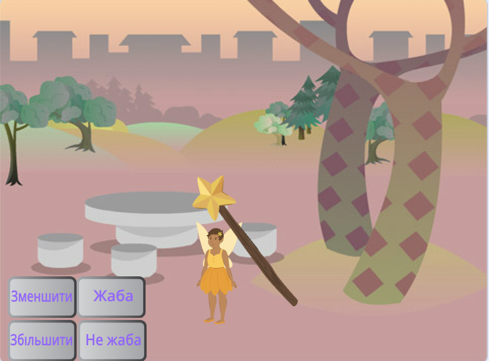
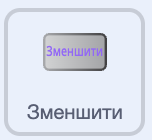
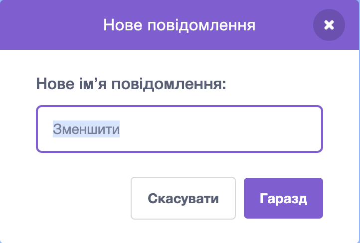
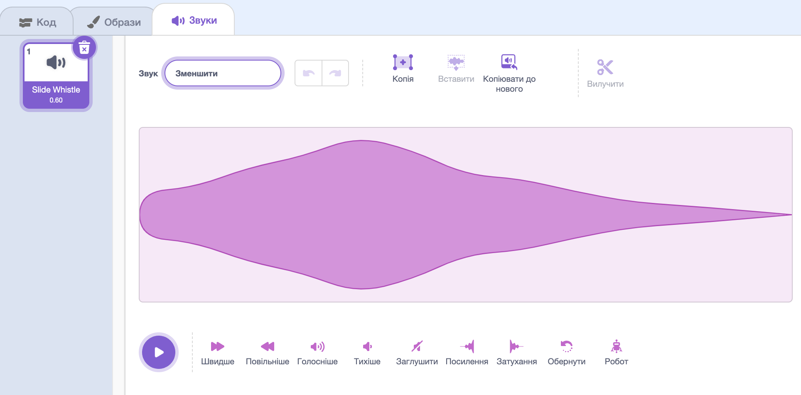

## Заклинання зменшення

<div style="display: flex; flex-wrap: wrap">
<div style="flex-basis: 200px; flex-grow: 1; margin-right: 15px;">
Тепер ти зробиш так, щоб фея зменшувалась, коли ти натискаєш кнопку «Зменшити».
</div>
<div>
{:width="300px"}
</div>
</div>

--- task ---

Клацни на спрайт **Зменшити** у списку Спрайтів під Сценою.

Додай блок `коли спрайт натиснуто`{:class="block3events"}:



```blocks3
when this sprite clicked
```

--- /task ---

Ти хочеш, щоб спрайт **Fairy** (Фея) зменшувався, коли ти натискаєш на кнопку «Зменшити».

Спрайт **Зменшити** повинен `оповістити`{:class="block3events"} за допомогою `повідомлення`{:class="block3events"}, щоб спрайт **Fairy** дізнався про те, що було накладено заклинання зменшення.

--- task ---

Додай блок `оповістити`{:class="block3events"}:


```blocks3
when this sprite clicked
+ broadcast (повідомлення1 v)
```

--- /task ---

--- task ---

Натисни на `повідомлення1`{:class="block3events"} і вибери «Нове повідомлення». Дай новому повідомленню назву `Зменшити`.



Твій код повинен виглядати так:


```blocks3
when this sprite clicked
broadcast (зменшити v)
```

--- /task ---

Тепер, коли ти натискаєш кнопку **Зменшити**, Скретч `оповістить`{:class="block3events"} за допомогою повідомлення `Зменшити`{:class="block3events"}, але поки нічого не відбудеться.

--- task ---

Додай код до спрайту **Fairy**, щоб він зменшувався, коли отримає повідомлення `Зменшити`{:class="block3events"}:


```blocks3
when I receive [Зменшити v]
change size by [-10] // відʼємні числа зменшують розмір
```

--- /task ---

--- task ---

**Тест:** натисни на кнопку **Зменшити**, щоб зменшити спрайт **Fairy**. Роби це скільки завгодно разів.

**Усунення помилок:** якщо твій спрайт **Fairy** росте замість того, щоб зменшуватися, додай знак мінуса `-` перед числом `10`, щоб утворилося відʼємне число `-10`.

--- /task ---

--- task ---

Додай скрипт, щоб повертати спрайт **Fairy** до нормального розміру, `коли натиснуто зелений прапорець`{:class="block3events"}:


```blocks3
when flag clicked
set size to [100] %
```

--- /task ---

Коли повідомлення передаються за допомогою `оповіщення`{:class="block3events"}, їх можуть отримувати всі спрайти. Коли спрайт чарівної палички **Wand** `отримує`{:class="block3events"} повідомлення `Зменшити`{:class="block3events"}, він має `відтворити звук`{:class="block3sound"}.

--- task ---

Натисни на спрайт **Wand**, а потім на вкладку **Звуки**.

Додай звук **Slide Whistle**.

Зміни назву звуку на `Зменшити`, щоб його було легко знайти.




--- /task ---

--- task ---

Додай скрипт для відтворення звуку:


```blocks3
when I receive [Зменшити v]
play sound [Зменшити v] until done

```

--- /task ---

--- task ---

**Тест:** клацни на зелений прапорець, щоб запустити свій проєкт. Натисни на кнопку **Зменшити**, щоб почути звук і побачити, як зменшується **Fairy**.

--- /task ---

Кнопка **Зменшити** `оповіщує`{:class="block3events"} за допомогою повідомлення `Зменшити`{:class="block3events"}. Спрайти **Fairy** і **Wand** `отримують`{:class="block3events"} повідомлення й відповідають.

--- save ---
